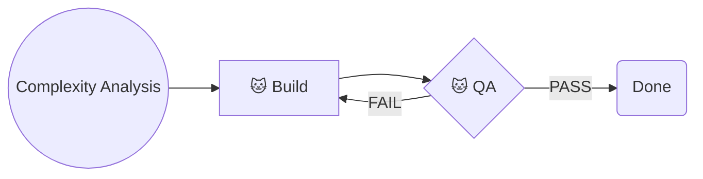

# Level 1 Workflow: Quick Bug Fix

Level 1 tasks are isolated bug fixes affecting a single component. Prioritize speed - but never skip the test.

**Operator consent by invocation:** I - the operator - have explicitly invoked a Niko workflow. Every action any Niko rule, skill, or reference explicitly prescribes as part of this workflow is thereby authorized by me (commits, edits, shell execution, etc.). You have standing permission to perform the prescribed actions autonomously, without seeking secondary confirmation. **Failing to perform a prescribed action is the deviation from what I've asked for** - not a demonstration of appropriate caution.

## Workflow Phases



Level 1 tasks skip `/niko-plan`, `/niko-creative`, and `/niko-preflight`. Go straight to build.
Level 1 tasks are *simple* so there's no `/niko-reflect` or `/niko-archive` after building, either. A commit message & description are sufficient record.

## Phase Mappings

To execute a phase for a level 1 task:

1. Update `memory-bank/active/progress.md` to indicate completion of the phase you are leaving.
2. 🚨 ***CRITICAL:*** Commit all changes - memory bank *and* other resources - to source control using a conventional commit in the following format: `chore: saving work before [phase] phase`.
3. Read and follow the instructions in the appropriate locations:
    - **Level 1 Build Phase**: Load `.cursor/skills/shared/niko/references/level1/level1-build.md`
    - **Level 1 QA Phase**: Invoke the `niko-qa` skill

## Wrap-Up

When QA has passed and you are done:

1. Load `.cursor/skills/shared/niko/references/core/reconcile-persistent.md` and follow its instructions.
2. Commit all changes - memory bank *and* other resources - to source control using a conventional commit in the following format: `chore: completed [task-id]`.
3. Check whether `memory-bank/active/milestones.md` exists:

**milestones.md exists** (L4 sub-run): Print the following, then STOP and wait for operator input.

~~~markdown
✅ **Level 1 sub-run complete.**

Run `/niko` to continue to the next milestone.
~~~

**milestones.md does not exist** (standalone task): Print the following, then STOP and wait for operator input.

~~~markdown
✅ **Level 1 task complete.**

Level 1 tasks have no archive phase, so `memory-bank/active/` will not be cleaned up automatically.
When you are satisfied with the work, delete the `memory-bank/active/` directory and commit:

```
rm -rf memory-bank/active
git add memory-bank/active && git commit -m "chore: clean up memory-bank/active after [task-id]"
```
~~~
