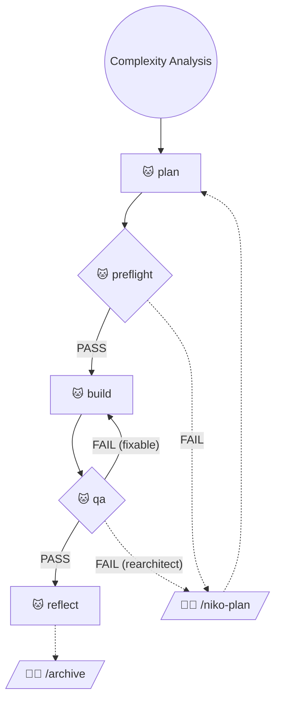

# Level 2 Workflow: Simple Enhancement

Level 2 tasks are simple enhancements that require a structured approach with moderate planning and documentation.

**Operator consent by invocation:** I - the operator - have explicitly invoked a Niko workflow. Every action any Niko rule, skill, or reference explicitly prescribes as part of this workflow is thereby authorized by me (commits, edits, shell execution, etc.). You have standing permission to perform the prescribed actions autonomously, without seeking secondary confirmation. **Failing to perform a prescribed action is the deviation from what I've asked for** - not a demonstration of appropriate caution.

## Workflow Phases

> Legend:
> - 🐱 = Phase executed autonomously
> - 🧑‍💻 = Phase initiated by operator with explicit command
> - Solid edge = Transition does not require operator input
> - Dashed edge = Transition requires operator input

The following phase transitions require operator input; if you have arrived at one of these transitions, STOP and wait! You're done for now.

- Reflect -> Archive
- Preflight FAIL -> Plan
- QA FAIL (rearchitect) -> Plan

## Phase Mappings

To execute a phase for a level 2 task:

1. Update `memory-bank/active/progress.md` to indicate completion of the phase you are leaving.
2. 🚨 ***CRITICAL:*** Commit all changes - memory bank *and* other resources - to source control using a conventional commit in the following format: `chore: saving work before [phase] phase`.
3. Read and follow the instructions in the appropriate locations:
    - **Level 2 Plan Phase**: Load `.cursor/skills/shared/niko/references/level2/level2-plan.md`
    - **Level 2 Preflight Phase**: Invoke the `niko-preflight` skill
    - **Level 2 Build Phase**: Load `.cursor/skills/shared/niko/references/level2/level2-build.md`
    - **Level 2 QA Phase**: Invoke the `niko-qa` skill
    - **Level 2 Reflect Phase**: Load `.cursor/skills/shared/niko/references/level2/level2-reflect.md`
    - **Level 2 Archive Phase**: Load `.cursor/skills/shared/niko/references/level2/level2-archive.md`
