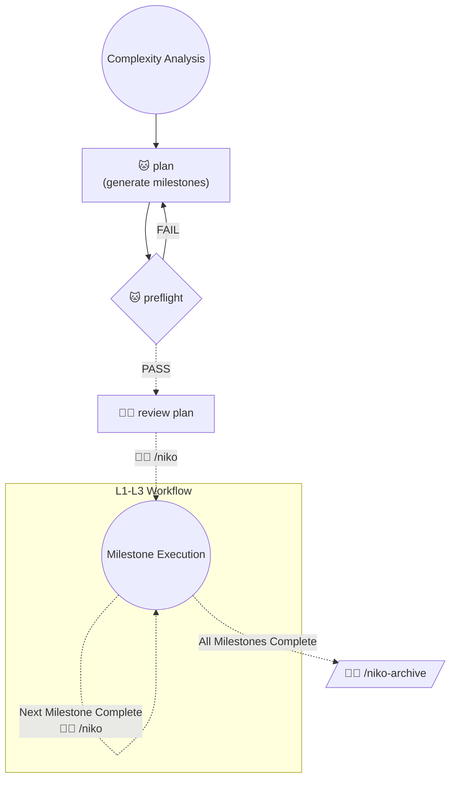

# Level 4 Workflow: Complex System

Level 4 tasks are too large to plan and execute in one pass. They are decomposed into multiple milestones, each executed as an independent L1/L2/L3 sub-run. There are no dedicated Level 4 build, QA, or reflect phases — those happen inside each sub-run at its own level.

**Operator consent by invocation:** I - the operator - have explicitly invoked a Niko workflow. Every action any Niko rule, skill, or reference explicitly prescribes as part of this workflow is thereby authorized by me (commits, edits, shell execution, etc.). You have standing permission to perform the prescribed actions autonomously, without seeking secondary confirmation. **Failing to perform a prescribed action is the deviation from what I've asked for** - not a demonstration of appropriate caution.

## Workflow Phases

> Legend:
> - 🐱 = Phase executed autonomously
> - 🧑‍💻 = Phase initiated by operator with explicit command
> - Solid edge = Transition does not require operator input
> - Dashed edge = Transition requires operator input

After the initial plan is reviewed, `/niko` manages the milestone lifecycle: checking off completed sub-runs, cleaning inter-run state, classifying the next milestone, and routing to the capstone archive when all milestones are done.

## Phase Mappings

Sub-run phases for milestones within an L4's scope are managed by the sub-run's own level workflow, not this file.

To execute a phase for a level 4 task:

1. Update `memory-bank/active/progress.md` to indicate completion of the phase you are leaving.
2. 🚨 ***CRITICAL:*** Commit all changes - memory bank *and* other resources - to source control using a conventional commit in the following format: `chore: saving work before [phase] phase`.
3. Read and follow the instructions in the appropriate locations:
    - **Level 4 Plan Phase**: Load `.cursor/skills/shared/niko/references/level4/level4-plan.md`
    - **Level 4 Preflight Phase**: Invoke the `niko-preflight` skill
    - **Level 4 Archive Phase**: Load `.cursor/skills/shared/niko/references/level4/level4-archive.md`
