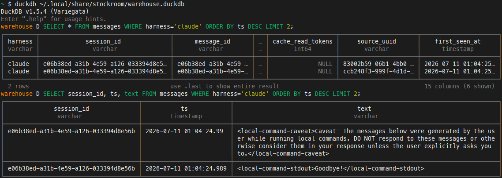

# stockroom

**A local, faithful, searchable warehouse of your agentic-coding history.**

[Documentation](https://texarkanine.github.io/stockroom/) · [Quickstart](https://texarkanine.github.io/stockroom/user-guide/quickstart/) · [Contributing](https://texarkanine.github.io/stockroom/contributing/)

Stockroom captures prompts, responses, and tool inputs from [Cursor](https://cursor.com/) and [Claude Code](https://code.claude.com/) into a single-file [DuckDB](https://duckdb.org/) warehouse with local [`sentence-transformers`](https://www.sbert.net/) embeddings. Kept content is stored **whole** — truncation is a read-time convenience, never a storage-time loss.

It ships as a **dual-manifest plugin** (one shared `skills/` tree for Cursor and Claude Code) with **no build step**: the committed layout is the install layout.

Drill into past sessions and reconstruct conversations:

After setup it can run **fully offline** — query the warehouse with the local `stockroom` or `duckdb` CLIs, no agent required:

Day-to-day use is still agent-native: ask about past work, or slash-invoke `/sr-search` and companions so the harness can assemble the right lookup for you.

## Why stockroom?

- **Faithful history** — full prompts, responses, and tool inputs in one local warehouse, not a truncated scrapbook.
- **Skill-first** — day-to-day use is ask-the-agent or slash-invoke `sr-*`; the CLI is an escape hatch after setup.
- **Local by design** — DuckDB + on-machine embeddings; no cloud index of your coding sessions.
- **Two harnesses, one tree** — Cursor and Claude Code share the same skills and engine.

## Quickstart

1. Add the [`txrk9-agent-plugins`](https://github.com/Texarkanine/txrk9-agent-plugins) marketplace and install `stockroom`.
2. **Cursor only:** enable **Include third-party Plugins, Skills, and other configs** (Settings → Rules, Skills, Subagents) so plugin hooks register.
3. Run first-time setup:
   - **Cursor:** `/sr-initialize`
   - **Claude Code:** `/stockroom:sr-initialize`
4. Ask the agent about past work, or slash-invoke `/sr-search` (Claude: `/stockroom:sr-search`).

Full walkthrough (prerequisites, what landed on disk, what to try next): [Quickstart](https://texarkanine.github.io/stockroom/user-guide/quickstart/).

## Skills

| Skill | Role |
| --- | --- |
| `sr-initialize` | Machine setup (torch, on-path CLI, schedule, first ingest) |
| `sr-search` | Friendly default search (routes to query / semantic) |
| `sr-query` | Read-only SQL against the warehouse |
| `sr-semantic` | Meaning-based (vector) search |
| `sr-dashboard` | Local metrics dashboard |

Harness-specific slash forms and when to use each: [Skill index](https://texarkanine.github.io/stockroom/user-guide/skills/).

## Documentation

- [User guide](https://texarkanine.github.io/stockroom/user-guide/) — quickstart, search, dashboard, ingest, troubleshooting
- [Architecture](https://texarkanine.github.io/stockroom/architecture/) — human tour of the system
- [Advanced](https://texarkanine.github.io/stockroom/advanced/) — CLI escape hatches, DuckDB tips
- [Contributing](https://texarkanine.github.io/stockroom/contributing/) — preparation & iteration ([GitHub PR notes](CONTRIBUTING.md))

## License

Layered, and enforced by `reuse lint` (see [`REUSE.toml`](REUSE.toml)): code is [AGPL-3.0-or-later](LICENSES/AGPL-3.0-or-later.txt); prompt-shaped skill content is layered under the Public Prompt License (PPL-S). Details: [Licensing](https://texarkanine.github.io/stockroom/contributing/licensing/).
