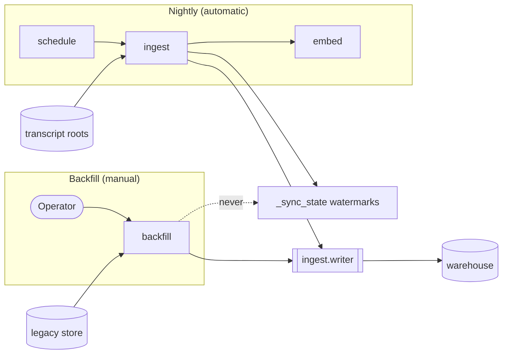

# Backfill

Backfill is one-shot excavation of a harness's *legacy* store — history that predates the transcript roots [ingest](warehouse.md) reads, is finite, and does not grow. It is a sibling of the ingest pipeline, not a mode of it, and the separation is structural rather than conventional.

Operator how-to lives in [User Guide → Backfill Legacy History](../user-guide/ingest/backfill/index.md). This page is why it is shaped the way it is.

## Invariants

- Never on nightly or hooks; import-edge and schedule guards assert the absence
- Writes only through `ingest.writer`; never touches `_sync_state`
- Skip set = warehouse snapshot; `--force` only matches this adapter's `source_path`
- Tokens at source grain; `source_mtime` stays NULL for a shared store

## Not On Any Automatic Path

`stockroom backfill` is manually run, always. No session-start hook invokes it, the scheduler entry stays exactly `stockroom ingest && stockroom embed`, and nothing reachable from the nightly path imports the `backfill` package.

That last one is the load-bearing guarantee, and it is an *absence*, so it is asserted rather than assumed: guard tests fail if the rendered schedule payload gains a `backfill` token, or if the `stockroom.ingest` package acquires an import edge onto `stockroom.backfill`. Legacy-store reads stay one deliberate command away from the thing that runs unattended every night.

## Orchestrator Over Adapters

Backfill is cross-harness by construction, even though exactly one legacy store is known today. The package mirrors how ingest is an orchestrator plus per-harness parsers:

| Module | Role |
| --- | --- |
| `backfill/__init__.py` | Source registry, skip set, write loop, per-source summary |
| `backfill/cursor_vscdb.py` | Today's only adapter |
| `backfill/__main__.py` | CLI |

Adapters own their source format and nothing else — they read their store, resolve their own path from flag/env/config, and yield the same `NormalizedSession` objects ingest parsers yield. **The orchestrator owns every warehouse interaction**; no adapter is handed a connection, and a test asserts a run still writes when the adapter never sees one. A second legacy store is a new file plus a registry entry, not orchestrator surgery.

The contract and how to add one: [Contributing → Backfill Adapters](../contributing/backfill-adapters.md).

## Reuses The Writer, Never The Watermark

Backfill writes through `ingest.writer.write_session` — the same single SQL touchpoint for session persistence that ingest uses — so backfilled rows are shaped, keyed, and de-duplicated identically. `workspace_key` in particular is derived by the writer, which is what lets a backfilled session converge with a transcript-authored session for the same working directory.

It deliberately never calls `update_watermark`. A run leaves `_sync_state` exactly as it found it, so excavating history does not change what tonight's incremental ingest will read.

That isolation makes the [required operating sequence](../user-guide/ingest/backfill/index.md#the-required-sequence) merely a cost concern, not correctness issue. The skip set is a snapshot of what the warehouse currently holds, so backfill before ingest reconstructs conversations whose transcripts are already on disk. Nothing is lost — the next ingest still selects them and supersedes the reconstruction — but the overlap is paid twice in embedding work and corrupts the run summary as a measurement. Ingest first; the skip set only grows.

A dry run opens through `warehouse.open_current()` instead: read-only, never migrating, and off the single-writer flock entirely. Rehearsing a backfill must not be able to create a warehouse, move its schema, or delay a running ingest — so a missing or behind-head warehouse is a typed refusal. Get your (ware)house in order before a backfill.

## Never Clobbering What It Did Not Write

The writer persists idempotently by delete-then-insert on `(harness, session_id)`, which makes a wrong skip set actively destructive rather than merely wasteful. Two things contain that:

**Provenance is exact.** Backfilled sessions carry sufficient identifiers to uniquely and exclusively identify their logical content. If some other source has been populating the same session's data... well, that data does, at least, belong in that session.

**The default skip set is everything already present.** Any `session_id` already in the warehouse for the adapter's harness is skipped before parsing, not after — adapters enumerate candidate ids cheaply first, so the expensive parse only runs on what will actually be written. A test asserts a skipped row is byte-identical afterwards.

`--force` narrows that skip set to sessions whose `source_path` is *this adapter's own store*, so a corrected parse can replace its own earlier output without hand-written SQL. `ingest`-authored rows carry a transcript `source_path` and are therefore unmatchable even under force.

Changing the keep predicate under `--force` renumbers positional `message_id`s and invalidates embeddings — see [User Guide → Fixing A Run](../user-guide/ingest/backfill/index.md#fixing-a-run). You'd only need this if you were changing how an existing backfill worked and needed to repair data in a warehouse that had already been backfilled w/ the older code path.

## Reading Foreign Stores Safely

A legacy store belongs to the harness, which may be running. Adapters open it strictly read-only and are expected to fail soft: an absent, unreadable, or actively-written store yields a one-line message and a nonzero exit. One unparseable record does not abort a run, and one failed source does not stop the others.

## Grain And Honesty

**Tokens are stored at the grain the source reports.** A per-turn count lands on *that* message, and session `*_tokens` stay NULL so `session_token_usage` reports `token_grain = 'message'`. Summing message counts into the session columns is explicitly forbidden by migration `0007`, and would additionally make the rollup view mislabel the grain as `'session'`.

That said, if a source only *has* session-grain token data, it will be written as such.

**`source_mtime` stays NULL for a shared store.** The column means "the mtime of *this conversation's* source transcript." If a legacy store is one file for thousands of conversations, its mtime is approximately the last time it was updated and will be actively incorrect for the majority of sessions. In such cases, `source_mtime` is left `NULL`.

When `source_mtime` is absent, the writer seeds `messages.first_seen_at` from time of the backfill run. That field means "when stockroom first observed this message" and is [not rebuildable from sources](warehouse.md#ingest-pipeline).
