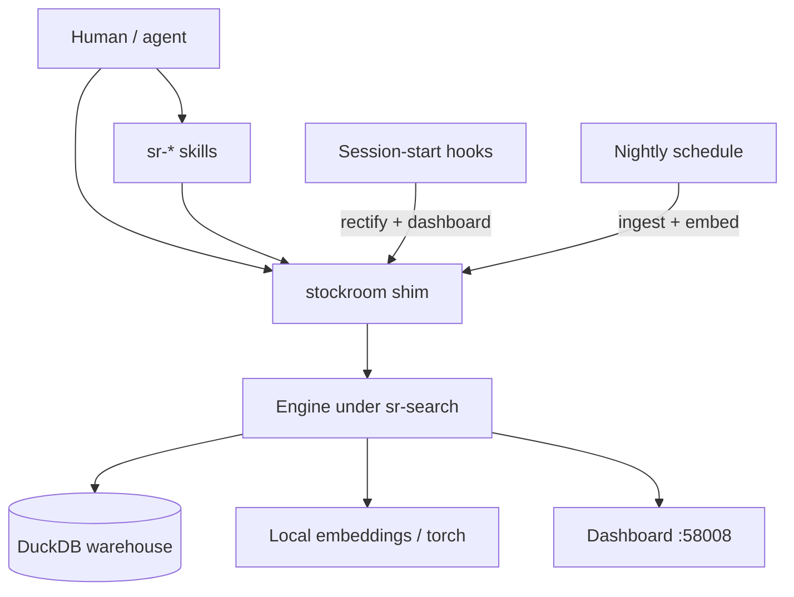

# Architecture

Architecture is the human systems atlas for Stockroom: how the pieces fit together, and which unusual constraints you must not remove without understanding them. It is not product how-to — that lives in the [User Guide](../user-guide/index.md). It is not day-to-day contributor loops — that lives in [Contributing](../contributing/index.md). It is not escape-hatch CLI recipes — that lives in [Advanced](../advanced/index.md).

If you already know how to operate the product and need the whole design surface in your head before changing it, start here.

## Control flow

Everything that runs Stockroom on a machine goes through the on-path `stockroom` shim into the Python engine under `skills/sr-search/`. Skills, session-start hooks, the nightly schedule, and direct human CLI use are different callers of the same contract.

## Pieces

- **Dual-manifest plugin** — Cursor and Claude Code each have a manifest; both point at one shared `skills/` tree. The committed layout is the install layout.
- **Skills** — `sr-*` agent procedures. Sibling skills have no Python of their own; they invoke `stockroom <subcommand>`.
- **Shim** — generated `~/.local/bin/stockroom`. Owns engine-dir resolution, `PYTHONPATH`, and torch-safe uv flags. Baked-only: succeed correctly or refuse with a one-line remedy.
- **Engine** — locked uv project under `skills/sr-search/` (`src/stockroom/`, migrations, tests). Run-in-place; not an installed Python package.
- **Warehouse** — single-file DuckDB under stockroom home. Rebuildable ETL from harness session records.
- **Embeddings** — local `sentence-transformers` vectors; torch is provisioned per-machine and held out of the dependency lock.
- **Hooks** — session-start commands that rectify the shim and launch the dashboard. Fire-and-forget; never the ingest path.
- **Schedule** — nightly `stockroom ingest && stockroom embed` on the platform scheduler.
- **Dashboard** — local offline metrics UI on port 58008; opens the warehouse without migrating.

## Read next

The overview is the map. The pages below are the atlas body — read them to load the model, not as optional appendices.

| Page | One job |
| --- | --- |
| [Packaging](packaging.md) | How code arrives and runs: plugin layout, engine-in-skill, lock, torch, shim |
| [Lifecycle](lifecycle.md) | When things fire: hooks, scheduled ingest, dashboard launch |
| [Warehouse](warehouse.md) | ETL doctrines, identity, concurrency, ingest, migrations |
| [Embeddings](embeddings.md) | Model/index, staleness, search-surface split, render note |

## Change surfaces

| If you change… | Read first |
| --- | --- |
| Plugin manifests, skill layout, engine packaging, uv lock, torch provisioning, or the shim | [Packaging](packaging.md) |
| Session-start hooks, nightly schedule, or dashboard process lifecycle | [Lifecycle](lifecycle.md) |
| Schema, ingest parsers/writer, warehouse open paths, or identity/provenance | [Warehouse](warehouse.md) |
| Embedding model, VSS/HNSW, semantic search, or how skills route over query/semantic | [Embeddings](embeddings.md) |
| Human install/heal recipes, torch troubleshooting steps | [User Guide](../user-guide/index.md) |
| Make / localdev / iteration loops | [Contributing](../contributing/index.md) |
| Raw CLI / DuckDB escape hatches | [Advanced](../advanced/index.md) |

## Related surfaces

- **Agents** use skill procedures plus the compact [`system-model.md`](https://github.com/Texarkanine/stockroom/blob/main/skills/sr-search/references/system-model.md) that ships with the plugin. This site does not fork that file.
- **Maintainers** in a checkout also have `memory-bank/systemPatterns.md` — related themes, different audience (implementation briefing). Do not collapse Architecture and that briefing into one SSOT.
- **Licensing** is layered (AGPL base with a PPL-S carveout for prompt-shaped skill payload). Detail lives in [Contributing → Licensing](../contributing/licensing.md).
