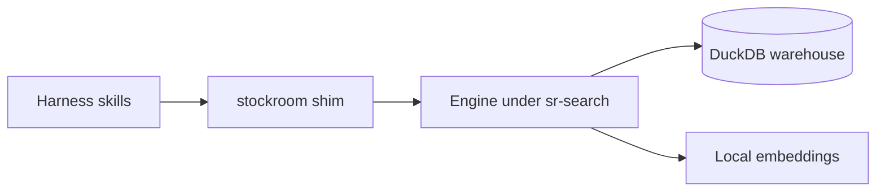

# Architecture

A short human tour of how Stockroom fits together. Plugin agents do not need this page — they use skill procedures plus the compact system model.

## Pieces

- **Dual-manifest plugin** — one shared `skills/` tree for Cursor and Claude Code; committed layout is the install layout (no build step for the plugin payload).
- **One engine** — Python under `skills/sr-search/`; sibling `sr-*` skills have no Python of their own.
- **One command** — the on-path `stockroom` shim owns engine resolution, `PYTHONPATH`, and uv flags; skills do not carry fallback incantations.
- **Warehouse** — single-file DuckDB ETL output from harness session records; query/semantic open it read-only.
- **Embeddings** — local `sentence-transformers` vectors; torch is provisioned per-machine and held out of the dependency lock.

## Doctrines worth knowing

- **No truncation at rest** — full message and tool text is stored; elision markers are a read-time display bound.
- **Ingest and embed can lag** — recent sessions may exist in SQL but be invisible to semantic search until embedded.
- **Identity is harness-labeled** — uniform `(harness, session_id)` / message ids; native harness ids stay as provenance.

## Canonical agent model

The using-agent doctrines live in [`skills/sr-search/references/system-model.md`](https://github.com/Texarkanine/stockroom/blob/main/skills/sr-search/references/system-model.md) on GitHub. That file ships with the plugin; this site does not fork it.

Maintainers working in a checkout also have `memory-bank/systemPatterns.md` — related themes, different audience (implementation briefing). Do not collapse the two; see [Contributing](https://github.com/Texarkanine/stockroom/blob/main/CONTRIBUTING.md).
