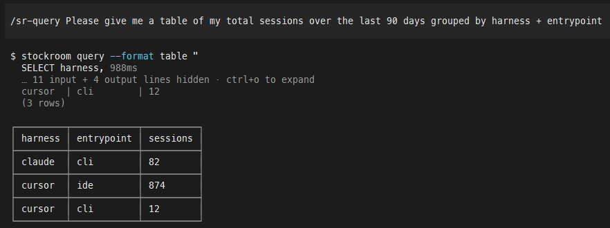
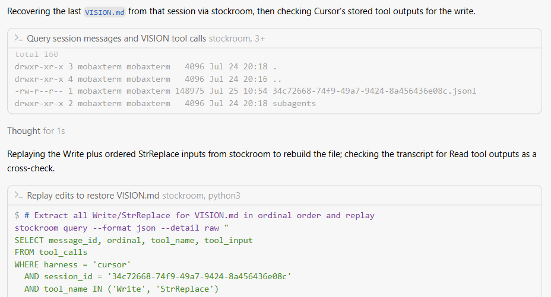
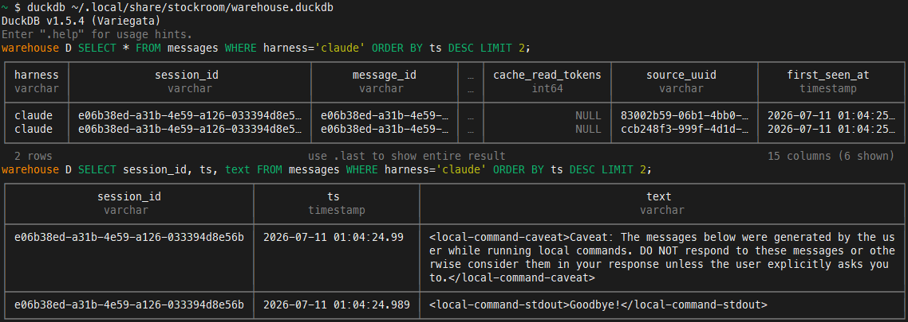

# stockroom

A local, faithful, searchable warehouse of your agentic-coding history.

Stockroom captures prompts, responses, and tool inputs from supported agentic coding harnesses into a single-file [DuckDB](https://duckdb.org/) warehouse with local embeddings so you can use SQL queries when you know exactly what you're looking for, and semantic searches when you don't.

## Agents Can Query the Past

Day-to-day use is expected to go through the `/sr-search` skill & its companions in your agent harness, allowing agents to intelligently assemble queries for you to find what you're looking for...

... or even to recall past interactions on their own while working on something for you!

## Dashboard Overview for You, Human!

It includes a dashboard that gives an at-a-glance visual overview of your coding habits and history...

{ width="400"}

... along with the ability to drill into and reconstruct past conversations:

{ width="400"}

## No Need for Internet or AI

It can even be used **fully offline** and **without AI** once it's set up: after installation, nothing else needs to be downloaded from the internet. Dependencies are fully locked so what you see on GitHub is *exactly* what you get, and you can query the warehouse directly with local `stockroom` and `duckdb` CLIs:

## Where to Go from Here

- Want it? [Quickstart](user-guide/quickstart.md)
- Want the systems mental model? [Architecture](architecture/index.md)
- Contributing or changing the product? [Contributing](contributing/index.md)