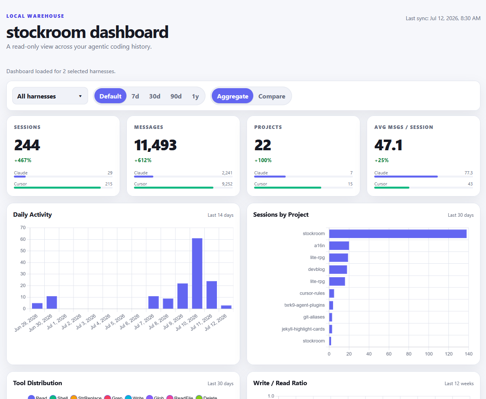
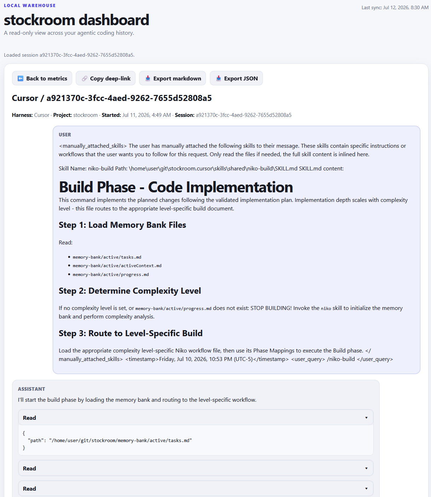

# Dashboard

The stockroom dashboard is a **local, read-only, fully offline** metrics UI over your warehouse — an at-a-glance view of cross-harness agentic-coding history. It does not ingest, embed, or migrate; freshness is owned by [Load the Warehouse](ingest.md).

Default URL: [http://localhost:58008](http://localhost:58008/) (also `http://127.0.0.1:58008/`). Every front-end asset is vendored — no CDN or external web requests are made at runtime. You can use it w/out an internet connection!



## `sr-dashboard`

The skill launches (or re-prints) the dashboard URL. Use it when you want the UI, not a SQL or semantic answer.

| Harness | Slash form |
| --- | --- |
| Cursor | `/sr-dashboard` |
| Claude Code | `/stockroom:sr-dashboard` |

```bash
~ $ stockroom dashboard
http://127.0.0.1:58008/
~ $
```

The server is idempotent: if something is already listening on the port, the command still prints the URL and exits cleanly.

Session-start hooks also attempt to launch the dashboard automatically when plugin hooks are registered.

## What you see

### Metrics

Harness filters, time ranges, and Aggregate / Compare views over sessions, messages, projects, daily activity, tool distribution, and related rollups. The warehouse is machine-scoped: the UI stays up across harness sessions and is not stopped when one IDE closes.

### Sessions

The metrics **Sessions** panel shows up to 20 matching conversations (10 newest + `… N more` + 10 oldest when there are more). Click a row to open reconstruction, or `… N more` for the paginated sessions-list view. That list has its own harnesses, time range, and per-page control (`25` / `50` / `100` / `All`); filter state lives in the URL. Browser Back is the only way back from the list or a session.

Both the panel table and the full list include a **Tokens** column (between Messages and Model). Counts use a compact K/M-style total; hover the `?` for an input / output / cache breakdown when usage is known. Claude Code sessions show real totals (including zeros). Cursor sessions (and other cases without usage data) show an em dash with no hover.

List deep-link shape:

```text
http://127.0.0.1:58008/?view=sessions&harness={harness}&per_page=50
```

Optional: repeated `harness`, `since` / `until` (omit both for **All** — the full unwindowed warehouse range), `page`, `per_page` (`25` | `50` | `100` | `all`).

### Session inspection

Open a conversation from Sessions (or a deep link) to read the thread, copy a deep-link, or export markdown/JSON when in-dashboard rendering is not enough. The header shows harness, project, started time, model (if known), and tokens (same compact total + hover breakdown as the lists; em dash when usage is unknown).



Session deep-link shape (both query params required):

```text
http://127.0.0.1:58008/?view=session&harness={harness}&session={session_id}
```

## Lifecycle notes

- After a plugin update moves the engine path, the next session start should replace a stale dashboard process with one launched from the new location.
- Port conflicts and auto-start misses: [Troubleshooting > Dashboard](troubleshooting/index.md#dashboard).

For search (not browsing), see [Search](search.md). For every skill at a glance, see [Skill index](skills.md).
