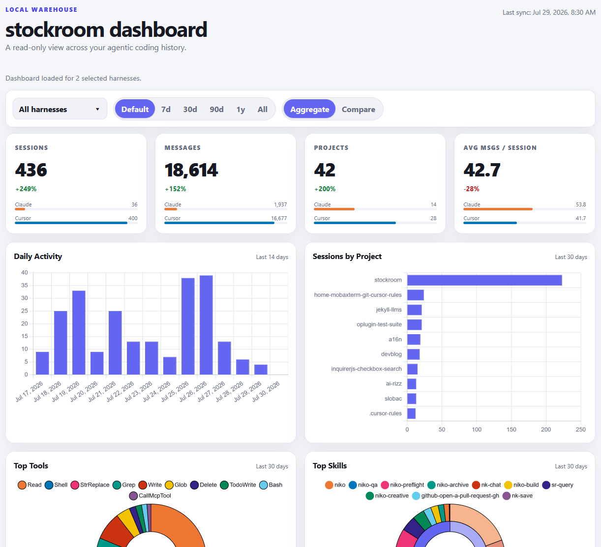
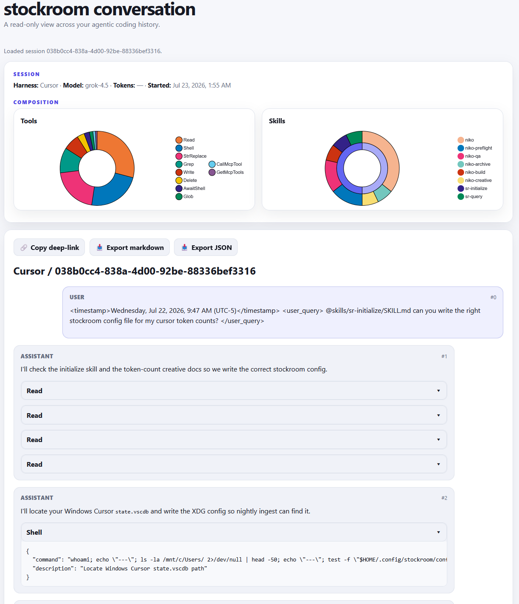

# Dashboard

The stockroom dashboard is a **local, read-only, fully offline** metrics UI over your warehouse — an at-a-glance view of cross-harness agentic-coding history. It does not ingest, embed, or migrate; freshness is owned by [Load the Warehouse](load/index.md).

Default URL: [http://localhost:58008](http://localhost:58008/) (also `http://127.0.0.1:58008/`). Every front-end asset is vendored — no CDN or external web requests are made at runtime. You can use it w/out an internet connection!



## `sr-dashboard`

The skill launches (or re-prints) the dashboard URL. Use it when you want the UI, not a SQL or semantic answer.

| Harness | Slash form |
| --- | --- |
| Cursor | `/sr-dashboard` |
| Claude Code | `/stockroom:sr-dashboard` |

```bash
~ $ stockroom dashboard
http://127.0.0.1:58008/
~ $
```

The server is idempotent: if something is already listening on the port, the command still prints the URL and exits cleanly.

Session-start hooks also attempt to launch the dashboard automatically when plugin hooks are registered.

## What you see

### Metrics

Harness filters, time ranges, and Aggregate / Compare views over sessions, messages, projects, daily activity, tool distribution, and related rollups. The warehouse is machine-scoped: the UI stays up across harness sessions and is not stopped when one IDE closes.

The date range runs `Default` · `7d` · `30d` · `90d` · `1y` · `All`. **`Default`** is not the widest setting — it lets each panel keep its own natural window (30 days for most, 14 days and 12 weeks for the activity trends). **`All`** starts at your earliest recorded activity rather than at some fixed epoch, so the axis covers your history and nothing more; the KPI cards read `New` under it, since there is no preceding period to compare against.

### Sessions

The metrics **Sessions** panel shows up to 20 matching conversations (10 newest + `… N more` + 10 oldest when there are more). Click a row to open reconstruction, or `… N more` for the paginated sessions-list view. That list has its own harnesses, time range, and per-page control; filter state lives in the URL.

Both the panel table and the full list include a **Tokens** display. Counts use a compact **K**ilo / **M**ega, etc-style total; hover the `?` for an input / output / cache breakdown when usage is known

List deep-link examples:

```text
http://127.0.0.1:58008/?view=sessions&harness=cursor&per_page=50
http://127.0.0.1:58008/?view=sessions&harness=cursor&harness=claude&per_page=100
http://127.0.0.1:58008/?view=sessions&harness=claude&since=2026-07-01T00:00:00Z&until=2026-08-01T00:00:00Z&page=2&per_page=25
http://127.0.0.1:58008/?view=sessions&per_page=all
```

### Session inspection

Open a conversation from Sessions (or a deep link) to see session metrics and tool/skill composition charts, then read through the whole conversation. Copy a deep-link or export markdown/JSON when in-dashboard rendering is not enough.



Session deep-link shape (both query params required):

```text
http://127.0.0.1:58008/?view=session&harness={harness}&session={session_id}
```

Appending an optional message hash scrolls to that message after the conversation loads:

```text
http://127.0.0.1:58008/?view=session&harness={harness}&session={session_id}#msg-{ordinal}
```

## Lifecycle notes

- After a plugin update moves the engine path, harness hooks are what rebake the on-path shim (they know the plugin root). Cursor also runs a non-blocking path-only `shim rectify` on each prompt submit as suspenders when `sessionStart` misses (common on some macOS Cursor setups); full ensure + dashboard launch still belong to session start.
- If a document request cannot be served as real UI, the listener may return a short **recovery HTML** page (instead of bare JSON) with a few starting steps and a link into troubleshooting. Many causes are possible — [Dashboard UI will not load](troubleshooting/index.md#dashboard-ui-will-not-load).
- Port conflicts and auto-start misses: [Troubleshooting > Dashboard](troubleshooting/index.md#dashboard).

For search (not browsing), see [Search](search.md). For every skill at a glance, see [Skill index](skills.md).
