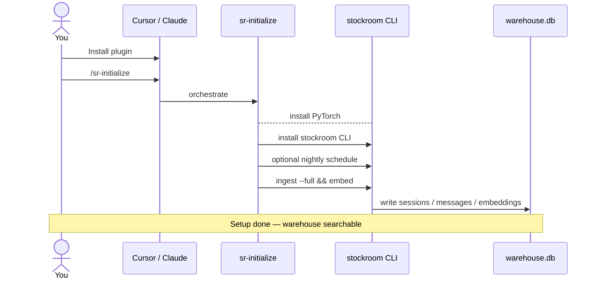
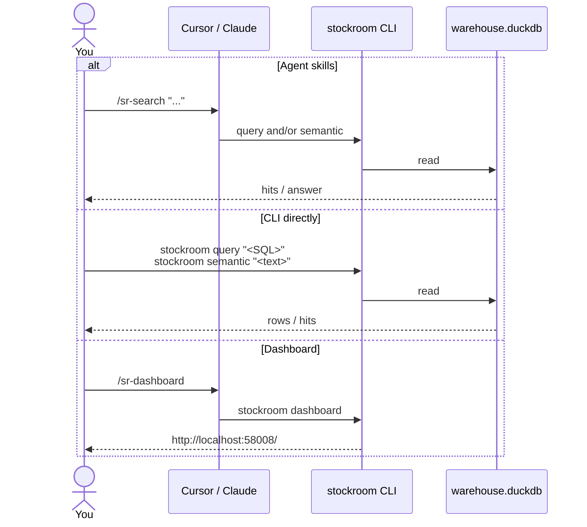
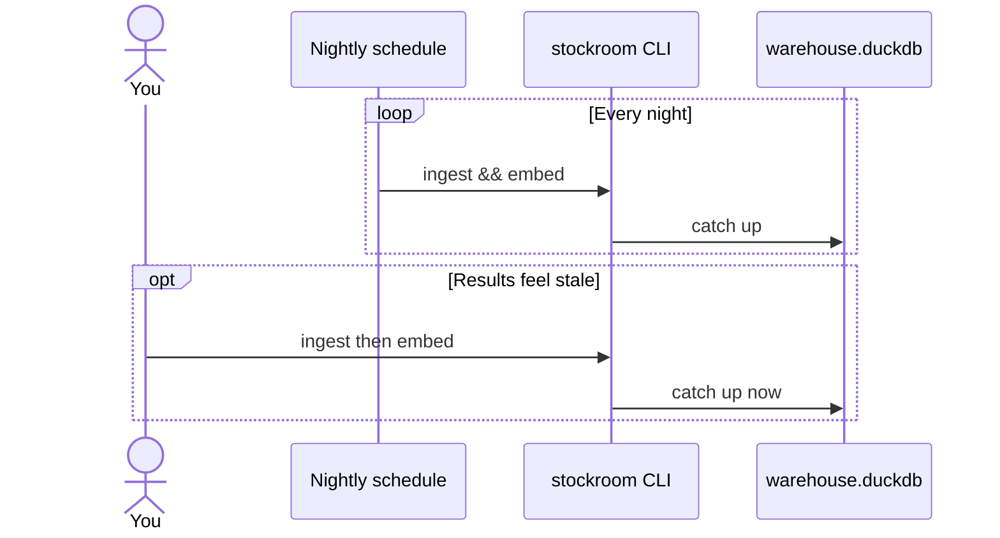

# Stockroom User Guide

Stockroom keeps a local warehouse of your Cursor and Claude Code history so you (or an agent) can search past work later. You install and initialize once; after that the loop is mostly **ask → answer**, with a quiet nightly job keeping the warehouse fresh.

This page is a light mental model only — not the full [Architecture](../architecture/index.md) tour.

Just want to get it working? Head over to the [Quickstart](quickstart.md) page.

## What you do

### Install Once

Install the plugin from the marketplace and run the `sr-initialize` skilli.

That does a one-time dependency sync, selects the correct [PyTorch]() for your machine, does the initial load of the warehouse and offers to schedule a nightly warehouse refresh.

---

---

### Use It

Ask your agents to `/sr-search ...` for things, or notice them searching on their own.

Outside your harnesses, you can use the `stockroom query <SQL>` and `stockroom semantic <text>` CLI commands to dig into the warehouse w/out spending any tokens.

The [Dashboard](dashboard.md) will be there for a visual summary of your work, too.

---

---

### Stay Fresh

If you opted into a nightly warehouse refresh, it will ingest new conversations & generate embeddings for them each night.

You can also use the `stockroom ingest` and `stockroom embed` CLI commands to catch up manually.

---

---

## Where Next?

- Get it working with [Quickstart](quickstart.md)
- Learn more about the [ETL](https://en.wikipedia.org/wiki/Extract,_transform,_load) process on [Load the Warehouse](ingest.md)
- Troubleshoot PyTorch at [Troubleshooting > Torch](troubleshooting/torch.md)