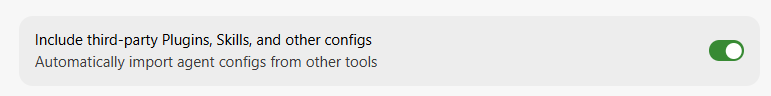

# Quickstart

Get Stockroom installed and running in a few minutes.

## Prerequisites

- [Cursor](https://cursor.com/) or [Claude Code](https://code.claude.com/)
- A POSIX shell and network access for the first-time setup (torch wheel + first ingest)

## Install and initialize

1. Add the [`txrk9-agent-plugins`](https://github.com/Texarkanine/txrk9-agent-plugins) marketplace (that README shows the Cursor and Claude Code UI steps), then install the `stockroom` plugin from it.
2. **Cursor only:** ensure **Include third-party Plugins, Skills, and other configs** (Cursor Settings → Rules, Skills, Subagents) is enabled. Plugin hooks do not register without this until [Cursor’s plugin-hooks bug](https://forum.cursor.com/t/plugin-hooks-not-loading-into-cursor-ide/156702) is fixed:

   

3. Run first-time setup:
	- **Cursor:** `/sr-initialize`
	- **Claude Code:** `/stockroom:sr-initialize`
4. Ask the agent something about past work, or slash-invoke `/sr-search`:

		/sr-search "What was the most-recent time I had to correct an agent's behavior?"

`sr-initialize` checks prerequisites, provisions the per-machine torch wheel, puts `stockroom` on your PATH, offers nightly ingest+embed scheduling, and runs the first full ingest + embed. Re-runs are safe & idempotent: it re-probes and only does what is still missing.

## What to try next

- Prefer **`sr-search`** when you are unsure whether the question is structured SQL or meaning-based recall — [Search](search.md).
- Open the local metrics UI with **`sr-dashboard`** (also launched automatically on session start - [click here!](http://localhost:58008) - when hooks are registered) — [Dashboard](dashboard.md).
- Curious what landed on disk? See [Installed layout](installed-layout.md).
- If something fails *and your agent can't figure it out*, see [Troubleshooting](troubleshooting/index.md).
