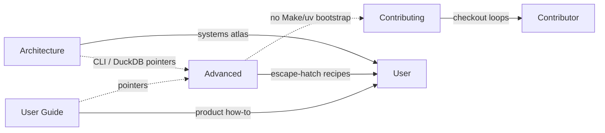

# Architecture Decision: advanced-topic-inventory

## Requirements & Constraints

**Functional**
- Cover confirmed advanced usages: `stockroom` CLI out-of-band of an agent harness; DuckDB CLI against the warehouse.
- Decide include/exclude for maybe-topic: successful direct `uv` against the engine.
- Deliver presentation-quality Advanced section under the landing + sub-pages shape.

**Quality attributes (ranked)**
1. **Minimalism / ownership clarity** — omit uncertain paths and anything UG already owns; no second onboarding track.
2. **Fitness for power-user escape hatches** — enough depth that a smart user succeeds without an agent turn.
3. **Maintainability** — do not fork skill/`system-model` flag tables; prefer `--help` + links.
4. **Reversibility** — easy to add a page later; hard to un-teach a footgun path once published.

**Technical / product constraints**
- Bootstrap/heal remain `sr-initialize` / User Guide; do not present clone `make`/`uv` as initialize substitute.
- UG already covers: query/semantic samples (Search), ingest/embed catch-up (Load the Warehouse), warehouse path (Installed layout), dashboard, torch remedies.
- Contributing owns checkout `uv`/`make` loops.
- Architecture points at Advanced for CLI/DuckDB recipes — Advanced must remain the recipe home without becoming systems atlas.

**Boundaries**
- In: which topics Advanced owns, at what depth, vs link-out vs omit.
- Out: page file splits (separate creative); Architecture prose; Contributing rituals.

## Components

## Options Evaluated

- **A — Full CLI encyclopedia**: Document every `stockroom` subcommand (ingest/embed/migrate/shim/torch/doctor/schedule/dashboard) at Advanced depth; DuckDB as appendix; maybe uv. Matches current scaffold breadth.
- **B — Escape-hatch duo**: Own only (1) out-of-band `stockroom` CLI for power-user invocation + read/search presentation, and (2) DuckDB CLI RO access. Link UG for ingest/embed/dashboard/torch; omit heal/migrate deep dives and omit direct `uv`.
- **C — Escape-hatch trio**: B plus a third topic documenting successful direct `uv` against the installed engine (torch-safe flags, when it is/isn't appropriate).
- **D — CLI reference + task recipes**: Split “how to invoke” from recipe pages (catch-up embed, manual migrate, etc.). User leaned against this unless paths are clearly real and not already in UG.

## Analysis

| Criterion | A Encyclopedia | B Duo | C Trio | D Recipes |
| --- | --- | --- | --- | --- |
| Minimalism | Weak — re-owns UG surfaces | Strong | Medium — uv is speculative | Weak if recipes duplicate UG |
| Fitness | High breadth, low focus | High for confirmed asks | High if uv is real | Medium |
| Maintainability | Flag-table drift risk | Lean, link-heavy | uv page is fragile (shim contract) | Recipe drift |
| Risk if wrong | Scope bloat / ownership blur | Might under-serve heal hackers | Teaches footgun / second bootstrap | Inflates Advanced |

Key insights:
- UG already teaches catch-up ingest/embed and warehouse path — Advanced repeating them violates the brief’s minimalism filter.
- Heal/migrate/shim/torch are initialize/troubleshooting territory, not “advanced usage with good reason” for a happy power user.
- Direct `uv` is the failure mode the shim exists to prevent for end users; successful contributor `uv` already lives in Contributing. Documenting end-user `uv` “successfully” fails the ranked #1 attribute unless we have a concrete, common scenario — we don’t.
- Option D’s catch-up recipes are already UG; manual migrate is rare and heal-adjacent — omit under “if unsure, don’t.”

### Choice Pre-Mortem

- **Users need a full subcommand map and feel stranded**: checked — mitigated by a short “other subcommands” pointer table that links UG / `--help` / initialize rather than deep recipes.
- **Omitting `uv` was wrong because power users routinely bypass the shim**: unchecked as a *demand* claim — no evidence in brief or archives that this is a real end-user path; Contributing covers checkout. If operator later asserts a real scenario, add a page (reversible). Prefer omit now.
- **DuckDB guidance without RO caveats causes warehouse corruption stories**: checked — DuckDB topic must lead with read-only open and prefer `stockroom query` for routine work.

## Decision

**Selected**: Option B — Escape-hatch duo

**Rationale**: Matches confirmed requirements and the #1 quality attribute (minimalism / ownership). Confirmed topics get real depth; maybe-`uv` and heal/recipe sprawl stay out until demand is concrete.

**Tradeoff**: No Advanced `uv` page; heal/migrate/schedule stay out of Advanced depth (pointers only). Operator can reopen if a concrete `uv` scenario appears.

## Implementation Notes

- **Include (Advanced-owned depth)**
  - Out-of-band `stockroom` CLI: what the shim is, prerequisites (`PATH` after initialize), how invocation differs from `sr-*`, read surfaces (`query` / `semantic`) with format/detail + `--help` (no skill-table fork), env overrides that matter for CLI use (`STOCKROOM_HOME`, optional ingest roots) with Installed-layout / UG links where path topology is already owned.
  - DuckDB CLI: warehouse file path (link Installed layout), **read-only** open recipe, when to prefer `stockroom query` vs raw DuckDB, caveats (locks, migrations, no presentation layer).
- **Exclude / link-out**
  - Catch-up ingest/embed → User Guide Load the Warehouse
  - Dashboard → User Guide Dashboard
  - Torch heal → UG troubleshooting
  - Contributor `uv`/`make` → Contributing
  - Direct end-user `uv` against engine → **omit** (this decision)
  - `migrate` / `shim` / `torch` / `doctor` / `schedule` → not Advanced recipes; at most a one-line “prefer initialize / `--help`” pointer if a CLI overview needs them for orientation
- **Inbound link audit**: Architecture/UG links to `advanced/cli.md` may retarget after page-IA creative.
