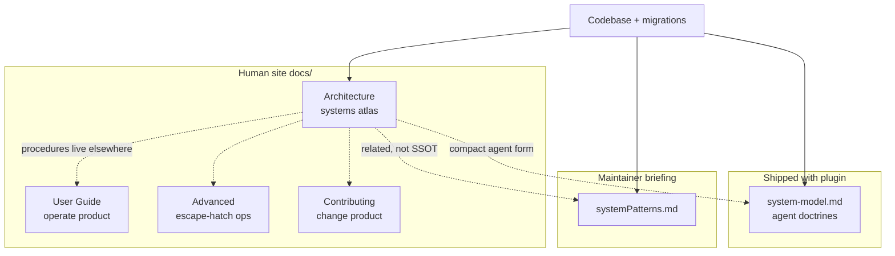

# Architecture Decision: Architecture Scope & Ownership

## Requirements & Constraints

**Functional requirements**
- Load a whole-system mental model for advanced systems-level users/contributors (not product how-to).
- Cover operator seed topics at appropriate depth.
- Surface topics that *should* be in Architecture beyond the seed list (inventory-driven).
- Preserve clear ownership vs User Guide, Contributing, Advanced, agent `system-model.md`, and maintainer `systemPatterns.md`.

**Quality attributes (ranked)**
1. Mental-model completeness for safe systems change
2. Ownership clarity (no forked SSOTs, no procedure dump)
3. Maintainability (won't drift into a second `systemPatterns` dump)
4. Scannability

**Technical constraints**
- WHAT-first; WHY only for unusual / Chesterton’s-fence designs
- Advanced deferred this task
- Human site lives under `docs/`; agents keep `system-model.md`
- Docs must build with properdocs

**Boundaries**
- In: systems map, unusual constraints, design surface/ethos
- Out: install/heal recipes, Make loops, CLI recipes, skill flag tables, licensing deep-dive

## Components

## Options Evaluated

- **A — Mirror systemPatterns**: Rewrite Architecture as a humanized dump of every `systemPatterns` section.
- **B — Seed-only**: Cover only the operator’s seed list; defer everything else.
- **C — Systems atlas with inclusion bar**: Architecture owns the control-flow map plus every doctrine where “would a systems change be unsafe or Chesterton-fenced without this?” is yes; other surfaces keep procedures and agent/maintainer briefings.

## Analysis

| Criterion | A Mirror | B Seed-only | C Atlas |
| --- | --- | --- | --- |
| Completeness | High but undifferentiated | Incomplete (admits gaps) | High with bar |
| Ownership | Forks MB into docs | Clear but thin | Clear |
| Maintainability | High drift risk | Easy, under-serves | Curated set |
| Scannability | Long undifferentiated | Short | Structured |
| Risk if wrong | Docs/MB diverge silently | Contributors still confused | Over/under-include topics |

Key insights:
- Inventory shows human docs already cover *operations* for shim/torch/hooks/ingest but almost never VSS/HNSW, flock/`open_current`, verify-don’t-invert, or embedding-model rationale — Architecture gaps, not User Guide gaps.
- Agent `system-model.md` is a *subset* (packaging, torch, ETL RO, truncation, embed staleness, identity). Architecture is broader (hooks, schedule, dashboard lifecycle, concurrency, rendered artifacts, search-surface split).
- Contributing already owns day-to-day loops; dumping those into Architecture would violate the brief.

## Decision

### Choice Pre-Mortem

- **Wrong because Architecture becomes a second systemPatterns**: checked — inclusion bar + “point don’t dump” for MB/agent docs; licensing/Make/CLI stay out.
- **Wrong because seed topics get diluted by inventory bloat**: checked — seed topics remain required; inventory items must pass the inclusion bar or be deferred with rationale in the plan.
- **Wrong because overlap with system-model looks like two SSOTs**: checked — Architecture states human systems atlas; links to system-model as agent-facing compact form; neither claims to replace the other (matches existing `docs/architecture` stub doctrine and CONTRIBUTING).

**Selected**: C — Systems atlas with inclusion bar
**Rationale**: Maximizes mental-model completeness without forking maintainer/agent surfaces or absorbing procedures. Matches ranked attributes and the operator’s “SYSTEM not product” brief.
**Tradeoff**: Some overlap with system-model wording is inevitable on packaging/torch/truncation/identity; accepted and managed by audience pointers, not by inventing a single SSOT across human+agent.

## Implementation Notes

### Inclusion bar

Include a topic in Architecture iff at least one holds:
1. It appears on the control-flow map (piece or edge), or
2. It is an unusual constraint likely to be Chesterton-fenced if unexplained, or
3. A systems-level change would be unsafe without knowing it.

### Required topics (seed + inventory pass)

| Topic | Why in Architecture |
| --- | --- |
| Control-flow map (plugin → skills → shim → engine → warehouse / embeddings; hooks; schedule; human CLI) | Map |
| Dual-manifest / run-in-place / committed=install | Packaging shape |
| Engine inside `sr-search` + locked uv (no downloads; prose+code sync) | Seed; unusual |
| Shim baked-only; `rectify` / `ensure-env` | Seed; unusual |
| Torch out of lock; freeze + heal; no exact sync | Seed; unusual |
| Dashboard session-hook launch; offline/static; torch-safe env | Seed |
| Periodic ingest via shim (not session-start); hook timeout doctrine | Seed |
| Hooks: fire-and-forget, idempotent, concurrent, fault-tolerant | Seed |
| Embeddings: sentence-transformers / BGE-small / 384-dim / VSS-HNSW; staleness | Seed + gap |
| Warehouse as rebuildable ETL; readers RO by construction | Unsafe without |
| No truncation at rest; read-time elision | Ethos / unusual |
| Harness-labeled identity & provenance | Unsafe without |
| Two-layer warehouse lock; `open()` vs `open_current()` | Gap; unsafe without |
| Search-surface split (engine power / skill judgement / no fusion module) | Ethos |
| Rendered-out artifacts (shim, hooks, schedule — one tested owner) | Ties hooks/shim |
| Ingest: parsers → writer; warehouse outlives sources | Unusual |
| Workspace identity: verify-don’t-invert | Gap; unusual |
| UTC timestamps at rest | Brief constraint |
| Docs ownership pointer (human site vs skills vs MB) | Prevents wrong edits |
| Licensing pointer only (AGPL + PPL-S carveout) | Contributing owns detail |

### Explicit exclusions (owned elsewhere)

| Topic | Owner |
| --- | --- |
| Quickstart / install / heal recipes | User Guide |
| Torch troubleshooting steps | UG troubleshooting |
| Installed path inventory | UG installed-layout |
| CLI subcommand recipes / raw DuckDB | Advanced |
| Make / localdev / iteration loops | Contributing |
| Skill operational rules & flags | Skills + UG skill index |
| Full licensing walkthrough | Contributing licensing |
| Agent operational doctrines | `system-model.md` |
| Maintainer pattern briefing | `systemPatterns.md` |
| Schema DDL / migration SQL listing | Migrations + tests (Architecture: forward-only + chokepoint only) |

### Relationship statements (to write into Architecture)

- Architecture = human systems atlas.
- `system-model.md` = compact agent-shipped doctrines (link; do not fork).
- `systemPatterns.md` = maintainer briefing in checkout (mention; do not mirror).
