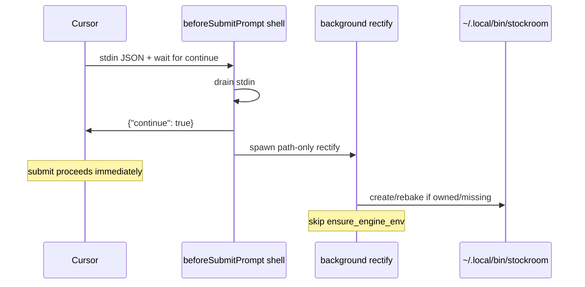

# Architecture Decision: Non-blocking trimmed beforeSubmitPrompt rectify

## Requirements & Constraints

**Ranked quality attributes:**
1. Non-blocking — must never delay Cursor prompt submit (`beforeSubmitPrompt` can gate send)
2. Trim / thrash avoidance — every-prompt frequency; no cold `uv sync` / torch work on the hot path
3. Heal the on-path shim when `sessionStart` missed (rebake/create for current `CURSOR_PLUGIN_ROOT`)
4. Simplicity & pattern alignment — keep sessionStart as the full heal+dashboard owner
5. Completeness of engine env — desirable but secondary here (`sessionStart` / `sr-initialize` remain)

**Technical constraints:** Cursor flat hooks JSON; drain stdin; emit `{"continue":true}`; `|| true`; existing `shim.rectify` / `ensure_engine_env`; no Claude change; no dashboard on this path.

**Boundaries:** In scope — Cursor `beforeSubmitPrompt` command shape + any thin CLI/flag needed for trim. Out of scope — `workspaceOpen`, Claude hooks, ingest/migrate, dashboard launch from this hook.

## Components

- **sessionStart hook** — full `rectify` (ensure-env + shim) + `stockroom dashboard` (unchanged)
- **beforeSubmitPrompt hook** — continue-first, background path-only heal
- **`stockroom.shim.rectify`** — today always calls `ensure_engine_env`; needs a path-only mode for the hot path

## Options Evaluated

- **A — Background full `shim rectify` after continue:** Same heal as sessionStart, detached; still runs `uv sync --check` (+ torch ensure) on every prompt when healthy.
- **B — Continue-first + path-only rectify (skip ensure-env):** New flag/mode: create/rebake shim only; env heal stays on sessionStart / explicit ensure-env.
- **C — Probe-then-heal in-process before continue:** Synchronous cheap header compare; only heal when drifted — still risks blocking if probe/IO stalls; more shell/Python complexity.
- **D — Tiny timeout synchronous full rectify:** Relies on fail-open; can still stall submit or kill mid-heal — rejects non-blocking requirement.

## Analysis

| Criterion | A Background full | B Path-only + continue-first | C Probe sync | D Tiny sync full |
|-----------|-------------------|------------------------------|--------------|------------------|
| Non-blocking | Good if continue printed first | Best | Weak (sync before continue) | Fail |
| Trim / thrash | Poor (`uv --check` every prompt) | Best | Medium | Poor |
| Shim heal on miss | Full | Path heal yes; env deferred | Yes when probe works | Fragile |
| Simplicity | High | Medium (one flag) | Higher | Low |
| Pattern alignment | sessionStart duplicate load | Clear split of duties | Extra probe layer | Against doctrine |

Key insights:
- Healthy `ensure_engine_env` still shells out to `uv sync --check` — not free at prompt frequency.
- Primary macOS miss symptom is missing/stale **shim bake** (needs `CURSOR_PLUGIN_ROOT`); env heal is orthogonal and already owned by sessionStart / initialize.
- Cursor requires a continue decision from this hook — parent must finish immediately; work belongs in a detached child.

## Decision

### Choice Pre-Mortem

- **Path-only leaves empty `.venv` after plugin move and sessionStart never fires:** checked — accepted; user still has `sr-initialize` / eventual sessionStart / explicit `shim ensure-env`; brief says rectify-only suspenders, not full sessionStart payload.
- **Background storms under rapid submits:** checked — path-only rebake is idempotent file write; still use `|| true` and no dashboard; optional later flock if needed (not required for v1).
- **Cursor still waits on shell until process exit even after JSON:** checked via docs — emit continue then exit parent after spawning child; keep hook `timeout` tiny (seconds) so a wedged parent cannot stall long; fail-open default if timeout.

**Selected**: Option B — Continue-first shell + background **path-only** rectify (skip `ensure_engine_env`)
**Rationale**: Satisfies non-blocking and trim (attrs 1–2) while still rebaking the shim with `CURSOR_PLUGIN_ROOT` when sessionStart missed (attr 3). Preserves sessionStart as sole automatic full ensure+dashboard owner (attr 4).
**Tradeoff**: Engine-env heal is not guaranteed on the suspenders path; cold empty `.venv` after a move may need sessionStart or `sr-initialize`.

## Implementation Notes

- Hook command sketch: drain stdin → `printf '%s\n' '{"continue":true}'` → background `{ uv python find …; PYTHONPATH=… "$PY" -m stockroom shim rectify --path-only …; } >/dev/null || true` → exit 0
- Add `rectify(..., ensure_env: bool = True)` or CLI `--path-only` / `--skip-ensure` (name in plan); default remains full ensure for sessionStart
- Cursor hook `timeout`: small (e.g. 5–15s) — only covers parent shell spawn+exit, not ensure budget
- Packaging tests: assert `beforeSubmitPrompt` exists, no `dashboard`, has continue JSON, has path-only/skip-ensure marker, sessionStart still full+300s
- Docs: lifecycle note that suspenders path is path-only
