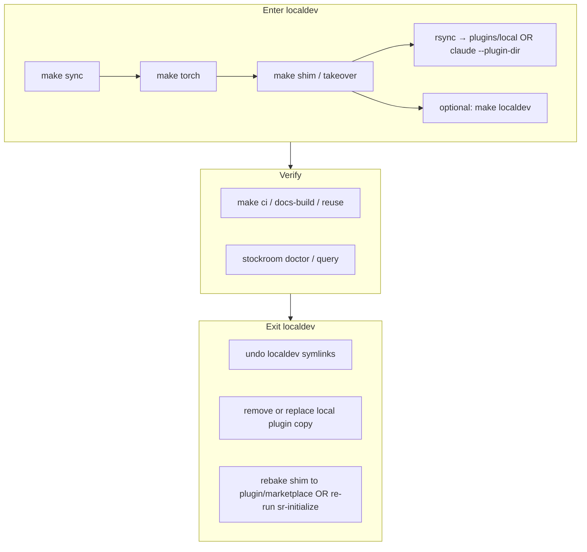

# Architecture Decision: contributor-localdev-round-trip

## Requirements & Constraints

**Functional**
- Enter: normal install → exclusive local checkout (on-path shim + engine + harness plugin/skills load).
- Verify: documented gates (`make ci`, docs/reuse as needed, ad-hoc `stockroom`).
- Exit: reverse path back to released/plugin install without a hybrid half-state.
- Capture footguns from archives + warehouse (torch strip after sync, no localdev undo, shim `--takeover` after marketplace uninstall, Cursor prefers rsync copy over symlink for `plugins/local`, third-party hooks toggle, marketplace UI ≠ local plugin path).

**Quality attributes (ranked)**
1. Footgun avoidance / correctness of the round-trip
2. Simplicity (no third end-user install UX; Makefile remains the checkout entrypoint)
3. Maintainability (docs and automation stay one story)
4. Discoverability for first-time contributors

**Technical constraints**
- End users stay on `sr-initialize` / marketplace — Contributing must not present `make`/`uv` as an alternative bootstrap.
- Existing pieces already exist: `make torch`, `make localdev`, `make shim`; no enter/exit orchestration or `localdev` undo today.
- Shim is baked-only succeed-or-refuse; owner `dev` vs harness ownership matters (`--takeover`).
- Cursor local plugin: real copy under `~/.cursor/plugins/local/stockroom/`; `make localdev` is a *different* surface (skills symlink farm in the checkout).
- Finished surfaces stay presentation-quality; Architecture/Advanced may only accrete notes.

**Boundaries**
- In scope: Contributing IA + any Makefile/script automation for enter/exit; necessary cross-links; notes dumps to Architecture/Advanced if content has no home.
- Out of scope: polishing Architecture/Advanced; changing end-user onboarding; inventing a marketplace substitute.

## Components

| Component | Responsibility today | Round-trip role |
| --- | --- | --- |
| Root Makefile | Dev entrypoint (`sync`/`torch`/`shim`/`localdev`/`ci`/docs) | Natural home for named mechanical steps |
| On-path shim | Baked engine + owner; rectify heals owned shims | Enter = bake `dev` (+ `--takeover` when needed); exit = rebake to harness/plugin |
| Engine venv | Locked deps; torch out-of-band | Enter includes torch after sync; verify may re-torch after `make ci` |
| `make localdev` | Skills-only symlink farm + pre-commit guard | Optional enter for skills iteration; **needs undo** |
| Cursor `plugins/local` | Full plugin snapshot via rsync | Enter for hooks/skills as installed plugin; exit removes/replaces |
| `docs/contributing/*` | development.md kitchen sink + licensing | Must narrate round-trip without becoming a second Makefile |

## Options Evaluated

- **A — Prose recipes only**: Document sequences; leave Makefile as today (maybe tiny undo). No orchestration targets.
- **B — Full Makefile orchestration**: `make contrib-enter` / `make contrib-exit` chain everything including rsync and takeover defaults.
- **C — Standalone scripts**: `scripts/contrib-*.sh` outside Makefile as the automation surface.
- **D — Hybrid thin targets + narrative docs**: Add only the missing mechanical named steps (especially undo, explicit local-plugin sync helper, documented shim takeover); Contributing pages own the ordered human story and when to use each surface.

## Analysis

| Criterion | A Prose | B Full make | C Scripts | D Hybrid |
|-----------|---------|-------------|-----------|----------|
| Footgun avoidance | Weak (operators already assemble ad-hoc and miss steps) | Strong if defaults are right; brittle if it hides ownership | Strong for enter, easy to diverge from Makefile | Strong for known pain; leaves human gates explicit |
| Simplicity | Highest for code | Medium — large target surface | Lowest — second entrypoint vs techContext | High — extends existing Makefile idiom |
| Maintainability | Docs drift from reality | Targets become SSOT; docs thin | Two homes for recipes | Docs narrate; make implements named atoms |
| End-user confusion risk | Low | Higher if names look like install | Higher | Low if named `localdev-*` / documented as contributor-only |
| Reversibility | High | Medium | Medium | High |

Key insights:
- Warehouse session `aef4448b` is the canonical enter path: sync → torch → shim (`--takeover` when marketplace-owned dead bake) → rsync local plugin → reload. That is a **procedure**, not one atomic tool.
- Session `bb1e3895` asked for localdev undo — Makefile has none. That is a clear mechanical gap prose cannot fix alone.
- `make localdev` and `plugins/local` rsync solve different problems; automation must not conflate them.
- Full enter/exit orchestration cannot safely own “reload window”, marketplace reinstall, or Claude durable marketplace install without pretending those are scriptable.
- Standalone `scripts/` fights the established “Makefile is the checkout entrypoint” pattern (`techContext.md`).

## Decision

### Choice Pre-Mortem

- **Over-automation hides ownership and people break exit**: checked — Hybrid keeps takeover/owner and exit rebake as explicit documented steps, not silent magic.
- **Prose-only leaves the same footguns we already hit**: checked — Hybrid adds undo + named helpers for the bits that bit us.
- **Contributor targets get mistaken for end-user install**: checked — naming stays under `localdev` / Contributing docs; doctrine already forbids make-as-bootstrap in Advanced/user-guide.

**Selected**: Option D — Hybrid thin Makefile targets + narrative Contributing docs  
**Rationale**: Maximizes footgun avoidance on the mechanical gaps we already observed, preserves Makefile-as-entrypoint simplicity, and keeps human/harness gates (reload, marketplace) honest in prose.  
**Tradeoff**: Contributors still follow a multi-step narrative (not one magic target); we accept that over a brittle mega-target.

## Implementation Notes

### Makefile atoms to add (thin)

- `localdev-clean` (or `localdev-undo`): remove `.cursor/skills/stockroom-local` symlinks and strip the managed pre-commit marker block (answers the Jul 9 operator question).
- Optional helper target for Cursor local plugin sync (e.g. `local-plugin` / `plugin-local`): `rsync` from repo root into `~/.cursor/plugins/local/stockroom/` with the documented excludes — so the recipe is not reinvented. Do **not** auto-reload the IDE.
- Document `make shim` + when `shim install --takeover` is required; if Makefile can pass through `--takeover` cleanly, prefer that over a raw python one-liner in docs. Do not invent a second owner model.

Do **not** ship a single `contrib-enter` that silently chains rsync+takeover+sync unless creative is revisited — the hybrid choice is *named atoms*, not a silent mega-pipeline. Docs may show a recommended ordered recipe calling those atoms.

### Contributing IA

- **`docs/contributing/local-workflow.md`** (name flexible): presentation-quality round-trip — Enter / Verify / Exit, with when to use `localdev` vs `plugins/local` vs Claude `--plugin-dir`.
- **`docs/contributing/development.md`**: day-to-day Makefile, torch-safe contract, two uv projects, ad-hoc invocation — not the lifecycle story.
- **`docs/contributing/licensing.md`**: keep.
- **`CONTRIBUTING.md`**: funnel points at local-workflow first for hackers, then development/licensing.
- Fix stale Makefile comment pointing at removed `docs/contributor-guide/torch.md`.

### Notes sinks

- Material that is “why the system is shaped this way” (shim ownership, heal after move) → rough notes under Architecture if not already covered.
- Power-user CLI that is not contributor-localdev → leave/confirm under Advanced; do not polish.

### Verification stance

- Docs-only gates: `make docs-build`, link hygiene, reuse if files touched.
- If Makefile targets are added: shell-level tests only if existing Makefile test infra exists; otherwise document manual verification of enter/undo idempotence (match prior `make localdev` idempotency checks from warehouse). Prefer not inventing pytest theater for Make.
