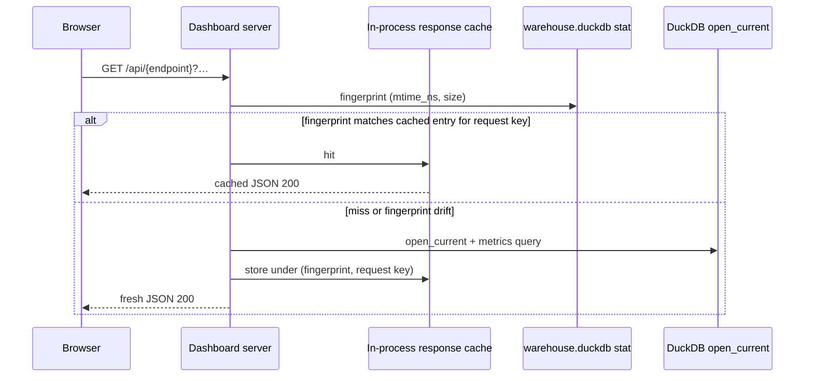

# Architecture Decision: Dashboard Cache Placement and Freshness Signal

## Requirements & Constraints

**Functional**
- After dashboard data has been computed once, a browser refresh must not wait on full metrics regeneration when the warehouse content is unchanged.
- Cache must invalidate when ingest writes new data.
- Cache must invalidate when backfill writes new data — even though backfill never touches `_sync_state` watermarks.
- Preserve existing JSON API contracts and status codes (200 / 400 / 404 / 503).

**Quality attributes (ranked)**
1. Correctness (no stale metrics after warehouse writes)
2. Performance on refresh when unchanged (skip expensive query work)
3. Simplicity / alignment with existing dashboard boundaries
4. Maintainability (no writer→dashboard coupling)
5. Scalability (single local user; process-local is enough)

**Technical constraints**
- Dashboard uses `warehouse.open_current` read-only; never migrates; never holds a reader lock between requests (`server.py` docstring).
- `ThreadingHTTPServer` — shared cache must be thread-safe.
- Long-lived dashboard process with identity-aware singleton on the port (`dashboard/__main__.py`); browser refresh remounts the SPA and clears client JS state.
- Live warehouse can be multi-GB (local machine ~14GB) — opening + querying on every parallel `/api/*` snapshot fetch is the pain.

**Out of scope**
- Changing ingest/backfill CLI or scheduling.
- Embedding pipeline UX; false invalidation after embed is acceptable if correctness is preserved.
- CDN / multi-machine cache.

## Components

- **Browser SPA**: always re-fetches on full page load (`fetchSnapshot` fan-out); no durable client snapshot today.
- **Dashboard HTTP server**: routes `/api/*` → metrics endpoints; owns process lifetime.
- **Warehouse file**: single-file DuckDB; any writer (ingest, backfill, embed, migrate) mutates the file.
- **`_sync_state`**: ingest watermark only; explicitly untouched by backfill.

## Options Evaluated

- **A · Server in-process cache + warehouse file fingerprint (`mtime_ns`, `size`)**: Cache JSON responses on the server; invalidate when the warehouse file’s cheap `stat()` fingerprint changes.
- **B · Server cache keyed only on `_sync_state` / watermark**: Reuse `max(updated_at)` / watermark as the cache epoch.
- **C · Explicit invalidation hooks in ingest + backfill**: Writers notify or clear a shared cache/token when they commit.
- **D · Client persistence (sessionStorage / localStorage) and/or HTTP `ETag`/`Cache-Control` alone**: Keep payloads in the browser or rely on conditional GETs without a server compute cache.

## Analysis

| Criterion | A File fingerprint | B Watermark only | C Writer hooks | D Client / HTTP only |
|-----------|--------------------|------------------|----------------|----------------------|
| Fitness (ingest+backfill) | Covers any file writer | Misses backfill | Covers only hooked writers | Does not stop server recompute on hard refresh unless perfectly tuned |
| Simplicity | Small module on server | Small but wrong | Cross-package coupling | SPA + header complexity |
| Maintainability | Dashboard-local | Dashboard-local | Ingest/backfill must know dashboard | Split brain browser/server |
| Risk | False invalidate on embed/migrate (safe) | Silent staleness after backfill | Missed writer = silent staleness | Hard refresh / process restart still slow |

Key insights:
- Watermark-only is eliminated by the product invariant that backfill must not move `_sync_state`.
- Verified: DuckDB write updates `st_mtime_ns` and `st_size`; read-only open leaves both unchanged.
- User pain is full page refresh against a long-lived local server — server-side hit addresses that directly.
- False invalidation from embed/migrate is rare and correctness-preserving; preferred over under-invalidation.

## Decision

### Choice Pre-Mortem

- DuckDB (or OS) might not bump warehouse file mtime/size on every commit path: **checked** — local proof with create + insert shows both change; read-only open does not.
- Dashboard process might restart on every browser refresh, emptying an in-process cache: **checked** — CLI is identity-aware long-lived listener; refresh remounts SPA only.
- File fingerprint might miss in-DB mutations that somehow leave file metadata unchanged: **checked for normal DuckDB commit path**; residual risk accepted as lower than watermark-only staleness; if ever observed, escalate to SQL content epoch.

**Selected**: Option A — server in-process response cache keyed by warehouse file fingerprint `(mtime_ns, size)` plus normalized request identity (endpoint + query params).
**Rationale**: Best correctness for ingest+backfill without writer coupling; matches ranked attributes (correctness → refresh performance → simplicity); aligns with dashboard owning read path only.
**Tradeoff**: Conservative false invalidation after unrelated warehouse writers (e.g. embed); cold cache after dashboard process replace/restart.

## Implementation Notes

- New small helper (e.g. `stockroom.dashboard.cache` or methods on `_DashboardServer`) holding a thread-safe map: `(fingerprint, endpoint, canonical_query) → JSON-serializable payload` (or encoded body).
- On each API GET: `stat` warehouse path (missing file → existing 503 path); compare fingerprint; hit returns cached 200 without opening DuckDB when safe; miss opens `open_current`, computes, stores.
- Cap or clear entire cache when fingerprint changes (simplest: drop all entries on fingerprint drift; optional LRU later only if memory pressure shows up).
- Do not change ingest/backfill modules for invalidation.
- Optional later: emit `ETag` derived from fingerprint for free 304s — not required for MVP if in-process hit already skips query work.
- Session detail and paged sessions list are cacheable under the same scheme (same fingerprint + distinct request keys).
