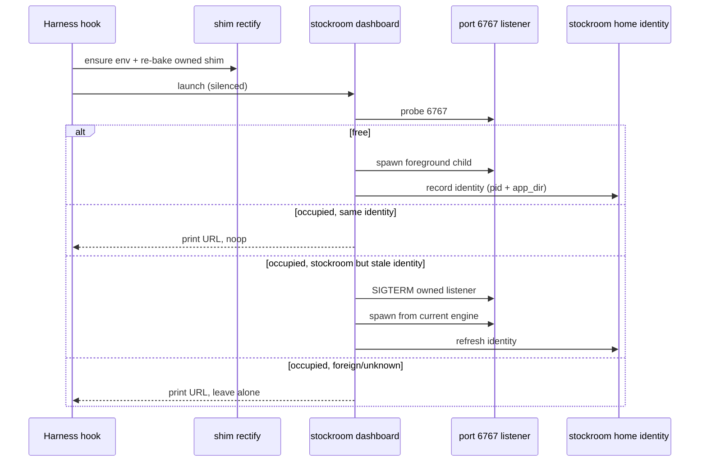

# Architecture Decision: Dashboard Lifecycle After Plugin Move

## Requirements & Constraints

### Problem

After a plugin-root move, session/workspace hooks already heal the on-path shim and engine env ([#17](https://github.com/Texarkanine/stockroom/issues/17) / `20260710-fix-plugin-env-heal-after-move`). The remaining gap: a **detached dashboard process** started from the old engine path keeps listening on port 6767. The launcher treats "port occupied" as success (`probe` → print URL → exit), so the new code never binds. Operator evidence: shim `APP_DIR` updates to the cache plugin path, `stockroom doctor smoke` works, but `ps` still shows the old `.../plugins/local/stockroom/.../.venv/bin/python3 -m stockroom.dashboard --foreground --port 6767`.

### Functional requirements

1. After one hook/session cycle that heals the shim to a new engine dir, the process serving `http://127.0.0.1:6767/` must be that new engine (or an equivalent identity), not a leftover from a dead plugin path.
2. Multi-harness: Cursor and Claude may both be open; closing one must not tear down a dashboard the other still relies on.
3. Preserve the existing hook contract: idempotent, fire-and-forget, never errors, never ingests/migrates (`productContext.md` / `systemPatterns.md`).
4. Do not kill unrelated listeners on 6767 (foreign processes).

### Ranked quality attributes

1. **Correctness after plugin move** — the actual reliability gap
2. **Multi-harness safety** — no harness-scoped stop that orphans the other
3. **Simplicity** — extend the existing "OS bind is mutex" launcher; avoid new daemons/supervisors
4. **Hook never-error** — replace/restart failures must degrade to current "URL printed, old server maybe still up" rather than fail the hook
5. **Safety of process control** — only touch processes we can prove are stockroom's dashboard

### Technical constraints

- Dashboard is intentionally detached (`start_new_session=True`) and machine-scoped (one port, shared warehouse) — see `dashboard/__main__.py` and p4 archive.
- Cursor: `workspaceOpen` is the app-lifecycle start hook; `sessionEnd` / `stop` are **agent** lifecycle, not IDE/workspace close. No `workspaceClose` in current Cursor hooks docs ([Cursor Hooks](https://cursor.com/docs/hooks)).
- Claude Code: `SessionEnd` exists but reasons include `clear` / `resume` (conversation ends, process often stays); not a reliable "harness exited" signal, and still harness-scoped.
- Shim is single-owner / single baked `APP_DIR` (`stockroom.shim`); dashboard identity should track the **engine that just ran `stockroom dashboard`**, not "this harness's plugin root" in isolation.
- Durable machine state already lives under stockroom home (torch freeze pattern).

### Scope

- **In:** how the running dashboard stays aligned with the healed engine across plugin moves and multi-harness use.
- **Out:** changing port selection, making the dashboard migrate, ingest-on-hook, or a general process supervisor.

## Components

| Component | Responsibility |
| --- | --- |
| Session/workspace **start** hooks | Rectify shim + call `stockroom dashboard`; still no stop/cleanup role |
| `stockroom dashboard` launcher | Probe, spawn, and (new) identity-aware replace |
| Detached foreground child | Own the HTTP loop until replaced or machine reboot |
| Identity record under stockroom home | Prove "this listener is ours" and "which `APP_DIR` it came from" |

## Options Evaluated

- **A — Close/stop hooks kill the dashboard**: Wire Cursor `sessionEnd` / Claude `SessionEnd` (or similar) to `stockroom dashboard stop`. Rejected as primary design.
- **B — Start-time identity-aware replace**: On launch, if 6767 is held by a stockroom dashboard whose recorded/observed engine identity ≠ current launcher identity, terminate that listener and spawn from the current engine. Foreign listeners untouched.
- **C — Cooperative self-exit via generation stamp**: Running server polls a stamp under stockroom home; exits when stamp ≠ its boot identity; next start binds. Soft variant of B.
- **D — Refcounted harness leases + close hooks**: Each start registers a lease; each end drops one; stop at zero. Requires reliable close hooks and correct lease semantics across clear/resume/crash.

## Analysis

| Criterion | A Close hooks | B Start-time replace | C Self-exit stamp | D Refcounted leases |
| --- | --- | --- | --- | --- |
| Fitness (stale after move) | Poor — close may never run; start still no-ops on busy port | Strong — next start after heal replaces | Strong — if stamp updated at rectify/launch | Strong if leases work; still needs start replace if close missed |
| Multi-harness safety | **Fails** — Claude exit kills Cursor's UI | Strong — no stop-on-close | Strong | Intended, but lease bugs = flapping |
| Simplicity | Hook sprawl + stop CLI | Small extension to existing launcher | Server loop + stamp writer | New lease protocol + close hooks |
| Hook never-error | Stop failures / races | Degrade to noop on kill failure | Degrade to stale until next start | Complex failure modes |
| Process-control safety | Easy to over-kill | Gated on owned identity | Self-only | Gated on leases |
| Risk / reversibility | High product footgun | Low — localized to launcher | Medium — timing/polling | High — distributed state for a local tool |

Key insights:

- The dashboard is a **machine singleton**, not a harness session resource. Product and p4 already treat start hooks as "ensure it's up," not "tie lifetime to this IDE." Close hooks fight that model.
- Cursor has no workspace-close app hook; agent `sessionEnd`/`stop` fire far too often or at the wrong grain. Claude `SessionEnd` is similarly wrong for "last harness left the building," and unreliable across `clear`/`resume`.
- The bug is not "dashboard outlives the IDE" (that is desired). The bug is **"port probe equates any listener with a current listener."** Fix the identity check at the place that already runs after every heal: start launch.
- Option C is viable but adds in-process polling for the same outcome B gets synchronously at the next hook. Prefer B; C remains a fallback if external SIGTERM proves too awkward on some platform.

## Decision

### Choice Pre-Mortem

- **Same-path in-place code update without `APP_DIR` or version change leaves a stale binary running**: partially checked — marketplace/cache installs change hash directories (operator repro); local/dev same-path updates are a weaker case. Mitigate by recording plugin/engine version (or content stamp) alongside `app_dir`, not path alone. Residual gap for "edit files in place, no version bump" is acceptable for v1.
- **Mis-identifying a foreign process on 6767 and killing it**: checked — require owned identity (pidfile we wrote and/or cmdline/`sys.executable` match for `stockroom.dashboard`); unknown → leave alone (current behavior).
- **Assuming close hooks would become reliable later**: checked against current Cursor/Claude docs — even if they improve, multi-harness still makes stop-on-close the wrong default.

**Selected**: Option B — start-time identity-aware replace (machine-scoped singleton; no close-hook lifecycle).

**Rationale**: Correctness after plugin move is achieved on the same path that already heals the shim (`rectify` then `dashboard`). Multi-harness safety is preserved because nothing stops the dashboard when one harness exits. Simplicity stays inside the existing launcher and stockroom-home durable-state pattern. Close hooks fail the multi-harness requirement and lack a reliable IDE-lifetime signal on Cursor.

**Tradeoff**: An orphan dashboard may keep running after all harnesses close until reboot or the next start replaces it — accepted and already true today. Same-path upgrades without an identity bump may not restart until path/version changes — accept or add a version stamp in the identity record.

## Implementation Notes

- Extend `stockroom.dashboard` launcher (not hooks JSON): when probe succeeds, decide **reuse** vs **replace** vs **leave foreign**.
- Identity record under stockroom home (e.g. `dashboard.identity` / pidfile): at minimum `pid` + absolute `app_dir` (and preferably engine/plugin version). Write after successful spawn; refresh on replace.
- Staleness rule: listener is stockroom-owned AND (`app_dir` ≠ current engine dir OR version ≠ current). Current engine dir = the `APP_DIR` implied by this process (shim-launched `sys.executable` / project root), consistent with baked shim.
- Replace: SIGTERM owned pid → brief wait for port free → existing spawn path. Kill failure → print URL, exit 0 (hook contract).
- Do **not** add SessionEnd / sessionEnd / stop hooks for dashboard shutdown.
- Optional later: `stockroom dashboard stop` for operators; not required for heal.
- Tests: unit-test the decision matrix (free / same identity / stale owned / foreign) with injectable probe/pid/kill/spawn; do not require live multi-harness.
- Docs: one sentence in using/development — dashboard is machine-scoped; plugin moves restart it on next session start via identity check.
