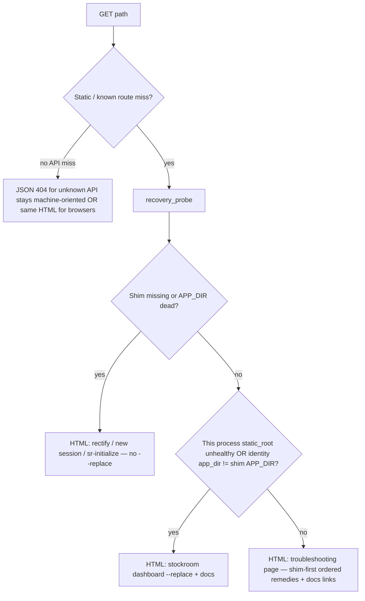

# Architecture Decision: Dashboard recovery detection vs generic troubleshooting

## Requirements & Constraints

**Ranked quality attributes:**
1. **Never** advise `stockroom dashboard --replace` when the shim needs rectifying (hard rule)
2. Prefer targeted guidance when detection is reliable
3. Always better than bare JSON `{"error":"not found"}` for HTTP static/API unknown routes that users hit when the UI is broken
4. Simplicity — no new deps; reuse shim header + identity + filesystem probes
5. Do not disturb SPA/data 404s (unknown session already handled in JS)

**Technical constraints:** Dashboard process may be half-dead (plugin dir deleted → static files missing); may still execute Python already loaded; on-path shim at `~/.local/bin/stockroom` with `STOCKROOM_OWNER` / `STOCKROOM_APP_DIR` headers; identity file under stockroom home.

**Boundaries:** In scope — server-side HTTP 404 / static-miss recovery page + probe ordering. Out of scope — fixing `?view=cowboy` noop; changing session-not-found SPA copy; Claude.

## Components

- **`stockroom.shim`** — header parse already exists (`_read_header`); reuse for probe
- **`dashboard.server`** — today `_not_found()` → JSON; becomes HTML recovery when `Accept` looks like a browser / for static misses
- **`dashboard.identity`** — optional cross-check that listener record disagrees with live shim target

## Options Evaluated

- **A — Targeted probe with ordered remedies:** Classify shim-dead vs stale-listener vs unknown; message accordingly; hard rule encoded in classifier.
- **B — Generic pretty troubleshooting only:** Always same HTML with shim-first ordered commands + docs; no classifier.
- **C — Redirect to docs site only:** External link; weak offline story; no local commands.
- **D — Leave JSON 404; fix only hooks:** Ignores accepted recovery-UX requirement.

## Analysis

| Criterion | A Probe | B Generic HTML | C Docs redirect | D JSON |
|-----------|---------|----------------|-----------------|--------|
| Hard rule (no false --replace) | Strong if shim-dead short-circuits | Strong if copy orders shim first and never leads with --replace alone | Weak | N/A |
| Targeted guidance | Best | Medium | Weak | None |
| Simplicity | Medium | Best | Best | Trivial |
| Offline / local | Good | Good | Poor | Useless |
| Fits brief | Preferred path | Explicit fallback | Insufficient | Rejected |

Key insights:
- `--replace` uses the on-path shim to spawn from the **current** engine; if the shim is dead/missing, `--replace` cannot be the first advice.
- Static root missing while process still listens is exactly "dashboard needs replace" **only after** shim points at a live engine.
- Browser navigations to `/cute-puppies` and true stale-root misses share `_not_found` today; classifier + generic fallback covers both without caring about SPA routes (those are `/` → index.html).

## Decision

### Choice Pre-Mortem

- **False positive shim-dead (transient FS / permissions) blocks --replace advice forever:** checked — message can include secondary "if shim already works: `--replace`" only on the generic page; shim-dead page omits `--replace` entirely.
- **Probe imports pull duckdb into 404 path:** checked — keep probe on stdlib + existing shim header helpers; no warehouse open on 404.
- **API clients break if `/api/unknown` becomes HTML:** checked — keep `Content-Type` JSON for `/api/*` 404s; HTML recovery for static/document requests only (or `Accept: text/html`).

**Selected**: Option A — **ordered recovery probe** with Option B as the terminal bucket (unknown / healthy-looking miss)
**Rationale**: Encodes the hard rule in control flow (shim-dead → never `--replace`). Still always ships a pretty page instead of bare JSON for document/static 404s. Generic bucket satisfies the brief's explicit fallback.
**Tradeoff**: Slightly more server logic and tests than a single static HTML blurb; worth it for the hard rule.

## Implementation Notes

- Add something like `dashboard.recovery.classify() -> shim_rectify | dashboard_replace | generic` using:
  1. Read on-path shim header (absent/unreadable/foreign → treat as needs rectify guidance, not `--replace`)
  2. `APP_DIR/pyproject.toml` missing → shim_rectify
  3. Else if `static_root` missing expected files (e.g. `index.html`) OR identity `app_dir` ≠ shim `APP_DIR` → dashboard_replace
  4. Else → generic troubleshooting (ordered: rectify / new session, then `--replace`, docs link)
- `_not_found` for non-API: render small self-contained HTML (inline CSS ok; match dashboard tokens lightly if easy — not a design-system project)
- Canonical docs link: `docs/user-guide/troubleshooting/index.md#dashboard` (and/or dashboard lifecycle) — use the published properdocs URL pattern already used elsewhere if one exists
- Remedies copy:
  - shim: new Cursor session (sessionStart) / wait for beforeSubmitPrompt heal / `sr-initialize` / last-resort bind — **no** `--replace`
  - replace: `stockroom dashboard --replace`
- Tests: unit-test classifier matrix; HTTP test that static 404 returns HTML with expected substring per class; API 404 stays JSON
