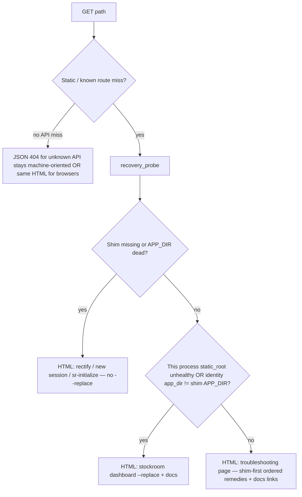

# Architecture Decision: Dashboard recovery detection vs generic troubleshooting

## Requirements & Constraints

**Ranked quality attributes:**
1. **Never** advise `stockroom dashboard --replace` when the shim needs rectifying (hard rule)
2. Prefer targeted guidance when detection is reliable
3. Always better than bare JSON `{"error":"not found"}` for HTTP static/API unknown routes that users hit when the UI is broken
4. Simplicity — no new deps; reuse shim header + identity + filesystem probes
5. Do not disturb SPA/data 404s (unknown session already handled in JS)

**Technical constraints:** Dashboard process may be half-dead (plugin dir deleted → static files missing); may still execute Python already loaded; on-path shim at `~/.local/bin/stockroom` with `STOCKROOM_OWNER` / `STOCKROOM_APP_DIR` headers; identity file under stockroom home.

**Boundaries:** In scope — server-side HTTP 404 / static-miss recovery page + probe ordering. Out of scope — fixing `?view=cowboy` noop; changing session-not-found SPA copy; Claude.

## Components

- **`stockroom.shim`** — header parse already exists (`_read_header`); reuse for probe
- **`dashboard.server`** — today `_not_found()` → JSON; becomes HTML recovery when `Accept` looks like a browser / for static misses
- **`dashboard.identity`** — optional cross-check that listener record disagrees with live shim target

## Options Evaluated

- **A — Targeted probe with ordered remedies:** Classify shim-dead vs stale-listener vs unknown; message accordingly; hard rule encoded in classifier.
- **B — Generic pretty troubleshooting only:** Always same HTML with shim-first ordered commands + docs; no classifier.
- **C — Redirect to docs site only:** External link; weak offline story; no local commands.
- **D — Leave JSON 404; fix only hooks:** Ignores accepted recovery-UX requirement.

## Analysis

| Criterion | A Probe | B Generic HTML | C Docs redirect | D JSON |
|-----------|---------|----------------|-----------------|--------|
| Hard rule (no false --replace) | Strong if shim-dead short-circuits | Strong if copy orders shim first and never leads with --replace alone | Weak | N/A |
| Targeted guidance | Best | Medium | Weak | None |
| Simplicity | Medium | Best | Best | Trivial |
| Offline / local | Good | Good | Poor | Useless |
| Fits brief | Preferred path | Explicit fallback | Insufficient | Rejected |

Key insights:
- `--replace` uses the on-path shim to spawn from the **current** engine; if the shim is dead/missing, `--replace` cannot be the first advice.
- Static root missing while process still listens is exactly "dashboard needs replace" **only after** shim points at a live engine.
- Browser navigations to `/cute-puppies` and true stale-root misses share `_not_found` today; classifier + generic fallback covers both without caring about SPA routes (those are `/` → index.html).

## Decision

### Choice Pre-Mortem

- **False positive shim-dead (transient FS / permissions) blocks --replace advice forever:** checked — message can include secondary "if shim already works: `--replace`" only on the generic page; shim-dead page omits `--replace` entirely.
- **Probe imports pull duckdb into 404 path:** checked — keep probe on stdlib + existing shim header helpers; no warehouse open on 404.
- **API clients break if `/api/unknown` becomes HTML:** checked — keep `Content-Type` JSON for `/api/*` 404s; HTML recovery for static/document requests only (or `Accept: text/html`).

**Selected (original creative):** Option A — ordered recovery probe with Option B as terminal bucket  
**Superseded (operator MVP, 2026-07-30):** Option B only — **one generic diagnostic page**

**Rationale (MVP):** Path-only `beforeSubmitPrompt` leaves env-heal undiagnosed; a half-wrong classifier that can still push `--replace` is worse than one honest page. The running process can do richer FS probes later, but MVP is “recognize broken → serve in-memory diagnostic HTML.” Exact classification deferred.

**Tradeoff:** Less targeted in-page root-cause messaging; relies on ordered remedies + online manual links (including ensure-env / `sr-initialize`, not only path rectify / `--replace`).

## Implementation Notes

### MVP (ship this)

- `dashboard.recovery`: render one self-contained HTML page from string constants (import at server startup so it survives plugin-dir deletion)
- Static/document miss (including `/` when `index.html` is gone) → that page; keep `_not_found()` JSON for `/api/*` and session miss
- Page content: short explanation + **ordered** remedies (shim/session heal → `shim ensure-env` / `sr-initialize` → `stockroom dashboard --replace`) + links to `https://texarkanine.github.io/stockroom/user-guide/troubleshooting/` (and anchors for dashboard / installed-layout / torch as docs allow)
- Tests: HTML content contracts + HTTP static 404 → HTML; API 404 → JSON. **No classifier matrix.**

### Deferred

- FS probes / `classify()` for shim-dead vs needs-replace vs env-incomplete (process *can* do some of this while code is still in memory; not this task)
