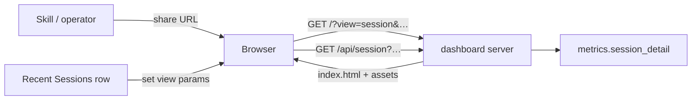

# Architecture Decision: Deep-link URL & Client Navigation

## Requirements & Constraints

**Functional**
- Address any session by `(harness, session_id)` with a stable, shareable URL
- Recent Sessions click uses the same addressing mechanism
- Skills can construct the URL from known identifiers
- Refresh / paste-into-browser must land on the session view

**Quality attributes (ranked)**
1. Simplicity — no SPA framework, no bundler, minimal server change
2. Deep-link reliability for skills / chat / terminals (URLs that survive copy-paste)
3. Alignment with existing static `ThreadingHTTPServer` (path → file under `static/`)
4. Reversibility — easy to change later without schema or API churn

**Technical constraints**
- Today: `/` → `index.html`; unknown paths 404; no hash router; filters are client-only (not in URL)
- Composite PK is `(harness, session_id)` — both required
- Offline loopback dashboard

**Out of scope**
- Putting Aggregate/Compare date filters into the URL (may come later; must not collide)
- Multi-page app framework

## Components

## Options Evaluated

- **A — Query params on `/`**: `http://127.0.0.1:58008/?view=session&harness=<h>&session=<id>` — client reads `URLSearchParams`, toggles metrics vs session pane; refresh-safe because path stays `/`
- **B — Hash route**: `http://127.0.0.1:58008/#/session/<h>/<id>` — pure client state; no server change; fragments often stripped or mishandled by terminals/markdown
- **C — Path route + SPA fallback**: `http://127.0.0.1:58008/session/<h>/<id>` — clean URLs; requires serving `index.html` for unknown paths; encoding edge cases for ids; more server surface
- **D — Separate `session.html`**: second document sharing modules — clearer file split, but duplicates shell/CSS wiring and splits the product surface

## Analysis

| Criterion | A Query on `/` | B Hash | C Path + fallback | D session.html |
|-----------|----------------|--------|-------------------|----------------|
| Fitness | Full | Full | Full | Full |
| Simplicity | Highest | High | Medium | Medium |
| Skill/copy reliability | High | Lower (fragments) | High | High |
| Server change | None | None | Required | None (new static file only) |
| Risk / reversibility | Low | Low | Medium | Medium (two shells) |

Key insights:
- Path routing's only real win is aesthetics; cost is SPA fallback and path-encoding of opaque ids
- Hash is idiomatic for SPAs but is the weakest for "skills offer a link" (fragment handling)
- Explicit `view=session` namespaces the mode so future filter-in-URL work can coexist

## Decision

### Choice Pre-Mortem

- **Future filter query params collide with `session`/`harness`**: mitigated by required `view=session` gate and reserved param names — checked in Implementation Notes
- **`session_id` characters break URLs**: must use `encodeURIComponent` / `URLSearchParams` — checked
- **Operators expect pretty `/session/…` paths**: aesthetic only; reversible later via redirect or dual support — accepted tradeoff, not a blocker

**Selected**: Option A — Query params on `/` with `view=session&harness=&session=`
**Rationale**: Best simplicity + skill-link reliability with zero server routing change; matches ranked attributes 1–3
**Tradeoff**: URLs are less "pretty" than path routes; accepted

## Implementation Notes

- Canonical template: `http://127.0.0.1:58008/?view=session&harness={harness}&session={session_id}`
- On boot: if `view=session` and both ids present → fetch detail + show session pane; else metrics pane
- Recent Sessions click: `history.pushState` / `replaceState` updating search params (same template), then render session view
- Back / clearing params restores metrics pane (`popstate` listener)
- Document the template in `sr-dashboard` (and a one-liner in search/query skills if they surface session ids)
- Do not put Aggregate date-range state into these params in this task
