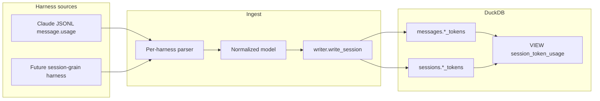

# Architecture Decision: Dual-Grain Token Storage & Rollup Surface

## Requirements & Constraints

**Functional**
- Keep Claude message-grain tokens on `messages` (already ingested).
- Easy per-session token rollups for message-grain sources.
- Cheap path when a future harness reports session-grain totals only.
- Never invent message-level tokens from session totals.
- No Cursor usage attribution from CSV/API.

**Quality attributes (ranked)**
1. **Correctness / one meaning per field** — grain honesty over convenience.
2. **Maintainability / pattern alignment** — match existing dual-grain precedent.
3. **Simplicity** — fewest new abstractions that meet (1)–(2).
4. **Query ergonomics** — rollups are one obvious object, not tribal SQL.
5. **Performance** — personal-scale DuckDB; avoid premature indexes.

**Technical constraints**
- Forward-only DuckDB migrations; `ADD COLUMN` / `CREATE VIEW` are cheap.
- Schema already encodes dual grain for models: `messages.model` vs `sessions.models` (0001 comments).
- Ingest: parsers → `NormalizedSession`/`NormalizedMessage` → writer-only SQL.
- No new dependencies.

**Out of scope**
- Cursor dashboard CSV/Admin API enricher.
- Dashboard UI token cards (unless a tiny docs example).
- Fabricating per-message splits from session totals.

## Components

- **Parsers**: fill only the grain the harness actually reports.
- **Writer**: persists typed columns; no aggregation inventing the other grain.
- **VIEW**: read-time rollup surface; coalesces without mutating stored grain.

## Options Evaluated

- **A — Messages only + docs SUM**: Keep status quo; document `SUM` SQL; add session columns later when needed.
- **B — Dual typed columns + rollup VIEW**: Add nullable `sessions.*_tokens` now (NULL for Claude/Cursor); VIEW exposes message sums, native session totals, and an effective rollup (`COALESCE(native, sum)`); no extra index.
- **C — Separate `token_usage` fact table**: Rows with grain discriminator + FK to message or session.

## Analysis

| Criterion | A Docs SUM | B Dual cols + VIEW | C Fact table |
|-----------|------------|--------------------|--------------|
| Fitness | Rollups possible but not idiomatic; session-grain later is another migration + API surface | Meets rollup + future grain now | Meets grain flexibility |
| Pattern alignment | Weak — ignores model dual-grain precedent for a similar problem | Strong — same shape as `model`/`models` | Conflicts — tokens become a parallel store |
| Simplicity | Simplest short-term | One migration + view + thin ingest fields | New table, writer paths, join rules |
| Ergonomics | Tribal SQL | `SELECT * FROM session_token_usage` | Flexible but heavier for callers |
| Risk / reversibility | Cheap later ADD COLUMN, but rollup contract deferred | Cheap; VIEW replaceable; columns nullable | Harder to unwind; overbuilt for two grains |

Key insights:
- 0001 already chose dual columns for cross-grain metrics (`model` vs `models`). Tokens are the same problem.
- A fact table solves a problem we do not have (many observations per entity, mixed non-entity grains).
- An index is unnecessary: `messages` PK is `(harness, session_id, message_id)`; session `GROUP BY` is already the leading key. Personal warehouse scale does not justify ART indexes for this.
- `COALESCE(session_native, message_sum)` is safe if harnesses fill only one grain (enforced by ingest discipline, same as models).

## Decision

### Choice Pre-Mortem

- **A future harness reports both grains and they disagree, so COALESCE hides conflict**: checked — same discipline as models; ingest fills only the reported grain; VIEW can expose both `*_native` and `*_from_messages` so disagreement is visible if it ever appears.
- **VIEW becomes a fake “source of truth” and writers start writing only to the view’s effective columns**: checked — views are read-only; writer continues to target base tables only; docs state grain ownership.
- **Adding session columns now is premature YAGNI**: checked — columns are nullable no-ops today; alternative (add later) is equally cheap, but deferring loses the single rollup contract the brief asked for. Preference for explicit schema now wins on ergonomics (rank 4) without harming simplicity much.

**Selected**: Option B — Dual typed columns on `sessions` + `session_token_usage` VIEW  
**Rationale**: Matches the established dual-grain pattern, makes rollups one query, and makes session-grain onboarding an ingest fill — not a redesign. Correctness and pattern alignment beat a fact table; ergonomics beat docs-only SUM.  
**Tradeoff**: Slight schema surface growth before a session-grain harness exists; accepted because nullability keeps it inert and ADD COLUMN now vs later is the same cost class.

## Implementation Notes

- Migration `0007_session_token_usage.sql` (name flexible):
  - `ALTER TABLE sessions ADD COLUMN` for `input_tokens`, `output_tokens`, `cache_creation_tokens`, `cache_read_tokens` (BIGINT, nullable).
  - `CREATE VIEW session_token_usage AS …` joining `sessions` to aggregated `messages`, exposing at least: `harness`, `session_id`, `*_from_messages`, `*_native` (session columns), `*_total` / effective via `COALESCE(*_native, *_from_messages)`, and optionally `token_grain` (`'session' | 'message' | 'none'`).
- Extend `NormalizedSession` + writer to persist session token fields (always `NULL` for Claude/Cursor today).
- Do **not** backfill Claude session columns from `SUM(messages)`.
- No secondary index.
- Docs (`docs/user-guide/search.md` and/or schema notes): show `session_token_usage` as the rollup entrypoint; remind message-level detail stays on `messages`.
- Schema golden snapshot + migration tests updated per existing contract.
