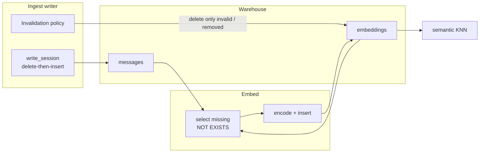

# Architecture Decision: Embedding Invalidation on Ingest

## Requirements & Constraints

### Open question

How should ingest treat message embeddings when it rewrite-replaces a session, so that we (1) recompute only missing/invalid vectors, (2) avoid recomputing vectors that are still valid, and (3) survive the failure mode **ingest succeeded, embed failed** without leaving semantic search stranded?

### Functional requirements

1. **Must** recompute embeddings that are missing (never written) or invalid (owner text no longer matches what the vector represents).
2. **Must not** recompute embeddings whose owner message text is unchanged.
3. After ingest without a successful embed, semantic search must remain useful for the bulk of already-embedded history (not collapse to near-empty).
4. Embed's existing selection (`NOT EXISTS` current-model vector per message) remains the recompute engine — invalidation only decides *which* vectors disappear so embed can refill them.

### Ranked quality attributes

1. **Correctness** — no durable stale vector for changed text (hard).
2. **Lag resilience** — ingest/embed decoupling must not strand semantic (operator goal; currently violated).
3. **Minimal recomputation** — especially the append-only / session-grew case (operator goal).
4. **Simplicity** — prefer extending the existing writer pattern over new subsystems.
5. **Schema thrift** — avoid migrations unless they buy something text-compare cannot.

### Technical constraints

- Ingest writer is delete-then-insert per `(harness, session_id)` (`ingest/writer.py`); that shape stays unless this decision replaces it.
- `message_id = '{session_id}#{ordinal}'` is the join key; embeddings are derived (`owner_table='messages'`, `owner_id=message_id`).
- Embed already incremental via `NOT EXISTS` + `--full`; model change already forces replace (PK excludes `embed_model`).
- Status quo (Phase 2 m1 **option B**): blanket session-grain embedding cascade on every rewrite — zero schema change, maximal invalidation.
- Creative doc `creative-incremental-reembed-detection.md` was cleared at m1→m2; surviving authority is code comments + `memory-bank/archive/systems/20260707-p2-embeddings-search.md`.
- Nightly is ingest-then-embed; torch can be missing (observed Jul 11–12 2026) — embed failure after successful ingest is a real ops mode, not theoretical.

### Scope

**In:** when/how embeddings are deleted or retained across session rewrite; interaction with embed selection; failure semantics under lag.

**Out:** torch provisioning / heal (necessary ops, orthogonal); changing chunking/model; embedding tool_calls; merging ingest+embed into one transaction; soft-search ranking tweaks.

## Components

Today `I` = "delete all embeddings for every message in the rewritten session." Embed refill is separate and may never run.

`write_session` already loads prior rows before delete to carry `first_seen_at` — a natural hook for a finer invalidation compare.

## Options Evaluated

- **Option A — Keep blanket session cascade (status quo)**: On every session rewrite, delete all that session's message embeddings; embed refills everything missing.
- **Option B — Surgical invalidation by text compare (compare-and-keep)**: Before rewrite, load `message_id → text`. After computing the new message set, delete embeddings only for removed ids or ids whose text changed; leave unchanged ids' vectors alone. No schema migration.
- **Option C — Content-hash column**: Persist a hash on `messages` (or beside embeddings); invalidate when hash differs. Same selection semantics as B, with a migration and a stored fingerprint.
- **Option D — Soft-stale / deferred replace**: Never delete at ingest; mark stale (flag/table) or replace only inside embed; semantic may serve old vectors for changed text until re-embed.

## Analysis

| Criterion | A Cascade | B Text compare | C Content hash | D Soft-stale |
|-----------|-----------|----------------|----------------|--------------|
| Fitness (correct + minimal recompute + lag resilience) | Correct; fails minimal recompute and lag resilience | Meets all three | Meets all three | Strong lag resilience; weak correctness if stale served |
| Alignment with constraints | Matches m1 option B | Extends existing pre-delete carry-forward | Needs migration | Needs flag + semantic policy |
| Simplicity | Simplest delete rule | Small writer change; one compare | Migration + write path | More moving parts |
| Maintainability | Easy to explain; expensive ops behavior | Clear invariant: vector valid iff text equal | Clear; hash algorithm is another contract | Stale-vs-fresh policy forever |
| Scalability (session growth) | Re-embeds whole session on every mtime bump | Re-embeds only new/changed | Same as B | Re-embeds only in embed pass; search may be wrong meantime |
| Risk / reversibility | Known-bad under torch gap | Low; easy to revert to A | Medium (migration) | Medium (semantic semantics change) |

Key insights:

- The stranded failure mode is caused by **eager delete-before-successful-recompute**, not by incremental embed selection. Any design that keeps valid vectors across ingest automatically satisfies goal (2) for the common append case.
- Append-only growth (the nightly common path) changes few/no existing texts — A recomputes the world; B/C recompute roughly the delta.
- B and C are semantically equivalent if the hash is of the exact stored `text`. C does not buy lag resilience beyond B; it only avoids holding old text in memory and enables future cross-process checks. Given messages are already parsed into memory and `first_seen_at` already does a pre-delete SELECT, B is the simpler fit.
- D maximizes availability but either (i) serves vectors that no longer match warehouse text (violates correctness) or (ii) excludes stale from search (then changed messages are holes anyway — same as B for the change set, with extra machinery). Reject D as the primary policy; B already keeps the large unchanged set searchable.
- System patterns favor derived data + chokepoints; they do **not** require session-grain cascade. m1 chose cascade for zero schema change — B keeps zero schema change while fixing the over-invalidation.

## Decision

### Choice Pre-Mortem

- **Premise wrong: message text equality is not a sufficient validity key** (e.g. embed inputs later include role/metadata not in `text`): checked — current embed encodes message `text` only (`embed.py`); equality of stored text is exactly the validity predicate today. If embed inputs expand later, widen the compare/fingerprint in the same place.
- **Edge case: ordinal identity collision with identical text after a pathological reorder keeps a vector that is "right text, wrong conversation position"**: checked as acceptable — semantic retrieves by meaning of text; ordinal is identity not semantics. If text differs, B invalidates.
- **Ops assumption: embed eventually runs** so holes for *new/changed* messages close: checked as already required by system-model staleness doctrine; this decision does not invent a new dependency on embed, it shrinks the hole from "whole rewritten session" to "delta only."

**Selected**: Option B — Surgical invalidation by text compare (compare-and-keep)

**Rationale**: Maximizes correctness + lag resilience + minimal recomputation without a migration, by extending the writer's existing pre-delete carry-forward pattern. Replaces m1 option B's blanket cascade with message-grain invalidation keyed to the same bytes embed reads.

**Tradeoff**: Accepts temporary semantic holes for **actually changed** (or removed) messages until embed runs — preferred over serving stale vectors (D) or re-embedding unchanged history (A). Accepts in-memory old-text map per rewritten session instead of a persisted hash (C) — revisit C only if a future requirement needs fingerprints outside the writer.

## Implementation Notes

- **Component boundary**: Invalidation stays inside `ingest/writer.py` (`write_session` / `_delete_session`). Embed selection unchanged. Semantic unchanged.
- **Algorithm sketch**:
  1. `old_texts = SELECT message_id, text WHERE harness=? AND session_id=?` (same moment as `first_seen_at` carry).
  2. Build `new_texts` from the normalized session (`message_id → text`).
  3. `invalidate = {id | id in old_texts and (id not in new_texts or old_texts[id] != new_texts[id])}` — also delete embeddings for ids that somehow have vectors but are not in `new_texts` after rewrite (same set). New ids need no delete.
  4. `DELETE FROM embeddings ... owner_id IN invalidate` (session-scoped).
  5. Remove the blanket embedding delete from `_delete_session`; keep deleting tool_calls/messages/sessions as today.
  6. Insert new session rows as today.
- **Embed**: unchanged — `NOT EXISTS` picks up new messages and invalidated ones; `--full` still means re-embed everything.
- **Tests** (replace/extend `test_rewriting_session_cascades_embedding_delete`):
  - Rewrite with identical texts → embeddings retained.
  - Append-only growth → old ids retained; new ids absent until embed.
  - Changed text at same `message_id` → that id's embeddings deleted; siblings retained.
  - Removed message id → its embeddings deleted.
  - Other sessions' embeddings never touched.
- **Migration path**: none. Deploy code change; next ingest stops over-deleting; one embed pass backfills any delta holes.
- **Docs/skills**: system-model "Embedding Pipeline and Staleness" should note that re-ingest no longer drops unchanged vectors; coverage checks still apply for new/changed content and embed lag. Optional follow-up (out of scope): nightly torch preflight so embed failure is rarer — does not replace this design.
- **Explicitly rejected for this decision**: soft-stale search of changed text; content-hash migration without a new requirement; keeping blanket cascade.
