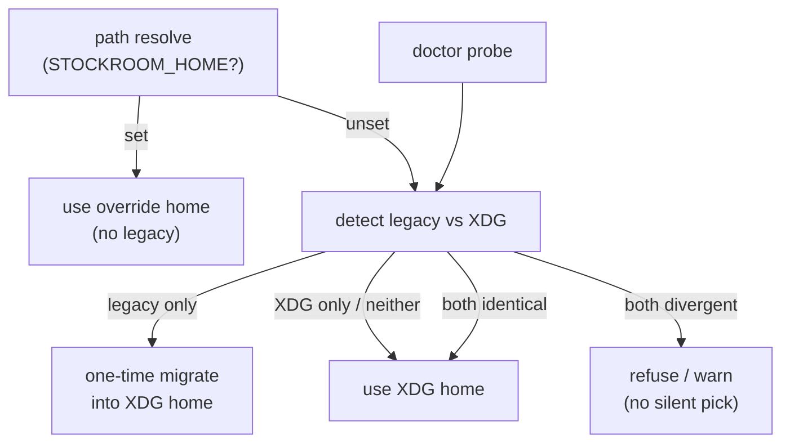

# Architecture Decision: Legacy `~/.stockroom/` Migration

## Requirements & Constraints

**Functional**
- Existing installs may hold durable data at `~/.stockroom/warehouse.duckdb`
- Destination tree (from Q1): `$XDG_DATA_HOME/stockroom/` / `~/.local/share/stockroom/`
- No silent data loss; refuse or warn loudly when both locations have divergent content
- `stockroom doctor` reports active home and whether legacy data was found
- When `STOCKROOM_HOME` is set, skip legacy migration entirely (override owns the tree)

**Quality attributes (ranked)**
1. Data safety — never clobber or silently choose the wrong warehouse
2. Idiopotency / predictability — same inputs → same outcome; re-entry safe
3. Operator surprise cost — prefer automatic when unambiguous; never automatic when ambiguous
4. Implementation simplicity — few call sites; fits `home_dir()` / doctor patterns

**Out of scope**
- Migrating harness roots; rewriting cron/launchd *mechanism*; Windows paths

## Components

`home_dir()` today mkdir-on-resolve — migration logic must not invent an empty XDG tree that then blocks detecting “legacy only.”

## Options Evaluated

- **A — Safe auto-migrate at path resolve**: On resolve (when `STOCKROOM_HOME` unset), if legacy warehouse exists and XDG warehouse does not → move (or copy-then-remove) contents into XDG home; if both exist with divergent content → refuse; if both absent → create XDG home. Doctor reports outcome facts.
- **B — Detect-only + explicit migrate subcommand**: Path resolve always prefers XDG (may start empty while legacy still holds data). `stockroom migrate-home` (or doctor-guided step) performs the move. Doctor always reports legacy presence.
- **C — Defer code**: Keep reading legacy if present else XDG; document deferral on issue #3. Doctor reports; no move yet.
- **D — Init-path-only migrate**: Auto-migrate only from `sr-initialize` / `schedule install`, not from every `home_dir()` call. Ad-hoc `stockroom query` against a fresh XDG empty DB while legacy holds data is possible until init runs.

## Analysis

| Criterion | A Auto at resolve | B Explicit only | C Defer | D Init-only |
|-----------|-------------------|-----------------|---------|-------------|
| Safety | High if refuse-on-conflict | Highest (operator starts move) | Medium (dual-read complexity) | Medium (window of wrong empty XDG) |
| Surprise | Low when unambiguous | Higher — stockroom “breaks” until migrate | Low until forgotten | High — empty warehouse after upgrade |
| Simplicity | Medium — careful pre-mkdir detect | Medium — new CLI surface | Low short-term / high long-term | Split behavior by entrypoint |
| Fits patterns | Matches lazy chokepoints | New command vs existing lazy ethos | Leaves O1 unfinished | Skills become owners of data move |

Key insights:
- Acceptance allows deferral, but dual-tree read (C) recreates the layout mess we are leaving; pure deferral without reading legacy would strand operators. Deferral only works as “still `~/.stockroom` until a later issue” — contradicted by wanting XDG as default now.
- B is safest socially but fails the product bar: after this ships, default paths change and an existing warehouse becomes invisible until a manual step. Few operators ≠ zero operators.
- D’s empty-XDG window is worse than A because `home_dir()` mkdir would create the destination before init runs.
- A wins if “divergent both present” is a hard fail (not a silent pick) and doctor surfaces active home + legacy status for recovery.

**Conflict definition (implementation detail for A):** treat “both present” as both `warehouse.duckdb` files existing. “Divergent” = not the same file (inode/device) and not byte-identical (or simply: refuse whenever both files exist unless identical size+mtime+checksum — safest: refuse whenever both exist and are not hardlinked/same file). Prefer move over copy so legacy disappears on success and re-runs stay idempotent.

## Decision

**Selected**: A — Safe auto-migrate at path resolve (when `STOCKROOM_HOME` unset), with hard refuse when both warehouses exist and are not the same content/file; doctor reports active home + legacy facts

**Rationale**: Safety #1 is satisfied by refuse-on-ambiguity, not by refusing to help. Predictability and low surprise require that the first post-upgrade stockroom call that needs a home ends at the XDG tree with the operator’s data, without inventing a second empty warehouse. Matches the engine’s lazy chokepoint style (`warehouse.open` / `home_dir`).

**Tradeoff**: Path resolution gains side effects on one-time migration (disk move). Mitigate by: detecting *before* mkdir; logging/printing a clear one-line notice to stderr when a migrate occurs; never migrating when `STOCKROOM_HOME` is set; documenting that `stockroom schedule install` should be re-run if an old crontab still redirects to `~/.stockroom/logs/`.

## Implementation Notes

- Introduce pure helpers (e.g. `legacy_home()`, `xdg_data_home()`, `detect_homes()`, `migrate_legacy_home_if_needed()`) callable from `home_dir()` and from `doctor.probe_facts`.
- Detection order: if `STOCKROOM_HOME` → return it (mkdir as today). Else compute XDG target and legacy `~/.stockroom`. If XDG warehouse missing and legacy warehouse present → migrate then return XDG. If both warehouses present and not same → raise typed error / exit with next-action message. Else return XDG (mkdir).
- Migrate contents of legacy home that stockroom owns (at least `warehouse.duckdb`, optional lock + `logs/`); remove or leave a tombstone — prefer successful move leaving no live warehouse at legacy path.
- Doctor facts: `home: <path>`, `home-source: STOCKROOM_HOME|XDG_DATA_HOME|default`, `legacy-home: <path|absent>`, `legacy-warehouse: present|absent`.
- After migrate, existing schedule entries may still name the old log path until reinstall — document in doctor warning and `sr-initialize` / techContext.
- Do not defer; update issue #3 when done (acceptance checkbox), not with a deferral rationale.
