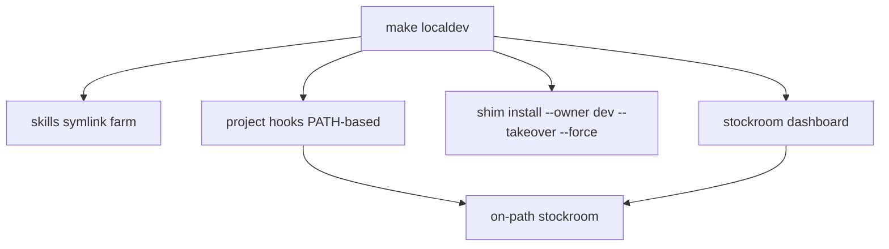

# Architecture Decision: localdev-hooks-and-force

## Requirements & Constraints

**Functional**
- `make localdev` wires: skills + project hooks + claim shim (TAKEOVER+FORCE) + bounce dashboard.
- After marketplace plugin uninstall, next harness launch in this repo runs from checkout.
- Hooks must not depend on `CURSOR_PLUGIN_ROOT` / `CLAUDE_PLUGIN_ROOT` (gone after uninstall).
- FORCE replaces a *live* foreign bake only with TAKEOVER+FORCE (two-key); dead foreign still TAKEOVER-only.
- FORCE downplayed outside localdev/recovery; not agent-default.

**Quality attributes (ranked)**
1. Correctness after uninstall (no PLUGIN_ROOT footgun)
2. Simplicity (one `make localdev`)
3. Reversibility (`localdev-clean`)
4. Safety (FORCE hard to invoke accidentally)

**Technical constraints**
- Cursor project hooks: `.cursor/hooks.json` (`version: 1`, flat `sessionStart`) — [Cursor Hooks](https://cursor.com/docs/hooks). May be experiment-gated on some Cursor builds; document that.
- Claude project hooks: prefer `.claude/settings.local.json` (gitignored) with nested `SessionStart`.
- Existing skills mirror: `.cursor/skills/stockroom-local` + pre-commit marker (not gitignore).
- Dashboard bounce: existing identity-aware `stockroom dashboard` (no stop/restart this rework).

**Boundaries**
- In: FORCE on shim install; localdev expansion; delete plugin-local; docs rip-it-out story; status separator.
- Out: `dashboard stop/restart` subcommands; agent skill docs advertising FORCE.

## Components

## Options Evaluated

- **A — PLUGIN_ROOT-style project hooks**: Copy plugin hook JSON, substitute checkout path for PLUGIN_ROOT.
- **B — PATH-based project hooks**: After shim claim, hooks only call `stockroom shim rectify --owner dev` + `stockroom dashboard` (no engine path in hook).
- **C — No hooks in localdev**: Skills + shim only; document manual dashboard / rely on next session without auto-start.

| Criterion | A | B | C |
|-----------|---|---|---|
| Fitness after uninstall | Medium (path must stay correct) | High | Weak (misses sessionStart) |
| Simplicity | Medium | High | Highest code / lowest UX |
| Reversibility | Medium | High (markers/clean) | High |
| Risk | Hook drifts from bake | Project hooks experiment flag | Operator forgot dashboard |

## Decision

### Choice Pre-Mortem

- **Project hooks silently disabled in Cursor**: checked — document experiment/settings; dashboard still reachable via CLI after localdev bounce.
- **FORCE leaks into agent skills**: checked — Make + CLI help warn; SKILL.md never lists `--force`.
- **Hook uses PLUGIN_ROOT and breaks after uninstall**: eliminated by choosing B.

**Selected**: Option B — PATH-based project hooks + FORCE two-key on shim  
**Rationale**: Once localdev claims the shim, hooks should use the same on-path surface contributors already trust; no second engine-path SSOT in hook JSON.  
**Tradeoff**: Cursor project-hooks gating may mean hooks no-op on some builds; localdev still bounces dashboard once at enter via `local-dashboard`.

### Composition amendment (operator 2026-07-12)

Supersedes mega-`localdev` inlining. Make exposes `local-skills`, `local-engine`, `local-dashboard`; `make localdev` only composes them. Harness-dependent targets require `HARNESS=cursor|claude`.

**Hooks amendment (same day):** Project-hook *automation* dropped entirely. Committed `hooks/*.json` depend on `*_PLUGIN_ROOT`, which is unset after marketplace uninstall — copying them into the project does not fix that. Enter path does not install hooks; docs note manual work only when changing the hook bootstrap surface. PATH-based hook *content* (rectify + dashboard via on-path `stockroom`) remains a valid *manual* pattern if someone edits hooks by hand — not a Make target.

### Implementation Notes

**FORCE policy** (`stockroom.shim.install`):
- Add `force: bool = False`.
- Alive foreign → refuse unless `takeover and force`.
- Dead foreign → refuse unless `takeover` (`force` optional).
- CLI: `--force` with help text that it replaces a *working* foreign bake; Make `FORCE=1` → `--force`.
- `make localdev` always runs shim with `--owner dev --takeover --force`.
- `make shim` only adds flags when `TAKEOVER=1` / `FORCE=1`.

**Hooks**:
- Cursor: ensure `.cursor/hooks.json` has `version: 1` and a managed-marker `sessionStart` command: PATH export + `stockroom shim rectify --owner dev` + `stockroom dashboard` (same spirit as plugin hook, no PLUGIN_ROOT).
- Claude: write/merge managed block into `.claude/settings.local.json` (create if absent); do not touch committed `.claude/settings.json`.
- Use BEGIN/END markers analogous to localdev pre-commit; `localdev-clean` strips them (and removes file if only managed content / empty).
- Extend pre-commit guard or gitignore as needed so hook artifacts don't land in commits (prefer markers + reset like skills, or gitignore `.cursor/hooks.json` only if repo never commits project hooks — **prefer markers**; stockroom may not want to gitignore all project hooks forever).

**Skills**: keep existing Cursor `.cursor/skills/stockroom-local` farm. Claude: symlink or document `claude --plugin-dir` only if project skills path is unclear — prefer mirroring into a Claude-discoverable local skills location if one exists; otherwise document Claude skills via checkout path in appendix (MVP: Cursor skills+hooks + shim; Claude hooks in settings.local + note skills load).

**Delete** `plugin-local` target and all docs references.

**Status**: print two sections with a blank line / header separator:
1. localdev-managed (skills, hooks markers, pre-commit block)
2. shim (owner/app_dir hints via parsing shim or `stockroom doctor` reminder)

**Docs**: rip-it-out narrative first; modular appendix; FORCE warned.
