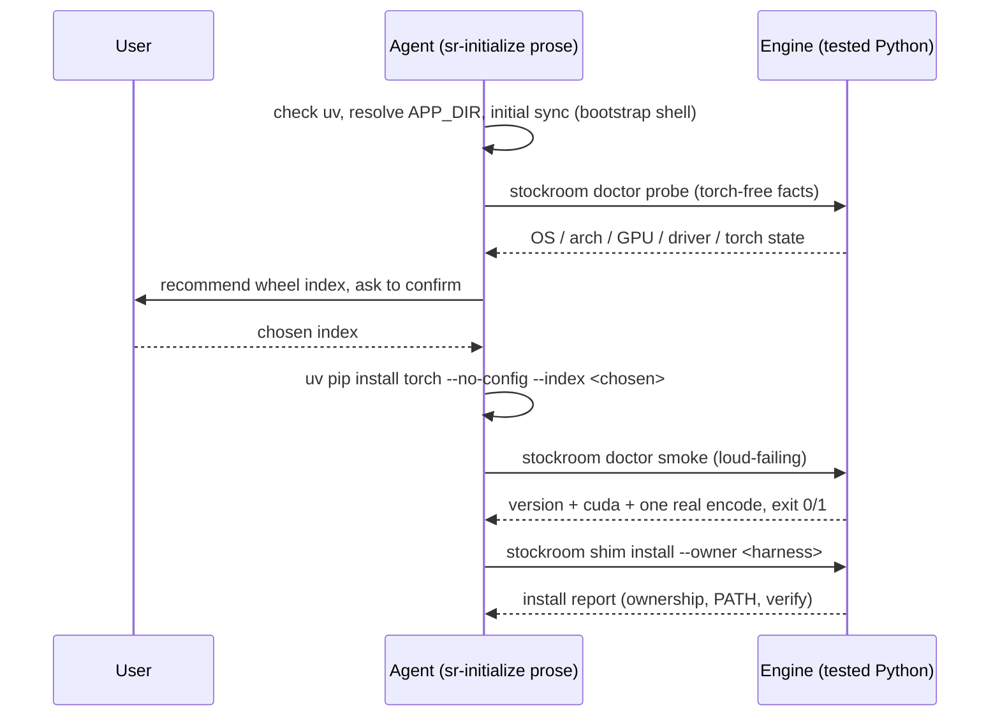

# Architecture Decision: Onboarding Logic Surface (Python/prose split for `sr-initialize` m3)

## Requirements & Constraints

The m3 half of `sr-initialize` must deliver: prerequisite checks (uv present and usable), platform/accelerator detection, per-machine out-of-band torch provisioning, a loud-failing smoke test (version, `cuda.is_available()`, encode one string), and binding of the m2 shim. The open question is **where each piece lives**: tested engine Python vs skill prose driven by the agent.

**Never-do list first** (the m2 reflection's process insight — enumerate the hard "must never" constraints before ranking candidates):

1. **Never run an exact sync after torch is provisioned** — it strips torch. The one legitimate exact sync is the *initial* `uv sync --frozen --no-config` on a clean machine, *before* torch exists.
2. **Never pick the torch wheel silently.** The wheel is a per-machine human choice (o9 spike: PyPI's newest wheel dropped Pascal `sm_61` and crashes at first kernel launch on the operator's own GPU). Detection may *recommend*; the human confirms.
3. **Never report a broken setup as success** — the smoke test must exercise the real production path (the actual embedding encoder, not a bare torch import) and fail loudly (nonzero exit, clear one-line reason).
4. **Never write the shim outside the m2 ownership policy** — CLI binding goes through `stockroom shim install --owner <harness>`, nothing else.
5. **Never plant a second drift-prone incantation garden.** The skill may carry the *one* pre-shim bootstrap incantation (it is the system's sanctioned bootstrapper — litter-audit: "understanding how the system is invoked lives in the initializer"), but every step that *can* go through a tested CLI must.

**Ranked quality attributes**: (1) testability — complexity belongs in tested layers (the m2 rework's explicit design goal); (2) correctness of the human-in-the-loop wheel choice; (3) simplicity — no machinery beyond what m3 needs; (4) m4 reusability (scheduling/first-run will want the same diagnostic surface).

**Hard structural facts** that bound the design:

- The **uv prerequisite check cannot be Python**: the engine only runs *through* uv. The bootstrap layer (uv check, engine-dir resolution, initial sync) is irreducibly prose/shell.
- **Detection cannot be fully algorithmic**: `nvidia-smi` reports the driver's max CUDA version, but "which torch index is right" also depends on GPU generation vs wheel support (the `sm_61` lesson) and on a moving set of published indexes. A hardcoded driver→index map in Python would drift and would still need human override. Facts are mechanical; the mapping is judgment.
- **Probe-type checks must run torch-free** (they run before provisioning); the smoke test is torch-dependent by definition (CI: `importorskip("torch")` convention).

## Components

## Options Evaluated

- **A — Prose-only orchestration**: `SKILL.md` drives raw shell (`command -v uv`, `nvidia-smi`, `python -c` smoke one-liner, `uv pip install`); no new engine code.
- **B — Monolithic `stockroom init` command**: one tested Python command performing checks → detection → provisioning → smoke → shim install end-to-end.
- **C — Read-only `stockroom doctor` (probe + smoke) + prose orchestration**: new tested module reporting environment facts and running the loud-failing smoke; the skill orchestrates, the user confirms the wheel, provisioning stays the one documented uv line, shim binding stays `stockroom shim install`.

## Analysis

| Criterion | A (prose-only) | B (monolithic init) | C (doctor + prose) |
|-----------|----------------|---------------------|--------------------|
| Fitness | Smoke as untested `python -c` prose; loud-failure shape unverifiable | Interactive wheel confirmation inside a CLI fights the agent-mediated conversation; must split anyway to accept the chosen index | Facts + pass/fail in Python; judgment + consent in the LLM layer where they belong |
| Testability | Worst — the load-bearing smoke logic lives in the untestable layer | Good, but provisioning-as-subprocess-of-uv-inside-uv is awkward to test honestly | Best — probe/smoke are pure tested surfaces (subprocess/injection); mutations stay in already-tested or one-line-documented paths |
| Simplicity | No new code, but N drift-prone incantations (the exact litter m5 deletes) | One new command but with embedded prompting, subprocess uv orchestration, and consent plumbing | One small read-only module + one dispatcher row |
| Risk (violates never-do?) | High: silent-wrong-wheel and quiet-smoke risks live in prose | Medium: silent automation pressure on the wheel choice (never-do #2) | Low: doctor is constitutionally read-only; every mutation has an explicit owner |
| m4 reuse | None | Poor (init is m3-shaped) | Good (m4 re-runs probe/smoke to validate before scheduling/first-run) |

Key insights:

- This is the search-surface architecture pattern again (**engine superpowers, wrapper skills, judgement router**): mechanical fact-gathering and pass/fail verification are engine superpowers; the wheel choice is judgment that belongs to the LLM + human. Option C is that pattern applied to onboarding.
- The bootstrap boundary is irreducible: uv check, engine-dir resolution, and the initial exact sync *cannot* be engine Python. Accepting that cleanly (prose owns bootstrap, Python owns everything after the engine is runnable) dissolves the apparent tension in the question.
- Option B's apparent "one command" promise is false: the human wheel confirmation forces a two-phase CLI anyway, at which point it is Option C with worse ergonomics.

## Decision

**Selected**: Option C — a read-only `stockroom doctor` module (`probe` + `smoke` actions) plus prose orchestration in `skills/sr-initialize/SKILL.md`.

**Rationale**: It puts every testable behavior in tested Python (top-ranked attribute, the m2 rework's proven design goal), keeps the wheel choice human-confirmed by construction (the agent mediates; never-do #2 is structural), and adds the least machinery — one read-only module and one dispatcher row. It also mirrors the project's established judgment-vs-mechanism split, so it is the *conventional* shape for this codebase, not a new idea.

**Tradeoff**: The skill prose carries more steps than a monolithic `stockroom init` would expose (bootstrap, probe, confirm, provision, smoke, bind). Accepted: those steps are exactly the onboarding conversation the agent must have anyway, and each mechanical step is one tested or one documented line.

## Implementation Notes

- **New module `stockroom.doctor`** (dispatcher's seventh subcommand), flat argparse like `stockroom.shim`: positional action `probe | smoke`.
  - `probe` (torch-free, read-only): reports `os`, `arch`, GPU presence/name/driver CUDA version (via `nvidia-smi`, injectable for tests; absent → none), torch state (importable? version? `cuda.is_available()`?), and the engine dir. Plain aligned `key: value` text — the consumer is the agent; no `--json` (YAGNI, per the m2 preflight advisory).
  - `probe` carries **no index-recommendation logic** — facts only. The recommendation mapping (Linux+NVIDIA → matching `cu*`; macOS / no GPU → `cpu`; the `sm_`-generation caveat) lives in the skill prose as guidance for the agent's recommendation, which the user confirms.
  - `smoke` (torch-required, read-only, loud): prints `torch.__version__` and `torch.cuda.is_available()`, then encodes one string through the real `BgeEncoder` (`stockroom.embed`) — the production path, and it pre-warms the HF model cache as a side benefit. Exit 0 with a one-line `ok` summary; any failure → one clear stderr line, exit 1. Missing torch is a *diagnosed* failure ("torch not installed — provision it first"), not a traceback.
  - Testing: `probe` fully covered torch-free (injected/nvidia-smi-stubbed); `smoke`'s real-model path is one `importorskip("torch")`-gated test, its failure paths covered via injection.
- **Q2 collapses into this decision**: with "Python reports facts, prose owns the mapping" fixed, detection mechanics stop being ambiguous — `platform` module for OS/arch, `nvidia-smi` subprocess for GPU facts, import-attempt for torch state. No remaining open question.
- **Skill flow** (`skills/sr-initialize/SKILL.md`, operator-invoked, `enable-model-invocation` like siblings): bootstrap (uv check → owner-detect via which `*_PLUGIN_ROOT` exists → resolve APP_DIR → `uv sync --frozen --no-config`, the one legitimate exact sync) → `doctor probe` → recommend + confirm wheel → `uv pip install torch --no-config --index <chosen>` → `doctor smoke` → `stockroom shim install --owner <harness>` (relay refusals; `--takeover` only with explicit user consent) → report. After the shim lands, subsequent steps use `stockroom …` itself.
- **Ordering is load-bearing** and the skill must state it: initial exact sync happens *before* torch provisioning; afterwards everything is `--no-sync`.
