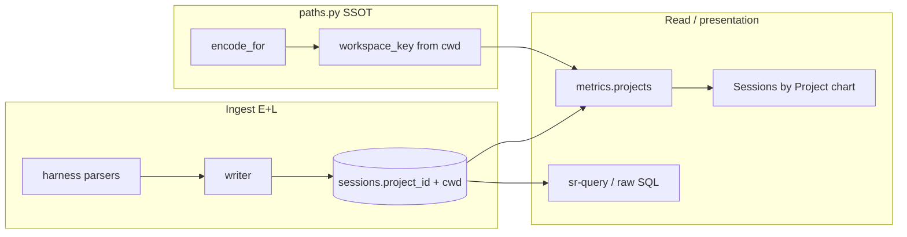

# Architecture Decision: project-rollup-layer

## Requirements & Constraints

**Open question:** Should Claude/Cursor same-path project merge (stockroom off by Claude’s leading-separator slug) live in the chart/presentation path, or in ETL? Is caution about mutating identity at write time overdone? Is “strip leading/trailing non-alnum” a viable normalize?

**Functional requirements:**
- Same absolute `cwd` across harnesses must roll up as one chart row (Cursor `home-…-stockroom` + Claude `-home-…-stockroom`).
- Different paths on disk stay separate (lite-rpg under `/home/...` vs `/mnt/v/...`), even if humans know they’re one GitHub repo.
- Friendly leaf labels + slug-on-hover remain presentation concerns.

**Quality attributes (ranked):**
1. **Identity fidelity** — one meaning per field; `project_id` stays harness-native slug.
2. **Correct merge boundary** — same path merges; different paths don’t.
3. **Simplicity / reversibility** — smallest layer that fixes the pain; easy to undo.
4. **Future-T relevance** — anything persisted at write time must still be meaningful years later.
5. **Performance** — negligible at current scale (top-N projects over a window).

**Technical constraints:**
- Existing contract (`systemPatterns`, `docs/architecture/warehouse.md`, `ingest/paths.py`): `project_id` verbatim; `cwd` best-effort; verify-don’t-invert.
- Dashboard already owns Aggregate/Compare and friendly labels as **client/metrics presentation**, not warehouse identity ([dashboard-polish #8](../archive/enhancements/20260710-dashboard-polish.md)).
- Ingest today is mostly **E+L**; little Transform. Adding T is fine only if the derived fact is durable.

**In scope:** where the rollup key is computed and consumed (paths helper + first consumer).  
**Out of scope:** git-remote / mount canonicalization for “same repo, different path”; rewriting historical `project_id` values.

## Components

- **Ingest writer** — persists source truth only.
- **`ingest.paths`** — owns encode asymmetry and any derived key function.
- **`metrics.projects`** — first consumer of rollup for the chart.
- **Raw SQL** — continues to see verbatim `project_id` until/unless an additive column exists.

## Options Evaluated

- **A — Read-time rollup (metrics/chart):** Group/rank in `metrics.projects()` by a key derived from `cwd` (Cursor-form `encode_for("cursor", cwd)` when `cwd` set; else `project_id`). Algo lives in `paths.py`. No warehouse schema change.
- **B — ETL mutate `project_id`:** At write, strip Claude leading `-` / leading-trailing non-alnum so stored ids match Cursor. Chart “just works.”
- **C — ETL additive `workspace_key` (real T):** Persist a new nullable column at ingest; `project_id` unchanged. Chart and SQL both can group on it.
- **D — Cosmetic strip leading/trailing non-alnum as the normalize:** String trim of non-alnum on slug edges, anywhere (ETL or read).

## Analysis

| Criterion | A Read-time | B Mutate project_id | C Additive column | D Edge strip |
|-----------|-------------|---------------------|-------------------|--------------|
| Fitness (same cwd / split paths) | High if key = encode(cursor, cwd) | Partial (slug-only; NULL cwd weak) | High (same algo, persisted) | Poor (cosmetic ≠ path equality) |
| Identity fidelity | Preserves | **Breaks** verbatim + Claude encode invariant | Preserves | Breaks if stored |
| Simplicity | Smallest | Looks small, contract debt large | Schema + backfill | Misleadingly simple |
| Future-T relevance | N/A (not stored) | Bakes a presentation fix into identity forever | High if key semantics stay “Cursor-form of cwd” | Low — heuristic ages badly |
| Risk / reversibility | Low (change metrics) | High (re-ingest / migration to undo) | Medium (migration; additive) | High if in ETL |

Key insights:
- Chart vs ETL is a false dichotomy if “ETL” means **mutate identity**. The real fork is **presentation rollup now** vs **additive derived column when warehouse-wide grouping is a product need**.
- Caution about mutating `project_id` is **not** over-caution — it matches the workspace-identity doctrine and the prior backbone decision (normalize at ingest into `project_id` rejected; same-path merge is a canonicalization problem on `cwd`).
- “Strip leading/trailing non-alnum” is **more** presumptuous than it looks: it is not grounded in the documented Cursor/Claude encode asymmetry, and it does not express “same path.” Prefer `encode_for("cursor", cwd)` when `cwd` is known.
- Mostly-EL today argues **against** rushing a persisted T column for one chart. When T lands, bank on a key whose definition is already in `paths.py` and already used at read time — then persistence is a promotion, not a redesign.

## Decision

### Choice Pre-Mortem

- **Wrong because SQL users still see split stockrooms and complain:** ~~accepted~~ **operator override** — queriers must be able to `GROUP BY` the same key the chart shows. Elevates Option C.
- **Wrong because too many NULL `cwd` rows leave splits:** checked — when `cwd` is unknown, `workspace_key` is NULL (or falls back per notes below); no fabricated merge.
- **Wrong because we later need mount/git identity:** checked — out of scope; this column is path-derived, not repo-derived.
- **Wrong because “Cursor-form” encode hard-codes today’s two harnesses:** checked — document the transform as **harness-neutral path encode with leading separator stripped** (the shared half of `encode` / `encode_for`), not “whatever Cursor does forever.” Future harnesses with different slug rules still get a path-derived key when `cwd` is known.

**Selected**: **Option C — additive `workspace_key` column** (migration + ingest populate), with algo SSOT in `ingest.paths`. Chart and SQL both group on it. **Option A alone rejected** after operator requirement that display and query share a reconstructible key.

**Rationale**: Identity fidelity still holds (`project_id` untouched). Durability of T is justified: the key is “same absolute path → same key,” which remains meaningful over time. Chart and `sr-query` stay aligned.

**Tradeoff**: Schema migration + writer/backfill work; rows without `cwd` may still not cross-harness-merge (honest NULL / weak fallback).

## Naming

**Operator decision: column name is `workspace_key`.**

| Candidate | Verdict |
| --- | --- |
| **`normalized_project_id`** | Rejected. Sounds like a mutated `project_id`; `_id` means identity; “normalized” invites cosmetic strip heuristics. |
| **`workspace_key`** | **Accepted.** Matches 0002’s “workspace identity” language; `key` ≠ identity `id`; derived rollup join key, not the harness slug. |

### Documented contract (operator-approved)

Best-effort attempt so that the same project at the same `cwd` on the same machine, touched by each harness, can have its `cwd` + `project_id` inputs folded into `workspace_key` for cross-referencing (chart + SQL). Not a rewrite of harness-native `project_id`. Different paths on disk stay different keys.

### Per-harness T (operator refinement)

Each harness has its **own** ETL transform for computing `workspace_key` from that harness’s `cwd` / `project_id` (and whatever else it needs). Dispatch is extensible — adding a harness means adding a strategy, not stretching a single global string munge. The **convergence contract** is shared (same machine + same `cwd` ⇒ same `workspace_key` when both sides can derive it); the **derivation** is harness-specific. Do not hard-code “always Cursor-form encode” as the only forever path inside one untyped helper with no harness parameter.

## Implementation Notes

- **Column:** `sessions.workspace_key TEXT` (nullable), migration `0006` (or next free number). No rewrite of `project_id`.
- **Shape:** `workspace_key_for(harness, *, cwd=None, project_id=None) -> str | None` (or equivalent) with a per-harness registry/strategy map; unknown harness → `NULL` or documented default.
- **Today’s strategies (illustrative — finalize in plan/build):** Cursor and Claude both aim at the same key when `cwd` is the same absolute path (e.g. both effectively produce leading-separator-stripped path encode of that `cwd`); implementation may share a private path helper but **must** go through harness-keyed entry points so a third harness can diverge.
- **Fallback when that harness cannot derive:** `NULL` (prefer honesty) unless plan picks coalesce-to-`project_id`.
- **Not the algo:** strip arbitrary leading/trailing non-alnum globally; mutate stored `project_id`.
- **Ingest:** writer calls the harness-specific T on every session insert/upsert; `--full` re-ingest backfills.
- **Consumers:** `metrics.projects()` ranks/groups by `workspace_key`; hover can still show `project_id`(s) when multiple slugs roll into one key.
- **Docs:** migration header (like 0002); `paths.py` (or sibling module) docstring for dispatch + contract; `docs/architecture/warehouse.md` Workspace identity; `systemPatterns` one-liner.
- **Answer to “am I overly-cautious?”:** About mutating `project_id`: still no. About additive T now that SQL parity is required: **not cautious — correct.**
