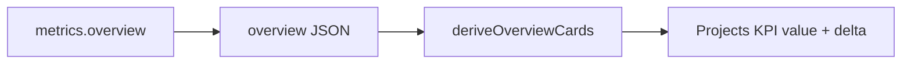

# Architecture Decision: Projects KPI Previous-Window Contract

## Requirements & Constraints

**Functional requirements**
- The Projects KPI value remains a distinct project count over the selected harness set for the current overview window.
- If a Projects delta is shown, current and previous values must measure the same thing: distinct projects in each window under the same harness filter.
- KPI meanings stay mode-independent; Aggregate/Compare must not change the Projects card.

**Ranked quality attributes**
1. Correctness of measured facts
2. Consistency with the m1 overview contract and dashboard-spec distinct-project rule
3. Simplicity of client math
4. Minimal public-boundary blast radius

**Technical constraints**
- Dashboard paths remain read-only; no warehouse write, ingest, or migration.
- Existing overview fields (`per_harness.*.prev_projects`, `distinct_projects`) must keep their current meanings.
- The client cannot reconstruct a previous distinct count without previous-window project identities, which the API does not expose.
- m2 originally avoided JSON shape changes; QA proved that constraint collides with a truthful Projects delta, so a narrow additive field is in scope for this rework if it is the correct fix.

**Boundaries**
- In scope: overview payload shape for previous distinct projects, `deriveOverviewCards` delta input, and the tests that lock both sides.
- Out of scope: changing Projects to a summable card, per-panel deltas, drill-down into project lists, or any other endpoint.

## Components

- `metrics.overview` already builds current and previous per-harness project sets and a current `distinct_projects` union.
- `deriveOverviewCards` correctly uses `distinct_projects` for the value, but incorrectly sums `prev_projects` for the delta baseline.
- The missing seam is a filtered previous-window distinct count parallel to `distinct_projects`.

## Options Evaluated

- **Add `prev_distinct_projects`**: Extend overview with a server-computed distinct count for the previous window under the same harness filter; client deltas Projects against that field.
- **Hide the Projects delta**: Keep the distinct current value and omit percentage change for that card only.
- **Redefine Projects as summable**: Replace the card value with `sum(per_harness.projects)` so current and previous both sum, abandoning the distinct-project rule.

## Analysis

| Criterion | Add `prev_distinct_projects` | Hide Projects delta | Redefine as summable |
|---|---|---|---|
| Fitness | Current and previous become comparable distinct counts | Stops lying, but drops the trend the card advertises | Makes delta math work by changing the metric the card claims |
| Spec alignment | Completes the cur/prev pair the spec already implies for client deltas | Leaves the documented delta story incomplete for Projects | Contradicts core rule that projects cannot be summed across harnesses |
| Simplicity | One additive integer; client swaps the baseline field | Smallest code change | Forces KPI and breakdown semantics to diverge from the mock/spec |
| Blast radius | Additive JSON field; existing consumers ignore unknown keys | UI-only inconsistency among KPI cards | Semantic regression on the primary Projects value |
| Risk | Low and reversible; server already holds previous project sets | Medium product risk: silent loss of trend | High: knowingly wrong aggregate for multi-harness selections |

Key insights:
- The bug is not client arithmetic skill; it is a missing previous-window rollup for a non-summable metric.
- `prev_projects` remains useful for per-harness breakdown bars; it is the wrong baseline for the aggregate Projects card.
- Hiding the delta is a valid honesty fallback, but it is inferior once the server can emit the matching previous distinct cheaply from sets it already materializes.

## Decision

**Selected**: Add `prev_distinct_projects`

**Rationale**: Correctness and spec alignment both require a previous distinct count. The server already walks the previous window and can union those project ids under the active harness filter with negligible cost. An additive field preserves existing meanings, keeps client delta math uniform, and restores a truthful Projects trend without abandoning the distinct-project rule.

**Tradeoff**: This rework intentionally amends the earlier "no JSON shape changes in m2" boundary for one additive overview integer. That is preferable to shipping a false delta or deleting the trend.

## Implementation Notes

- In `metrics.overview`, after filling `previous_projects`, set `prev_distinct_projects` to the size of the union of previous project ids across the selected/active harnesses, mirroring `distinct_projects`.
- Empty and unknown-harness shapes include `"prev_distinct_projects": 0`.
- `deriveOverviewCards` keeps `distinct_projects` as the Projects value and uses `prev_distinct_projects` for `formatDelta`; it must not sum `prev_projects` for that card.
- Extend Python overview tests and the Node `deriveOverviewCards` contract with a shared-project fixture where `sum(prev_projects) > prev_distinct_projects`, asserting a no-change or correct delta rather than a false decline.
- Document the additive field in any overview-facing comments or tech notes touched by the rework; do not rewrite the brainstorm spec unless already editing it for the milestone.
- Per-harness `projects` / `prev_projects` remain unchanged for KPI breakdown bars.
