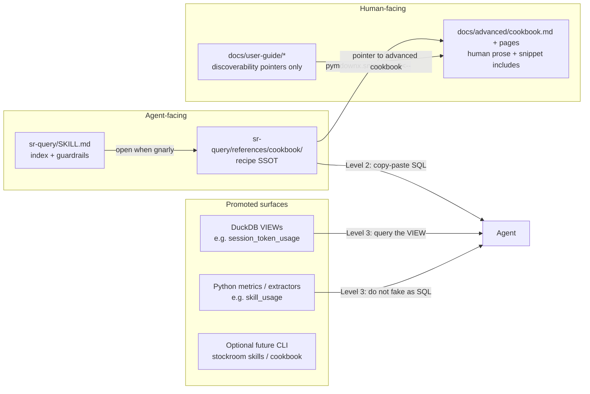

# Architecture Decision: Query Cookbook Ownership & Dual-Audience Delivery

**Issue:** [#69](https://github.com/Texarkanine/stockroom/issues/69) — "Top Skills/tools" query resource  
**Approach:** Architecture creative phase  
**Date:** 2026-07-20

## Requirements & Constraints

### Functional requirements

1. **Primary:** An agent using `sr-query` must not re-derive harness-specific or otherwise gnarly warehouse queries (skills, tools, token rollups, and peers).
2. **Secondary:** A human operator must be able to find and copy/paste a starter query without reverse-engineering the dashboard API.
3. Recipes must remain discoverable after plugin install (agents read local skill files; docs site is optional).

### Ranked quality attributes

1. **Correctness / drift resistance** — wrong SQL that looks authoritative is worse than no recipe.
2. **Maintainability** — one owner per fact; no parallel corpora that rot independently.
3. **Agent fitness** — recipes live where agents already look (`sr-query` skill tree).
4. **Human discoverability** — docs site shows the same starter SQL in-page (copy button), not a "go read the plugin" goose chase.
5. **Simplicity** — one SSOT, rendered twice; no new build pipeline unless recipe count forces it.

### Technical constraints

- Existing docs ownership doctrine (`memory-bank/systemPatterns.md`): human prose under `docs/`; agents use `SKILL.md` + `skills/**/references/**`; **do not** park a user-guide corpus under `skills/**/references/` (recipes are agent material, not a user-guide corpus).
- `skills/**/SKILL.md` and `skills/**/references/**` are PPL-S (prompt-shaped); engine code is AGPL.
- `pymdownx.snippets` is already enabled in `properdocs.yaml` with `base_path: .` and `check_paths: true`. The "not a snippet farm" comment is historical caution against *mindless* include sprawl — **operator override (2026-07-20):** intentional dual-audience includes of cookbook recipe bodies are desired, not discouraged.
- Token rollups already chose VIEW `session_token_usage` + short `sr-query` examples; user-guide keeps pointers only ([archive 20260719](../../archive/enhancements/20260719-token-usage-grain-rollups.md)).
- Skill usage is **not** pure SQL: candidate SQL + per-harness Python extractors in `stockroom.dashboard.skill_usage` ([archive 20260717](../../archive/features/20260717-dashboard-skill-usage.md)). Encoding that as mondomarkdown SQL would fight the product.

### Boundaries

**In scope:** where the cookbook lives, how agents vs humans reach it, what earns a recipe vs a promoted surface, what else belongs, whether snippets / CLI / VIEWs are the dual-channel means.

**Out of scope:** implementing #69 recipes, extracting a `stockroom skills` CLI, or changing dashboard extractors.

## Components

| Component | Responsibility |
| --- | --- |
| `SKILL.md` | When to use `sr-query`, guardrails, schema sketch, **index** of cookbook recipes + promoted surfaces |
| `references/cookbook/*.md` | Agent-owned **recipe SSOT** — gnarly, verified, copy-paste SQL or "use this surface" cards |
| DuckDB VIEWs | Stabilize rollups the product (and agents) both need; writers never target them |
| Dashboard extractors / metrics | Truth for skill identity × invoker; not re-encoded as SQL recipes |
| `docs/advanced/cookbook*.md` | Human TOC + when/why prose; **includes** recipe bodies from the skill cookbook via snippets |
| User-guide pages | Discoverability pointers only — no cloned SQL |

## Options Evaluated

### A — Skill-only cookbook, docs pointers

Recipes live under `skills/sr-query/references/cookbook/`. `SKILL.md` indexes them. Human docs link to GitHub (or local plugin path) without including bodies. No `pymdownx.snippets`.

Favors: docs ownership doctrine; prior token-rollup archive; simplicity. Conflicts: weaker "copy button on docs site" UX.

### B — Skill SSOT + pymdownx snippet mirror into docs

Same SSOT as A, but `docs/advanced/cookbook*.md` pages wrap human prose around `--8<--` includes of recipe bodies (or dedicated `*.sql` fragments) so the docs site shows the same starters with copy buttons.

Favors: dual audience, single edit, site-native UX. Watch-outs: `edit_uri` on the docs page points at the wrapper (not the SSOT) — wrappers should say "edit the skill recipe"; don't stuff human-only narrative into included files.

### C — Docs-owned cookbook, agents deep-link out

Human SSOT under `docs/`; skill points at published URL or relative docs path.

Favors: nice human site. Conflicts: **agents need local plugin files**; docs site is not part of marketplace install; violates agent-primary goal.

### D — Named engine recipes / CLI cookbook

Ship `.sql` (or recipe ids) inside the engine; `stockroom query --recipe tools-top` or `stockroom cookbook show …` prints/runs them. Docs and skill both point at the CLI.

Favors: drift can be tested; great agent UX. Conflicts: new surface + tests for a problem markdown may still solve; overkill at current recipe count.

## Analysis

| Criterion | A Skill + pointers | B Skill + snippets | C Docs-owned | D CLI recipes |
| --- | --- | --- | --- | --- |
| Fitness (agent primary) | Strong | Strong | Weak (offline/plugin) | Strong |
| Fitness (human secondary) | Weak (click-away) | Strong (inline copy) | Strong | Strong |
| Drift resistance | Good if inclusion bar is strict | Same SSOT; includes stay honest | Two audiences fight ownership | Best if tested |
| Doctrine alignment | Good | Good (prose in docs, body in skill) | Conflicts agent doctrine | Neutral / new pattern |
| Simplicity | Best | Slight include ceremony | Medium | Highest cost |
| Risk if wrong | Humans bounce off links | Edit-button points at wrapper | Agents miss recipes | YAGNI |

Key insights:

- **"Three kinds of recipe" is the wrong frame.** Token VIEWs, tool `GROUP BY`s, and skill extractors are different **promotion levels**, not three parallel markdown genres. Treating skills as markdown SQL would reintroduce the mondo-SQL design the skill-usage creative phase rejected.
- **Gnarly ≠ must be a `.md` recipe.** When the product already owns the logic in tested Python (skills) or a VIEW (tokens), the cookbook entry should point at that surface — not reverse-engineer it.
- **Snippets are how dual audience works without dual SSOT.** Ownership stays under `skills/…/references/cookbook/`; docs wrappers own human when/why and pull the body in. That is the opposite of a farm of orphan includes — it is one recipe, two renderings.
- The old "not a snippet farm" line was about avoiding a docs corpus made of disconnected fragments. A deliberate cookbook mirror does not match that anti-pattern.

## Decision

### Choice Pre-Mortem

- **Skills get documented as SQL anyway, then silently diverge from extractors:** Checked — decision forbids harness skill CASE recipes; cookbook cards must name the Python/metrics surface (or a future CLI) as truth.
- **Cookbook under `references/` grows into a second user guide:** Checked — inclusion bar + SKILL.md stays the operational home; recipe files are short "when + SQL/surface + caveats," not narrative how-tos. Human narrative stays in the docs wrappers.
- **Docs "Edit this page" sends people to the wrapper, not the SQL:** Checked — each wrapper notes the SSOT path under `skills/sr-query/references/cookbook/`; acceptable friction vs dual corpora.

**Selected**: **Option B with a promotion ladder** — agent-owned cookbook at `skills/sr-query/references/cookbook/`, docs advanced pages that **snippet-include** those recipes for humans, and an explicit ladder for when markdown is the wrong vessel.

**Rationale**: Agent-primary SSOT still wins; operator wants the same useful starters on the docs site with copy buttons. Snippets deliver that without cloning SQL. Promotion ladder still prevents lying about skill usage as pure SQL. Option D stays a later promotion if recipe count or testability demands it.

**Tradeoff**: Docs edit affordance points at wrappers; contributors must know to edit the skill recipe. Accepted — better than maintaining two copies or making humans leave the site.

## Promotion ladder

| Level | When | Where | Examples |
| --- | --- | --- | --- |
| 0 — Ad hoc | Short, obvious SQL | Agent invents it | `COUNT(*)`, `DISTINCT harness` |
| 1 — Inline example | Common, stable, &lt;~15 lines | `sr-query/SKILL.md` worked examples | Busiest tools `LIMIT 5`; token VIEW top-N |
| 2 — Cookbook recipe | Gnarly **pure SQL** agents get wrong; not owned elsewhere | `references/cookbook/<name>.md` | Safe `tool_input` extracts; dual-grain model queries; workspace_key joins; embed-coverage gaps; subagent trees |
| 3 — Promoted surface | Logic reused by product **or** not honestly expressible as SQL | Migration VIEW and/or Python/CLI | `session_token_usage`; skill × invoker via extractors / metrics (future: `stockroom skills`) |

**#69 mapping:**

- **Tools top-N / full table:** Level 1–2 pure SQL (simple `GROUP BY tool_name`; date/harness filters). Cookbook optional for "full table / by day / by harness" variants beyond the inline LIMIT example.
- **Skills full table:** **Level 3**, not Level 2 SQL. Cookbook card explains harness rules at prose altitude and directs agents to the dashboard metrics path (or a future CLI that reuses extractors). Do **not** ship reverse-engineered candidate SQL as if it were the answer.
- **Token rollups:** Already Level 3 VIEW + Level 1 example. Cookbook may host longer rollup variants (by day, by workspace) that still `SELECT` from the VIEW — not a third parallel kind.

## Cookbook file shape

Each recipe file (short):

1. **Title + one-line intent**
2. **When to use / when not to**
3. **SQL** (fenced) *or* **Surface** (`VIEW` / "use metrics.skills extractors" / future CLI)
4. **Caveats** (harness NULLs, grain, drift triggers)
5. **Verified against** (migration head or "dashboard extractors as of …")

`references/cookbook/index.md` is the agent TOC. `SKILL.md` links the index; it does not inline every recipe.

## What else bears including

Candidates that clear the Level 2 bar (or Level 3 pointer cards):

| Recipe / card | Why |
| --- | --- |
| Tools by harness / by day / unbounded top-N | #69 secondary; pure SQL; dashboard only shows top 10 |
| Skill usage → promoted surface card | #69 primary; **not** SQL body |
| Token rollups beyond the VIEW sketch | By day, by `workspace_key`, cache vs input — still query the VIEW |
| Safe `tool_input` JSON extract patterns | Already partially in SKILL guardrails; expand per common tools |
| Dual-grain models (`messages.model` vs `sessions.models`) | Easy to get wrong across harnesses |
| `workspace_key` / `project_id` / `cwd` identity | Verify-don't-invert; join gotchas |
| Subagent / `parent_session_id` trees | Non-obvious graph query |
| Embed coverage gaps | Messages present, vectors missing — silent staleness |
| Activity window joins | Mirror dashboard `since`/`until` semantics for ad-hoc SQL |
| Write vs read tool classes | Only if we document the same sets the dashboard uses — else drift; prefer pointing at constants or keep out |

**Do not include:** narrative user-guide prose, dashboard Chart.js concerns, or "how ingest works" (that is architecture / system-model).

## Implementation Notes

- Add `skills/sr-query/references/cookbook/` (+ `index.md`) when implementing #69; keep `SKILL.md` as index + Level 1 examples only.
- Add `docs/advanced/cookbook.md` (nav under Advanced) as human TOC + per-recipe sections/pages: human when/why prose in docs; recipe body via `pymdownx.snippets` `--8<--` from `skills/sr-query/references/cookbook/…` (`check_paths: true` already on).
- Prefer including a dedicated includable fragment (e.g. fenced SQL block file, or a clearly delimited section) so docs wrappers don't pull agent-only index chrome. Whole short recipe `.md` files are fine when they are already dual-audience-safe (title + when + SQL + caveats).
- Each docs wrapper notes: **SSOT path** = skill cookbook file (because Material "edit" hits the wrapper).
- User-guide (`search.md`, etc.) stays pointer-only into Advanced cookbook — no cloned SQL there.
- Update `properdocs.yaml` comment from "rare use / not a snippet farm" to something accurate: snippets are for **shared cookbook bodies** (and similarly intentional dual-audience includes), not for composing the whole site from fragments.
- **Skills for #69:** Level 3 cookbook card first (prose + surface pointer; snippet still fine for that card); consider `stockroom skills` only if operators need tabular skill use outside the dashboard.
- **Drift policy:** new harness or extractor change updates Level 3 surfaces + tests; Level 2 recipes that mention harness quirks must list their drift triggers; prefer promoting to Level 3 over growing CASE forests in markdown.
- Optional later: Option D (`--recipe` / `cookbook` CLI) if recipe count or CI verification of SQL bodies becomes painful.

## pymdownx-snippets verdict

**In.** Skill cookbook is SSOT; docs **include** those bodies so humans get the same starters on the site. Anti-pattern to still avoid: inventing docs-only fragment trees with no agent home, or stuffing long human narrative into files agents must load. Useful recipes in both places, one edit.
