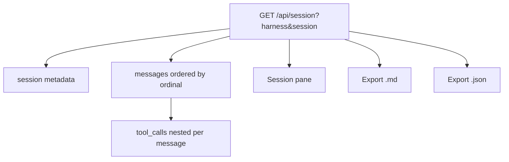

# Architecture Decision: Reconstruction Content Model

## Requirements & Constraints

**Functional**
- Reconstruct a prior conversation for inspection in the dashboard
- Work for any `(harness, session_id)` deep link
- Optional export as markdown and/or JSON (issue optional; brief acceptance criteria include it — **in scope**)

**Quality attributes (ranked)**
1. Faithfulness to warehouse truth (ordering, full text, tool inputs as stored)
2. Usefulness for "what happened in this session" inspection
3. Simplicity of API + UI (one payload, one view)
4. Export as escape hatch for richer tooling

**Technical constraints**
- Schema contracts: `messages ORDER BY ordinal`; `tool_calls` per `message_id ORDER BY ordinal`; tool **inputs only**
- No truncation on detail path (`truncate_cell` is list-only)
- Recent Sessions list remains main sessions only (`NOT is_subagent`) — unchanged
- Deep link may target subagent sessions if the operator has the id

**Out of scope**
- Rendering tool **results** (not stored)
- Thinking/reasoning blocks (not stored)
- Live streaming / follow session
- Editing warehouse data

## Components



## Options Evaluated

- **A — Messages only**: Chat turns (`role` + `text`) in order; tools omitted from API/UI
- **B — Messages + nested tool_calls**: Each turn includes ordered tool inputs; UI shows tools under the turn; export includes both
- **C — Parallel resources**: `/api/session` messages + separate `/api/session/tools`; UI merges client-side
- **D — Messages only in UI, tools export-only**: Inspect chat in browser; full fidelity only after download

## Analysis

| Criterion | A Messages only | B Nested tools | C Parallel APIs | D Tools export-only |
|-----------|-----------------|----------------|-----------------|---------------------|
| Faithfulness | Partial | Full (stored) | Full | Full on disk only |
| Inspection usefulness | Weak for agent work | Strong | Strong | Weak in-browser |
| Simplicity | Highest | High | Lower | Medium |
| Export value | OK | Best | Best | Required crutch |

Key insights:
- Agent sessions without visible tool calls are incomplete reconstructions for this product
- Two endpoints (C) add client merge complexity with no caching benefit on loopback
- Export-only tools (D) fights the primary use case (in-dashboard perusal)

## Decision

### Choice Pre-Mortem

- **"Tool inputs are huge JSON and make the UI unusable"**: real risk — mitigate with collapsed `<details>` per tool in UI; full content still in export — checked
- **"Operators only wanted chat transcript"**: issue says reconstruct conversation in an agent-coding warehouse — tools are first-class; export still offers a chat-only edit path for humans — checked as product reading
- **"Subagent deep links confuse Recent Sessions users"**: list stays main-only; deep link is explicit — checked

**Selected**: Option B — single `/api/session` payload with session metadata, ordered messages, and nested `tool_calls`
**Rationale:** Best faithfulness + in-browser usefulness at acceptable UI complexity
**Tradeoff:** Large tool_input blobs need progressive disclosure in the UI; accepted

## Implementation Notes

### API wire shape (illustrative)

```json
{
  "harness": "cursor",
  "session_id": "…",
  "project_id": "…",
  "project_name": "…",
  "cwd": "…",
  "started": "…Z",
  "is_subagent": false,
  "parent_session_id": null,
  "messages": [
    {
      "message_id": "…#0",
      "ordinal": 0,
      "role": "user",
      "text": "…",
      "model": null,
      "ts": null,
      "tool_calls": []
    },
    {
      "message_id": "…#1",
      "ordinal": 1,
      "role": "assistant",
      "text": "…",
      "model": "…",
      "ts": "…Z",
      "tool_calls": [
        {"ordinal": 0, "tool_name": "Shell", "tool_input": { }}
      ]
    }
  ]
}
```

- 404 JSON when `(harness, session_id)` missing
- `sessions()` list response gains `session_id` (harness already present) for click-through
- Subagent sessions: detail endpoint serves them; Recent Sessions does not list them

### UI

- Full-pane swap (hide metrics, show session view) — not a modal
- Header: back control, harness, project, started, session id (copyable), export buttons
- Turns: role label + markdown-rendered `text`; tool calls in collapsed `<details>` with `tool_name` summary and pretty-printed JSON body (not markdown-it)
- Missing session: clear error + back

### Export (in scope)

- **JSON**: download the API payload (pretty-printed)
- **Markdown**: `#` title with harness/session/project; each turn as `## user|assistant` + body text; tools as fenced `json` blocks under the turn
- Client-side `Blob` + download attribute — no server export endpoint
