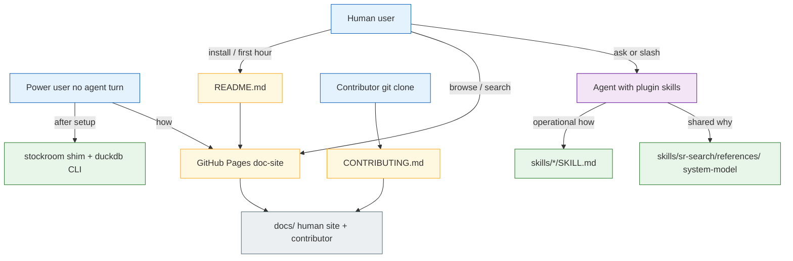
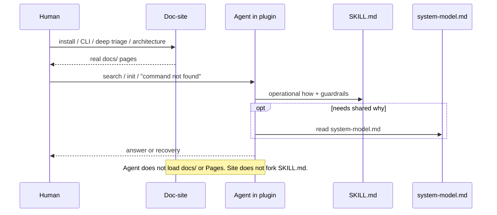

# Architecture Decision: Release-Quality Documentation Corpus

## Requirements & Constraints

### Open question

What does "release quality" documentation look like for Stockroom — what content exists, where it lives, how it relates to the skills (the primary usage path), and how to keep the corpus discoverable and maintainable without copy/paste duplication — given sibling exemplars `ai-rizz` (properdocs site over `docs/`) and `slobac` (properdocs site over skill-local `references/docs/`, dual human/agent audience)?

### Functional requirements

1. **README funnel**: what it is → sales pitch → quickstart → key pointers (contrib, license, full docs).
2. **CONTRIBUTING**: present when contributing is non-obvious (it is: torch-out-of-lock, engine-under-skill, layered REUSE, dual manifests).
3. **User-facing docs**: quickstart (expand beyond README if needed), usage guidance where non-obvious, architecture where non-obvious, troubleshooting (high priority — many failure modes), and an **advanced / manual usage** path for operating without agentic inference.
4. **Skill-first usage**: most day-to-day use goes through `sr-*` skills; docs must not re-teach what skills already operationalize. Manual/CLI usage is a first-class *escape hatch*, not a second onboarding track — do not document bootstrap-via-`make`/`uv` as an end-user alternative to `sr-initialize`.
5. **Discoverability + maintainability**: one owner per fact; minimize duplication; dual-audience set kept tiny; snippets ≈ 0; agents never depend on Pages.
6. **Release polish parity**: properdocs site (Material theme, strict link/anchor validation), CI build gate, GitHub Pages deploy — matching sibling repos.

### Ranked quality attributes

1. **Maintainability / DRY** — one canonical home per fact; skills and human docs cross-link, do not fork.
2. **Audience fitness** — skill-first operators get agents that work; humans get install/troubleshoot/mental-model material skills cannot replace; power users get a documented **post-setup CLI / raw DuckDB** path without a second onboarding manual.
3. **Discoverability** — README → doc-site; agents → `SKILL.md` + `references/`; slash + "ask the agent" taught.
4. **Simplicity** — no second parallel manual that duplicates every `SKILL.md`.
5. **Sibling alignment** — reuse properdocs tooling/patterns from ai-rizz/slobac; do not force SLOBAC's dual-audience layout where the product shape differs.

### Technical constraints

- **Plugin installs do not provide the human-facing doc-site.** GitHub Pages / the built properdocs `site/` is a repo+CI artifact, never part of the plugin payload agents load.
- **Do not treat repo-root `docs/` as available inside a plugin install.** Marketplace installs today often clone the GitHub repo (so `docs/` *may* appear on disk — observed in one Cursor cache, absent in one Claude cache), but that is incidental clone behavior, not a harness contract. Agents discover skill resources via the [Agent Skills](https://agentskills.io/specification) layout (`SKILL.md`, `references/`, `scripts/`, `assets/`), not via arbitrary sibling folders.
- **Agent-needed prose lives under skill `references/`** (spec-defined) — today that is essentially `system-model.md`. Do not park the human user-guide there by default.
- **The human-facing doc-site *can* snippet skill content, but should rarely.** Prefer real `docs/` pages and (at most) a link or one snippet for `system-model.md`. Do not structure the corpus as a snippet farm. Agents must never be told to depend on Pages.
- Committed layout = install layout means **no build step for the plugin payload** (skills, hooks, engine under `skills/sr-search/`) — not “every file in the git root is a supported agent resource.”
- PPL-S carveout covers `skills/**/SKILL.md` and `skills/**/references/**`. Keep that tree lean; contributor/dev docs stay in `docs/contributor-guide/` / `CONTRIBUTING.md`.
- Existing corpus: thin README; `docs/using.md`, `docs/development.md`, `docs/torch.md`; rich `SKILL.md` files; shared `skills/sr-search/references/system-model.md`.
- No `properdocs.yaml`, no `CONTRIBUTING.md`, no Pages workflow today.

### Boundaries

**In scope:** information architecture (what / where / who owns it), README+CONTRIBUTING shape, properdocs placement, skill↔docs ownership rules, troubleshooting + architecture placement, notes on skill-learning UX (no reliable public metrics).

**Out of scope:** writing the full doc prose, picking Material palette colors, exact CI workflow YAML, release-please coupling details, renaming skills.

---

## Components

### Audiences and channels



Note: site and skill trees barely overlap. No `S -->|snippets| Ref` edge by default.

### What is actually dual-audience?

Be discerning. **Most polished user-guide content is human/site-only.** Agents already get operational how from `SKILL.md` and compact *why* from `system-model.md`. SLOBAC ships "most of the content" inside the skill because the taxonomy *is* what the agent must read on every run. Stockroom is not that product — do **not** lean SLOBAC for the bulk of the corpus.

| Bucket | What goes there | Examples |
| --- | --- | --- |
| **Agent-only** | Operational procedures; progressive-disclosure references the agent needs mid-task | Each `SKILL.md`; existing per-skill guardrail/error tables; `references/system-model.md` |
| **Dual-audience** | Facts both a plugin agent *and* a human reader must see as the *same* canonical prose | **Only `system-model.md` today** — and that is already enough shared *why*. Do not grow this bucket casually. |
| **Human / site-only** | Install UI, onboarding habits, deep triage writeups, CLI-without-chat, contributor mechanics, architecture beyond system-model | `docs/user-guide/*`, `docs/architecture/*` (human tour), `docs/contributor-guide/*`, README, CONTRIBUTING |

**Not dual-audience (put on the site, not in skills):**

- **Install / quickstart** — humans need marketplace clicks and screenshots; `sr-initialize` already owns agent setup.
- **Using skills** — slash forms and "ask the agent" are human discovery docs; agents are already invoked.
- **Advanced / CLI / raw DuckDB** — for humans who want zero further inference; agents already call `stockroom` from skills.
- **Troubleshooting (long form)** — human-oriented catalogs, screenshots, "check this setting." Agent recovery stays in the **short tables already in `SKILL.md`** (and `sr-initialize` / `doctor`). Do not also ship a novel under `references/` unless a concrete agent failure mode proves the guardrails are too thin.
- **Deep architecture** — human/curious/contributor. Agents do **not** need more than `system-model.md`. They should not be told to go fetch the doc-site mid-task. A URL mention at the end of system-model is optional and likely unnecessary — prefer silence over a dangling "read more online" the agent cannot rely on offline.

**Snippets:** Ideal count is **zero**. A few are allowed only when verbatim reuse is truly required. Prefer: each fact lives in exactly one place; the other audience gets a **link** (or nothing). Rendering `system-model.md` on the site may use **one** snippet *or* a GitHub/blob link from an architecture page — do not build a wrapper forest of `--8<--` includes.

**Which skill / scattering?** Do **not** scatter mini doc-sites across skills. Shared agent references stay under **`skills/sr-search/references/`** (engine home; already where `system-model.md` lives). Sibling skills keep linking there. No per-skill parallel `references/docs/` trees.

### `system-model.md` vs `memory-bank/systemPatterns.md`

Same vibes, overlapping doctrines, **different audience and angle** — do not merge, snippet, or treat as one SSOT.

| | `skills/sr-search/references/system-model.md` | `memory-bank/systemPatterns.md` |
| --- | --- | --- |
| **Reader** | *Using* agent (plugin skill context) | *Maintaining* agent (Niko / checkout work) |
| **Job** | Doctrines that shape what queries/searches see and how to interpret failures | "What you must know before you touch the code" — coupling, owners, blast radius |
| **Altitude** | Product contracts (shim, torch-as-env, staleness, truncation, identity) | Implementation briefing (module paths, tests, hooks JSON shapes, locks, REUSE, Makefile) |
| **Packaging** | Ships with plugin (PPL-S `references/`) | Memory-bank / git clone — not a plugin runtime doc |
| **Tone** | No source paths; routes recovery to skills | Links into `src/`, tests, `docs/torch.md`; already cites system-model for shim rationale |

Overlap is intentional thematic rhyme (torch-out-of-lock, no truncation at rest, shim owns invocation, harness-labeled identity), not copy-paste. When a **doctrine** changes, update both deliberately; when an **implementation** detail changes, only systemPatterns (and code/docs) — system-model should stay doctrine-shaped.

**Worth mentioning in the shipped corpus?**

- **Yes, lightly, for maintainers:** one sentence in `CONTRIBUTING.md` (and/or the existing pointer already in systemPatterns) — "user-agent doctrines: `system-model.md`; maintainer briefing: `systemPatterns.md`; do not collapse them."
- **No in `system-model.md`:** do not point plugin agents at `memory-bank/` (wrong audience, not a runtime dependency, invites confusion).
- **No merge / no snippets** between the two. systemPatterns may keep linking *to* system-model (it already does); the reverse link is undesirable.
- **Public architecture page:** optional one-liner for curious humans ("product doctrines vs maintainer patterns") — not required for agents.

### Content ownership (single responsibility)

| Component | Owns | Does not own |
| --- | --- | --- |
| `README.md` | Positioning, 60-second quickstart, skills table, links to **doc-site** | Full install matrix, flag encyclopedia |
| `CONTRIBUTING.md` | How to land a change; pointers to contributor-guide | Product usage |
| `skills/*/SKILL.md` | Agent operational how + short recovery tables | Long-form human install/troubleshoot/CLI manuals |
| `skills/sr-search/references/` | Shared agent *why* (`system-model.md`); only add files when an agent must load them in a plugin install | Human user-guide corpus; contributor Makefile/`uv` |
| `docs/` (properdocs `docs_dir`) | **Real** human user-guide + architecture (site SSOT) + contributor-guide | Competing copies of `SKILL.md` / system-model; snippet wrapper farms |
| `properdocs.yaml` + Pages CI | Publish `docs/`; optional rare snippet of system-model | Owning agent runtime docs |

### Proposed tree

```
stockroom/
├── README.md
├── CONTRIBUTING.md
├── properdocs.yaml              # snippets rare / preferably unused
├── docs/                        # HUMAN site SSOT (real pages, not wrappers)
│   ├── index.md
│   ├── .pages
│   ├── user-guide/
│   │   ├── quickstart.md
│   │   ├── install.md
│   │   ├── using-skills.md
│   │   ├── troubleshooting.md   # human depth; agents use SKILL guardrails
│   │   └── advanced/
│   │       ├── index.md         # zero further agent turns
│   │       └── cli.md           # stockroom + duckdb CLI
│   ├── architecture/
│   │   └── index.md             # human tour; link to system-model (or one snippet)
│   └── contributor-guide/
│       ├── development.md
│       ├── torch.md
│       └── licensing.md
└── skills/
    ├── sr-initialize/SKILL.md   # setup procedure + short recovery
    ├── sr-search/
    │   ├── SKILL.md
    │   └── references/
    │       └── system-model.md  # dual-audience *why* — keep lean; no docs/ subtree by default
    ├── sr-query/SKILL.md
    ├── sr-semantic/SKILL.md
    └── sr-dashboard/SKILL.md
```

### Audience flow (no snippet farm)



---

## Options Evaluated

- **Option A — Lean skills + human site SSOT (recommended):** Real `docs/` pages for user-guide / architecture / contributor-guide. Agents use `SKILL.md` + existing `system-model.md` only. Dual-audience set stays tiny. Snippets ≈ 0 (optional one for system-model on the architecture page, or just a link).
- **Option B — SLOBAC clone:** Most/all published corpus under skill `references/docs/`; properdocs `docs_dir` points there. Right for taxonomy-as-product; **overfit** for Stockroom.
- **Option C — Snippet bridge (rejected):** Dual-audience user corpus in `references/docs/` with thin `docs/` wrappers via heavy pymdownx includes. Satisfies packing anxiety but creates a hard-to-maintain corpus and over-classifies human pages as dual-audience.

### Why not ship "most content" in the skill

SLOBAC's agent must read the manifesto/taxonomy every audit. Stockroom's agent must run procedures and understand a compact system model. Install screenshots, "ask the agent" pedagogy, CLI-without-chat, and deep architecture are **human** concerns. Plugin agents already recover via skill guardrails; they should not depend on the doc-site, and they do not need a second copy of the user guide under `references/`.

The earlier worry that "site SSOT fails the plugin constraint" only holds if you wrongly classify human pages as agent runtime docs. Agents do not need install.md in the plugin — they need `sr-initialize` and short guardrails.

---

## Analysis

| Criterion | A — lean skills + site | B — SLOBAC-in-skill | C — snippet farm |
| --- | --- | --- | --- |
| Plugin reliability | Pass (agents use skills only) | Pass | Pass |
| Dual-audience discipline | Strong (tiny set) | Weak (everything dual by default) | Weak (forces dual for site) |
| Maintainability | High — each fact one home | High for one tree; bloated skill payload | Low — wrappers + includes |
| Fitness for Stockroom | Best | Wrong product shape | Unnecessary complexity |
| Snippet count | 0–1 | 0 (`docs_dir` = references) | Many |

Key insights:

- **Deep architecture beyond system-model:** human/site only. Agent does not need it; do not instruct agents to retrieve the doc-site. A URL footer on system-model is optional and probably too much.
- **Troubleshooting:** short agent tables in `SKILL.md`; long human catalog on the site. Promote a skill `references/` troubleshooting file only if guardrails prove insufficient in practice.
- **Advanced CLI:** site-only (human escape hatch).
- **Shared references home:** `skills/sr-search/references/` only — no per-skill mini sites.

---

## Decision

### Choice Pre-Mortem

- **Agents fail in the field because long triage only lives on the site.** Possible — mitigate by keeping skill guardrails honest and complete for known failure modes; promote to `references/` only with evidence. Checked as a deliberate tradeoff.
- **Humans never find CLI/advanced docs.** Mitigate via README + site nav. Checked.
- **Over-growing dual-audience again.** Process rule: new `references/` file requires "must a plugin agent load this?" Checked.

**Selected**: Option A — lean skills + human site SSOT; dual-audience ≈ `system-model.md` only; snippets ≈ 0.

**Rationale**: Matches Agent Skills packing without pretending most user-guide pages are agent runtime docs. Avoids SLOBAC overfit and snippet-farm maintenance cost.

**Tradeoff**: Human troubleshooting depth is not in the plugin tree — agents rely on skill guardrails (and re-init/doctor). Accepted.

## Implementation Notes

### README shape

Unchanged funnel; Docs link points at **Pages site**, not "open docs/ in the plugin."

### Ownership rule

- **Operational how:** `SKILL.md` only.
- **Shared why (using agent):** `skills/sr-search/references/system-model.md` only.
- **Maintainer briefing (maintaining agent):** `memory-bank/systemPatterns.md` — related doctrines, different angle; do not merge with system-model; do not link memory-bank from system-model.
- **Human user-guide / advanced CLI / human troubleshooting / human architecture:** `docs/**` only (real pages).
- **Contributor:** `docs/contributor-guide/**` + `CONTRIBUTING.md`.
- **Snippets:** default none; at most one for embedding system-model on the site if a link is not enough.
- **New skill `references/` files:** only when a plugin agent must load them — not to feed the site.

### Advanced / manual usage

Lives under **`docs/user-guide/advanced/`** (human/site). Content intent unchanged (shim CLI + duckdb; not make/uv bootstrap).

### Architecture

- Site: short human tour in `docs/architecture/index.md`.
- Agent: `system-model.md` only — no doc-site fetch, no required "see also" URL.

### Properdocs

- `docs_dir: docs` with real content.
- Enable snippets in config for rare use; do not structure the corpus around them.
- Root docs dependency group + Pages CI.

### Migration

| Today | Tomorrow |
| --- | --- |
| `docs/using.md` | Split into real `docs/user-guide/{install,using-skills,quickstart,advanced/*}.md` |
| `docs/development.md` / `torch.md` | `docs/contributor-guide/` |
| `references/system-model.md` | keep as-is |
| — | human `troubleshooting.md` on site; do **not** add `references/docs/` tree unless evidence demands it |

### Skill-learning UX

Teach slash + ask-the-agent on the **site** / README. Agents do not need that pedagogy file in `references/`.

---

**Selected**: Option A — lean skills + human site SSOT
**Confidence**: High — dual-audience narrowed on purpose; prior snippet-bridge plan retracted.
