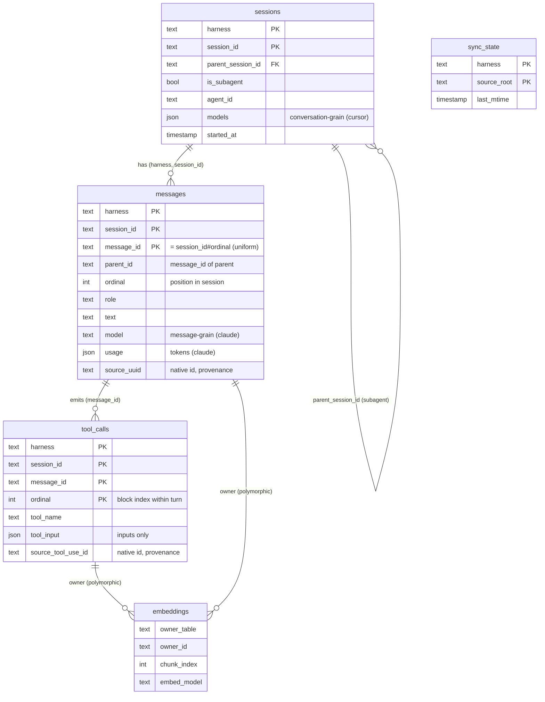

# Creative — Schema Field Enumeration + Draft DDL

**Task:** `p1-data-backbone` milestone 1 (Schema field enumeration + locked DDL), L3 sub-run.
**Status:** REVIEWED — all open questions resolved (§6). Ready to lock the DDL pending operator green-light.
**Evidence:** raw machine-generated enumerations in `./evidence/` (`cursor-field-enumeration.txt`, `claude-field-enumeration.txt`, `cursor-ai-code-tracking-db.txt`, `enumerator.py`). Derived empirically from the harnesses' own on-disk formats — clean-room compliant (no `claude-warehouse`; `cursor-warehouse.duckdb` not read as a schema source — only its ingest *logic* reviewed under operator direction to confirm sourcing).

## 1. Where the data lives (on-disk, this machine)

| Harness | Transcript path | Subagents | Per-record metadata |
|---|---|---|---|
| **Cursor** (IDE agent) | `~/.cursor/projects/<enc-path>/agent-transcripts/<conv-id>/<conv-id>.jsonl` | `…/<conv-id>/subagents/<subagent-conv-id>.jsonl` | **none** (only `role` + `message`) |
| **Claude Code** | `~/.claude/projects/<enc-path>/<session-id>.jsonl` | `…/<session-id>/subagents/agent-<agentId>.jsonl` + `agent-<agentId>.meta.json` | rich (uuid, parentUuid, timestamp, model, usage, cwd, gitBranch, version…) |

Corpus enumerated: **Cursor** 713 files / 25,065 records; **Claude** 39 files / 4,158 records. Both are JSONL event streams (one JSON object per line); line order *is* the ordering signal. The Cursor message stream is **content-faithful** (full text + full tool inputs) but **metadata-sparse** (no ids, timestamps, model, or usage in-stream); that metadata lives in `ai-code-tracking.db` (§1a).

**Secondary sources (real Cursor on-disk data, not the primary message stream):**
- **`ai-code-tracking.db`** — the important one. Found at `~/.cursor/ai-tracking/ai-code-tracking.db` natively, or on the WSL Windows mount (here: `/mnt/s/Users/Austin/.cursor/ai-tracking/ai-code-tracking.db`). Full enumeration in §1a + `evidence/cursor-ai-code-tracking-db.txt`. This is the roadmap's named "model/labeling enrichment" source and the empirical basis for the "WSL/Windows-mount-aware path resolution" requirement.
- `~/.cursor/chats/<hash>/<id>/store.db` — the Cursor **CLI** agent (SQLite). Investigated and **deferred out of v1** (§6): it's a content-addressed blob DAG (mixed JSON + protobuf) that embeds tool outputs and reasoning — a separate ingestion adapter, not a JSONL variant.
- `~/.cursor/cursor-warehouse.duckdb` — operator's *derived* warehouse (provenance-sensitive). Not read as a schema source.

## 1a. `ai-code-tracking.db` — the Cursor metadata side-store (ALL fields)

A SQLite DB Cursor writes to track AI-authored code. Tables (row counts from the operator's live DB):

| Table | Rows | Fields | Relevance |
|---|---|---|---|
| **`ai_code_hashes`** | 18,113 | `hash`, `source` (`composer`/`tab`), `fileExtension`, `fileName` (abs path), `requestId`, **`conversationId`** (= our `session_id`), **`timestamp`** (epoch ms), `createdAt` (epoch ms), **`model`** | The join that recovers Cursor's `model` *and* real timestamps — but **only for conversations that produced code** (`composer` 17,920 / `tab` 193), and keyed by `requestId`, **not** by transcript message. |
| `scored_commits` | 760 | `commitHash`, `branchName`, `scoredAt`, `lines{Added,Deleted}`, `tab/composer/human/blankLines*`, `commitMessage`, `commitDate`, `v1AiPercentage`, `v2AiPercentage` | **AI-code attribution** — an explicit **v1 exclusion** (roadmap "Future"). DROP. |
| `conversation_summaries` | **0** | `conversationId`, `title`, `tldr`, `overview`, `summaryBullets`, `model`, `mode`, `updatedAt` | Cursor's *would-be* session title/summary/mode. **Schema exists but unpopulated** here — so no reliable Cursor `title` source today. |
| `tracked_file_content` | **0** | `gitPath`, `content`, `conversationId`, `model`, `fileExtension`, `createdAt` | AI-authored file snapshots. Empty; source-file/content capture is a v1 exclusion. DROP. |
| `ai_deleted_files` | 72 | `gitPath`, `composerId`, `conversationId`, `model`, `deletedAt` | File-purge provenance — v1 exclusion. DROP. |
| `tracking_state` | 1 | `key`, `value` | Bookkeeping (`trackingStartTime`). DROP. |

**What this genuinely buys us (empirically, against the live warehouse):**
- **`model`: recoverable and well-populated.** After enrichment, **21,248 / 24,736 Cursor messages (86%) carry a model**, across 18 distinct models. Caveat: it's applied at **conversation granularity** (every message in a code-producing conversation inherits that conversation's model) — only **68 conversations** have code hashes at all, so read-only conversations get no model. **58/68 are single-model**, 9 are two-model, 1 is three-model.
- **`timestamp`: partial.** Real epoch-ms timestamps exist, but only for code-producing turns and only joinable at `conversationId`/`requestId` grain — **not mappable to an individual transcript message**. Usable to refine session `started_at`/`ended_at` for code-producing conversations; otherwise file mtime remains the fallback.

## 2. The headline finding: the two formats are wildly asymmetric

- **Claude Code is self-describing.** Every content record carries `uuid`, `parentUuid` (threading), `sessionId`, `timestamp`, `message.model`, `message.usage.*`, `cwd`, `gitBranch`, `version`, plus subagent identity (`agentId`, `isSidechain`) and explicit tool-call ids.
- **Cursor's transcript is content-faithful but metadata-sparse.** The message stream's *only* top-level keys are `role` and `message` (plus a `turn_ended` marker): full text and full tool inputs are present, but the stream carries **no ids, parent pointers, timestamps, model, or token usage**. That metadata lives in `ai-code-tracking.db` (§1a), recoverable at **conversation** grain (model for ~86% of messages; timestamps partially). Per-message identity/ordering is still **synthesized** from `(conversation-id-from-path, line-ordinal)`.

This asymmetry is the central schema design force. The response is **not** to let columns mean different things per harness, but to mint **uniform deterministic identities** (`message_id = {session_id}#{ordinal}`) for *both* harnesses and demote each harness's native ids to clearly-labeled `source_*` provenance columns (§5). The one place uniformity is genuinely strained is **`model`**: Claude has a true per-message model; Cursor has model(s) only **per conversation** (side-DB), not attributable to an individual message. Resolved by splitting model across two grain-specific columns (`messages.model` Claude-side, `sessions.models` Cursor-side) so neither harness fabricates a grain it lacks (§4, §6).

### Subagent ↔ parent linkage is also asymmetric

| | Claude Code | Cursor |
|---|---|---|
| Subagent file | `subagents/agent-<agentId>.jsonl` | `subagents/<subagent-conv-id>.jsonl` |
| In-record agent id | `agentId` on records; `isSidechain=true` | none (file is a bare message list) |
| Parent→child link | **explicit**: `agent-<id>.meta.json` → `{agentType, description, toolUseId}`; `toolUseId` points at the parent's `tool_use.id` | **structural only**: child file sits in the parent conversation's `subagents/` dir; parent `Task` tool_use has no child id (only `resume` references a *prior* subagent id) |
| Cross-session fork | `fork-context-ref` `{parentSessionId, parentLastUuid, agentId, contextLength}` | n/a observed |

## 3. ALL fields that exist (complete enumeration)

Legend: **KEEP** = goes in the locked schema · **DERIVE** = synthesized (not literally on disk) · **ENRICH** = filled later from a side source, NULL otherwise · **DROP** = exists but deliberately not stored (with reason).

### 3a. Cursor — `agent-transcripts/*.jsonl` (3 record kinds)

**`role:user` / `role:assistant`** (the only content-bearing records):

| On-disk field | Disposition | Target |
|---|---|---|
| `role` | KEEP | `messages.role` |
| `message.content[text].text` | KEEP | `messages` text content |
| `message.content[text].type` (`"text"`) | DROP (discriminator only) | — |
| `message.content[tool_use].name` | KEEP | `tool_calls.tool_name` |
| `message.content[tool_use].input` (+ all `…input.*` leaves: `command`, `path`, `pattern`, `glob`, `old_string`/`new_string`, `contents`, `todos[]`, `questions[]`, `prompt`, `subagent_type`, `resume`, `url`, `query`, `target_directories[]`, … — full list in evidence) | KEEP (stored **whole** as JSON, untruncated, **inputs only**) | `tool_calls.tool_input` |
| `message.content[tool_use].type` (`"tool_use"`) | DROP (discriminator) | — |
| `message.content[tool_use].input.todos[]` (TodoWrite) | KEEP (as ordinary tool input; no separate plan_documents table) | `tool_calls.tool_input` |
| *(no message id)* | DERIVE | `messages.message_id` = `{session_id}#{ordinal}` (uniform) |
| *(no parent)* | DERIVE | `messages.parent_id` = prior message's `message_id` (linear) |
| *(no ordinal)* | DERIVE | `messages.ordinal` = position in conversation order (byte order) |
| *(no model in stream)* | ENRICH (conversation-grained) | `sessions.models` ← distinct models from `ai-code-tracking.db.ai_code_hashes` on `conversationId` (1–3 per conv; NULL for non-code convs). `messages.model` stays NULL for Cursor (no per-message grain) |
| *(no timestamp in stream)* | ENRICH (partial) / mtime | `messages.ts` NULL; session `started_at`/`ended_at` from file mtime, refinable from `ai_code_hashes.timestamp` for code-producing convs |
| *(no tool_use id)* | DROP | native id absent; `tool_calls` identity is `(message_id, ordinal)`; `source_tool_use_id` NULL |

**`role:turn_ended`** — `{type:"turn_ended", status, error}`. Turn boundary / abort marker. Disposition: **DROP** as content; optionally surface `error`/`status` onto the preceding assistant message if we want abort visibility (open question, low priority).

Cursor has **no `tool_result` blocks at all** — the harness itself stores inputs only, which happily matches our tool-inputs-only invariant.

### 3b. Claude Code — `*.jsonl` (13 record kinds)

**`assistant`** (1,578 recs):

| Field group | On-disk fields | Disposition → target |
|---|---|---|
| Identity | `uuid`, `parentUuid`, `sessionId`, `type` | KEEP → `messages.message_id` / `parent_id` / `session_id` / role |
| Threading/agent | `agentId`, `isSidechain`, `attributionAgent` | KEEP → sessions/subagent linkage |
| Attribution | `attributionSkill`, `attributionMcpServer`, `attributionMcpTool` | KEEP (modest) → `messages.attribution_*` (NULLable) |
| Context | `cwd`, `gitBranch`, `version`, `entrypoint`, `userType` | KEEP `cwd`,`gitBranch`,`version` → sessions; DROP `entrypoint`,`userType` (low value) |
| Time | `timestamp` | KEEP → `messages.ts` |
| Content | `message.content[text].text` | KEEP → text |
| | `message.content[thinking].thinking` + `.signature` | **DROP both** — thinking is deliberately not captured (separable → dropped; see §5 design note) |
| | `message.content[tool_use].{id,name,input}` | KEEP → `tool_calls` (inputs only); `id` → `source_tool_use_id` (provenance) |
| | `message.content[tool_use].caller.type` | **DROP** — only `'direct'` ever observed (407/407); no signal |
| Model | `message.model` | KEEP → `messages.model` (the "model-per-chain" key) |
| Message meta | `message.id`, `message.type`, `message.role` | KEEP `role`; DROP `message.id` (use `uuid`), `message.type` |
| Stop info | `message.stop_reason`, `stop_details`, `stop_sequence` | DROP (not needed for reconstruction/search) |
| **Token usage** | `message.usage.*` (input/output/cache_*, `iterations[]`, `server_tool_use`, `service_tier`, `speed`, `inference_geo`) | **KEEP** → `messages.usage` (stored **whole** as JSON, untruncated). Claude-only; Cursor NULL (no token data on disk). |
| | `requestId`, `message.diagnostics.*` | DROP (operational; not token accounting) |

**`user`** (909 recs):

| Field | Disposition → target |
|---|---|
| `uuid`, `parentUuid`, `sessionId`, `timestamp`, `type` | KEEP (identity/threading/time) |
| `message.content` (string) **or** `message.content[text].text` | KEEP → text (both shapes occur) |
| `message.content[tool_result].*` (`content`, `is_error`, `tool_use_id`, nested text/tool_reference) | **DROP** — tool **outputs** (inputs-only invariant) |
| `toolUseResult.*` (huge subtree: `stdout`, `stderr`, `file.*`, `structuredPatch[]`, `results[]`, `resolvedModel`, …) | **DROP** — tool **outputs** |
| `agentId`, `isSidechain`, `isMeta` | KEEP `agentId`/`isSidechain`; **DROP `isMeta`** (Cursor has no equivalent; not worth a non-uniform column) |
| `cwd`, `gitBranch`, `entrypoint`, `userType`, `version` | as assistant (KEEP cwd/gitBranch/version) |
| `promptId`, `promptSource`, `permissionMode`, `queuePriority` | DROP (operational noise) |
| `sourceToolUseID`, `sourceToolAssistantUUID`, `origin.kind` | KEEP — links task-notification user turns back to the spawning tool_use (subagent reconstruction) |

**`system`** (405) — `subtype` (e.g. `turn_duration`), `content`, `level`, `durationMs`, `messageCount`, `pendingBackgroundAgentCount`, + identity/context. Disposition: **DROP** as content (operational logs). Possible exception: `content` carries slash-command invocations (`<command-name>/mcp…`) — low value, drop for v1.

**Session-scoped singletons (fold into `sessions`, drop the record):**

| Record kind | Field kept | → |
|---|---|---|
| `ai-title` | `aiTitle` | `sessions.title` |
| `custom-title` | `customTitle` | `sessions.title` (override) |
| `agent-name` | `agentName` | `sessions.agent_name` |
| `last-prompt` | `lastPrompt`, `leafUuid` | DROP (derivable) |
| `mode` | `mode` | DROP (or `sessions.mode`, low value) |
| `permission-mode` | `permissionMode` | DROP |
| `fork-context-ref` | `parentSessionId`, `parentLastUuid`, `agentId`, `contextLength` | KEEP → subagent/fork linkage on `sessions` |

**Dropped wholesale (not content, not reconstruction):**
- `file-history-snapshot` (400) — editor file-backup bookkeeping (`snapshot.trackedFileBackups.*`). DROP.
- `attachment` (189) — UI/skill-injection deltas (`attachment.addedNames[]`, `deferred_tools_delta`, …). DROP.
- `queue-operation` (56) — prompt queue bookkeeping. DROP.

## 4. Recommended kept subset → draft schema (harness-labeled, one shared set)

> Five tables: **sessions, messages, tool_calls (inputs-only), embeddings, _sync_state.** (The brief named a sixth, `plan_documents`; **dropped by operator decision** — no harness emits a distinct plan-document record, and the only candidate content, `TodoWrite` lists, is already captured verbatim in `tool_calls.tool_input`.) Every content row carries a `harness` column. DDL below is an **illustrative sketch for review**, not the locked `0001` text.

### The cross-harness semantic contract (governs every column)

**Every column means exactly one thing, independent of harness.** Only the *extraction* may differ per harness, and extraction MUST yield that one meaning. We never say "`ordinal` is X for Cursor but Y for Claude" — that design rots the moment a 3rd/4th harness appears. If a value cannot be made to mean the same thing everywhere, it does not get a shared column (it goes to a provenance column or is dropped).

Worked examples:
- `ordinal` **means** "0-based position of this message within its session, in conversation order." Cursor and Claude both *extract* it from JSONL byte order; the meaning is identical.
- `message_id` **means** "stable identity of this message within `(harness, session_id)`," and is uniformly **`{session_id}#{ordinal}`** for *all* harnesses (deterministic, not random, not a hash). Claude's native `uuid` is not the identity — it's kept in `source_uuid` (provenance only).
- **model is split by grain, and we never fake the grain we don't have.** Two distinct columns, each with one meaning: `messages.model` = "model that produced this *message*" (Claude has it; Cursor NULL); `sessions.models` = "model(s) attributed to this *conversation*" (Cursor has it from the side-DB; Claude NULL — it's queryable from messages). Cursor genuinely lacks per-message model and Claude isn't rolled up to the session, so each harness populates exactly the grain it actually has. No inheritance, no fabrication.

### Entity relationships



### How reconstruction works (ordinals)

- **`messages.ordinal`** — uniform meaning: position of the message within its session, in conversation order (0-based, contiguous over kept content messages). This is the session-reconstruction key: `messages ORDER BY ordinal`.
- **`tool_calls.ordinal`** — uniform meaning: the tool_use block's index within its emitting turn's content array. **Tool calls are children of a message, not peer rows**: one assistant turn commonly emits several (observed 2–6 content blocks/turn). Attach them with `tool_calls WHERE message_id = … ORDER BY ordinal`.
- **Threading:** `parent_id` = the `message_id` of the parent message (uniform). Claude extracts it by resolving `parentUuid`→parent's ordinal at ingest (handles the sidechain DAG); Cursor's chain is linear so it's the previous message. `ordinal` is reading order; `parent_id` is the logical thread.
- **Interleaving is preserved, not lost.** Empirically, **text never follows a tool call within a turn (0 / 5,646 tool-bearing turns across both harnesses)**: every turn is `[thinking?, text?, tool_use*]`, then yields. So a turn's text always precedes its tools, and concatenated-text + block-indexed tool children is **lossless by construction**. Guard: ingest asserts no record has text-after-tool; if a future harness violates the turn contract, it fails loudly and we revisit (see §6 Decided).

```sql
-- one row per conversation; subagents are their own session rows linked to a parent
CREATE TABLE sessions (
    harness            TEXT    NOT NULL,          -- 'cursor' | 'claude'
    session_id         TEXT    NOT NULL,          -- cursor: conv-id from path; claude: sessionId
    project_path       TEXT,                      -- decoded from the encoded project dir
    cwd                TEXT,                      -- claude: cwd; cursor: derived from project_path
    git_branch         TEXT,                      -- claude only
    source_path        TEXT    NOT NULL,          -- absolute path to the .jsonl (provenance + watermark)
    is_subagent        BOOLEAN NOT NULL DEFAULT FALSE,
    parent_session_id  TEXT,                      -- subagent → parent conversation
    agent_id           TEXT,                      -- claude: agentId; cursor: subagent file id
    agent_type         TEXT,                      -- claude: agentType/attributionAgent; cursor: Task.subagent_type
    spawning_tool_use_id TEXT,                    -- claude: meta.json toolUseId; cursor: NULL (structural only)
    agent_name         TEXT,                      -- claude agent-name
    models             JSON,                      -- conversation-grained model(s). cursor: distinct set from ai_code_hashes (1–3 observed); claude: NULL (per-message, see messages.model)
    title              TEXT,                      -- claude ai/custom title; cursor NULL (enrich)
    harness_version    TEXT,                      -- claude version; cursor NULL
    started_at         TIMESTAMP,                 -- claude min(ts); cursor NULL/mtime
    ended_at           TIMESTAMP,                 -- claude max(ts); cursor NULL/mtime
    PRIMARY KEY (harness, session_id)
);

-- the message-identity contract + reconstruction keys.
-- column meanings are harness-independent; per-harness extraction notes follow each.
CREATE TABLE messages (
    harness     TEXT    NOT NULL,
    session_id  TEXT    NOT NULL,
    message_id  TEXT    NOT NULL,   -- identity within (harness, session). UNIFORM format '{session_id}#{ordinal}', deterministic.
    parent_id   TEXT,               -- message_id of the parent (claude: resolve parentUuid→ordinal; cursor: previous message). NULL for roots.
    ordinal     INTEGER NOT NULL,   -- position in session, conversation order, 0-based. Extracted from JSONL byte order for both.
    role        TEXT    NOT NULL,   -- 'user' | 'assistant'
    text        TEXT,               -- the turn's text, stored whole (thinking deliberately NOT captured — see §5 design note)
    model       TEXT,               -- model that produced THIS MESSAGE. claude: message.model; cursor: NULL (model lives at session grain — see sessions.models)
    ts          TIMESTAMP,          -- wall-clock time of this message. claude: timestamp; cursor: NULL (no per-message time on disk)
    usage       JSON,               -- token usage subtree, stored whole. claude: message.usage.*; cursor: NULL
    source_uuid TEXT,               -- provenance only: harness-native record id if any (claude uuid; cursor NULL). NOT a join key.
    PRIMARY KEY (harness, session_id, message_id)
);

-- tool INPUTS only — never outputs
CREATE TABLE tool_calls (
    harness           TEXT NOT NULL,
    session_id        TEXT NOT NULL,
    message_id        TEXT NOT NULL,   -- FK → messages.message_id (the turn that emitted it)
    ordinal           INTEGER NOT NULL,-- block index of this tool_use within its turn's content array (uniform)
    tool_name         TEXT NOT NULL,
    tool_input        JSON NOT NULL,   -- stored whole, untruncated
    source_tool_use_id TEXT,           -- provenance: claude 'toolu_…' id (used to resolve subagent-spawn linkage); cursor NULL
    PRIMARY KEY (harness, session_id, message_id, ordinal)
);

-- forward-declared; populated in Phase 2 (embeddings + search)
CREATE TABLE embeddings (
    harness     TEXT NOT NULL,
    owner_table TEXT NOT NULL,         -- 'messages' | 'tool_calls'
    owner_id    TEXT NOT NULL,         -- references the owner row's message_id
    chunk_index INTEGER NOT NULL,
    embed_model TEXT NOT NULL,
    vector      FLOAT[384],            -- VSS/HNSW in Phase 2
    PRIMARY KEY (harness, owner_table, owner_id, chunk_index)
);

-- incremental ingest watermark + non-append mutation detector (per source root)
CREATE TABLE _sync_state (
    harness     TEXT NOT NULL,
    source_root TEXT NOT NULL,
    last_mtime  TIMESTAMP,
    last_path   TEXT,
    updated_at  TIMESTAMP NOT NULL,
    PRIMARY KEY (harness, source_root)
);
```

## 5. The message-identity contract (the crux)

### Design note: thinking is dropped on purpose

We **do not capture model "thinking"/reasoning** as a stored field. Rule: *if a harness lets us separate thinking from response, we separate it and drop it; if it doesn't, we accept whatever is folded into `text`.* Claude emits explicit `thinking` blocks → we drop them (keep only `text`). Cursor has no separate thinking block → its `text` is its single channel and we keep it as-is. There is no `thinking` column.

### Identifier naming + format

Every identifier column is named `*_id`, typed `TEXT`. The two *identity* columns are **uniform across harnesses by construction**, so the name carries a real, harness-independent promise:

| Column | Uniform value | Meaning |
|---|---|---|
| `session_id` | the conversation/session UUID (path-derived for Cursor, `sessionId` for Claude) | identity of a session |
| `message_id` | **`{session_id}#{ordinal}`** for *all* harnesses | identity of a message within a session |
| `parent_id` | a `message_id` (or NULL) | the parent message in the thread |
| `agent_id` | harness subagent id | identity of a subagent |
| `source_uuid` (messages) | native record id **or NULL** | provenance only — never joined on |
| `source_tool_use_id` (tool_calls) | native `toolu_…` id **or NULL** | provenance + subagent-spawn resolution |

No `_uid`/`_uuid` names: identity is a deterministic surrogate, not a wire-format UUID. Native harness ids live only in the clearly-labeled `source_*` provenance columns. (Contrast cursor-warehouse, which names its column `uuid` but stores `{session_id}:{line_idx}` — the misnomer we reject.)

### Derivation + stability (why re-ingest is idempotent)

`message_id` is a **pure function** `f(session_id, ordinal)` for *both* harnesses, and `ordinal` is a pure function of the record's position in an **append-only** JSONL log. Therefore re-ingesting the same bytes always reproduces identical ids — no randomness, no content hashing.

- **Claude:** `ordinal` from record order; `parent_id` by resolving native `parentUuid`→the parent's ordinal at ingest (dangling/dropped parents → nearest kept ancestor or NULL); native `uuid` retained in `source_uuid` for traceability and parent resolution.
- **Cursor:** `ordinal` from record order; `parent_id` = previous content message (linear chain; no branching observed); `source_uuid` = NULL (none on disk).
- **Why not content-hash ids?** They collide for identical messages (`"ok"`, `"yes"`) and change identity whenever content changes — strictly worse than position-derived ids under an append-only source.
- **The one failure mode** is the source log being *rewritten* (lines reordered/removed), which would shift ordinals. We **detect** it rather than silently re-id: `_sync_state` tracks each file's size+mtime (and may keep a prefix hash); a shrink/rewrite raises a flag for the operator instead of corrupting identities. (Optional hardening: a per-row content `digest` tripwire.)
- **Reconstruction keys satisfied:** conversation = `(harness, session_id)`; ordering = `ordinal`; parent/child = `parent_id`; subagent↔parent = `sessions.parent_session_id` (+ `spawning_tool_use_id`→`tool_calls.source_tool_use_id` where available).

## 6. Decisions (all open questions resolved)

- **`is_meta` — DROP.** No Cursor equivalent; not worth a non-uniform column.
- **`caller_type` — DROP.** Only `'direct'` observed (407/407); no signal.
- **`thinking` — DROP** (by design; see §5 note). Separable → dropped for Claude; Cursor has none.
- **`plan_documents` table — DROP.** No harness emits plan-document records; `TodoWrite` lists are already captured in `tool_calls.tool_input`. Schema is now five tables.
- **Within-turn interleaving — RESOLVED, no loss.** Verified 0/5,646 tool-bearing turns have text after a tool; the turn contract makes concatenated-text + block-indexed tools lossless. Ingest asserts this and fails loudly if a future harness violates it.
- **Token usage — KEEP.** `messages.usage JSON` (whole `message.usage.*` subtree, untruncated). Claude-only; Cursor NULL. (`requestId`/`diagnostics` still dropped — operational, not token accounting.)
- **`ai-code-tracking.db` scope — ACCEPTED as recommended.** KEEP `model` (→ `sessions.models`) + use `ai_code_hashes.timestamp` to refine session times; DROP `scored_commits`, `ai_deleted_files`, `tracked_file_content` (roadmap v1 exclusions); `conversation_summaries` empty → no Cursor `title` yet (enrich-when-available).
- **Model granularity — split by grain, no faking.** Add `sessions.models` (conversation grain, Cursor-populated) and keep `messages.model` (message grain, Claude-populated); each harness fills only the grain it actually has, the other is honestly NULL. (See §4 contract.)
- **Non-content Claude records — DROP** (`file-history-snapshot`, `attachment`, `system`, `queue-operation`, `mode`, `permission-mode`).
- **Cursor CLI `store.db` (`~/.cursor/chats/`) — OUT of v1 (deferred to a future milestone).** Investigated (86 agents on this machine): it is **not** a JSONL variant but a **content-addressed blob DAG** — `blobs(id=sha256, data)` + a `meta` head pointer (`latestRootBlobId`), reconstructed by DAG traversal. Serialization is **mixed**: ~72/305 blobs are JSON messages (`system`/`user`/`assistant`/`tool`), ~233 are **protobuf-encoded** intermediate/chunk nodes. It also **embeds full tool OUTPUTS** (`role:"tool"` blobs with stdout, `highLevelToolCallResult`) and explicit `type:"reasoning"` blocks — both of which v1 deliberately excludes. It maps to the *same* conceptual model later, but needs a separate ingestion adapter (protobuf decode + DAG walk + output/thinking filtering) and its own enumeration. Deferred.

## 7. Remaining work before lock

All review questions are resolved. Next (pending operator green-light): lock the DDL, write it as `migrations/0001`, build the TDD test suite, and commit the durable enumeration record + shared real/pathological fixtures.
