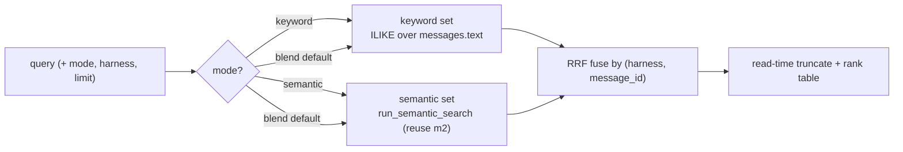

# Architecture Decision: Query Routing + Rank Fusion for `sr-search`

## Requirements & Constraints

`sr-search` is the *friendly default* entrypoint. The roadmap says it "picks SQL, vector,
or a blend per the question, merges and ranks." Two coupled decisions: **(1) routing** —
what lookup(s) a query triggers; **(2) fusion** — how the resulting sets become one ranked
list.

Quality attributes, ranked:

1. **Honesty / no silent failure** — the surface must never quietly drop a result set a
   user expected. A wrong auto-route that hides matches is worse than doing more work.
2. **Simplicity (KISS/YAGNI)** — the project's repeatedly-upheld value; `sr-query` and
   `sr-semantic` already exist as the *pure* escape hatches, so `sr-search` does not have
   to reinvent them.
3. **Determinism / testability** — fusion must be reproducible for torch-free unit tests.
4. **Reuse (DRY)** — prefer a standard, library-grade technique over a bespoke scorer.

**Scope resolution (the trap):** routing to "**SQL**" must **not** mean
natural-language→SQL translation — that needs an LLM and is out of scope for a local,
torch-only engine. The raw-SQL path already *is* `sr-query`. So within `sr-search`, "SQL"
collapses to the **keyword** lookup (an `ILIKE` predicate, per
`creative-keyword-search-mechanism.md`); the three lookup kinds the roadmap names map to
**keyword**, **semantic**, and **blend**.

Out of scope: NL→SQL, learned/embedding-based query classifiers, per-term boolean syntax.

## Components

Components: a keyword query (new, in `search.py`), the reused
`semantic.run_semantic_search`, and a pure `fuse()` function. All read-only, one
connection.

## Options Evaluated

**Routing:**

- **R-A — Blend by default + explicit `--mode {blend,keyword,semantic}`**: always run
  both halves unless the user forces one; the pure surfaces (`sr-query`/`sr-semantic`)
  remain the dedicated single-method tools.
- **R-B — Heuristic auto-router**: inspect the query (quotes, length, identifier-shape,
  "?"…) and *choose* keyword vs semantic vs blend automatically.

**Fusion:**

- **F-A — Reciprocal Rank Fusion (RRF)**: `score = Σ 1/(k + rank_list)` across the lists
  a doc appears in (k≈60). Rank-based, score-scale-independent.
- **F-B — Weighted normalized score**: normalize each side's score to [0,1] and take a
  weighted sum.
- **F-C — Interleave**: alternate one pick from each list.

## Analysis

| Criterion | R-A blend+flag | R-B auto-router |
|-----------|----------------|-----------------|
| Honesty / no silent drop | ✓ both run; nothing hidden | ✗ a misclassification silently drops a whole method |
| Simplicity | ✓ no classifier | ✗ heuristics to write, tune, and maintain |
| Testability | ✓ trivial | ✗ must test the classifier's guesses |
| "Friendly default" fit | ✓ blend *is* the friendly behavior | partial — clever but surprising |

| Criterion | F-A RRF | F-B weighted score | F-C interleave |
|-----------|---------|--------------------|----------------|
| Works with an **unranked** keyword set | ✓ uses ranks only (keyword needs just an ordering) | ✗ needs a keyword *score* we don't have | ✓ ranks only |
| Rewards docs found by both | ✓ contributions sum | ✓ if tuned | ✗ no boost |
| Score-scale independence | ✓ (designed for it) | ✗ normalization is fiddly/fragile | n/a |
| Determinism | ✓ | ✓ | ✓ |
| Standard technique (DRY) | ✓ the textbook hybrid-search default | ~ | ~ |

Key insights:

- **`sr-search` being the blend, not a router, is the whole point of the three-surface
  design.** `sr-query` is pure SQL; `sr-semantic` is pure vector; `sr-search` is the one
  that combines. An auto-router would duplicate the pure surfaces' job *and* add a
  silent-failure mode — it optimizes cleverness over honesty (attribute #1).
- **The keyword decision forces the fusion choice.** Because `ILIKE` yields **no score**
  (only a match + an ordering), score-based fusion (F-B) is off the table without
  fabricating a score. RRF (F-A) needs only *ranks*, so it fits the unranked keyword set
  natively and lets the semantic cosine ranking carry the relevance weight. This is the
  "lost keyword ranking is recovered downstream" link promised in the keyword doc.
- **RRF naturally dedups and boosts.** Fusing by `(harness, message_id)` means a message
  found by *both* keyword and semantic accrues both reciprocal-rank contributions and
  rises — exactly the desired hybrid behavior, for free.

## Decision

**Selected**: **R-A (blend by default + `--mode` override)** routing, fused with **F-A
(Reciprocal Rank Fusion)**.

**Rationale**: R-A is the only routing that satisfies honesty (#1) and simplicity (#2)
and matches the three-surface design (`sr-search` = the blend; pure lookups already
exist). RRF is the only fusion that works with an unranked keyword set without fabricating
a score, is the standard hybrid-search technique (DRY), is deterministic (testable), and
rewards dual-method matches.

**Tradeoff**: No "smart" auto-selection of a single method — but that is a feature, not a
loss (the pure surfaces and `--mode` cover it without guessing). RRF's `k` constant is a
tunable, not a correctness knob (k=60 is the well-established default).

## Implementation Notes

- **`fuse(keyword_ids, semantic_hits, *, k=60, limit) -> list[fused]`**: pure function over
  two ordered lists of `(harness, message_id)` keys; returns the top-`limit` keys by RRF
  score, descending, with deterministic tiebreak (RRF score, then keyword-rank, then
  `message_id`). Unit-testable with no DB.
- **Result provenance**: each `SearchHit` records which method(s) found it
  (`via ∈ {keyword, semantic, both}`) — surfaced as a column and useful for tests.
- **Modes**: `--mode blend` (default) runs both halves; `keyword` / `semantic` run one
  (fusion of a single list degenerates to that list's order — RRF still applies cleanly).
- **`--harness` filter** (the per-harness "filter" the cross-harness invariant describes;
  m2 deferred it here): applies to **both** halves. Keyword adds `AND harness = ?`; the
  semantic half needs `run_semantic_search` to accept an optional `harness` filter applied
  **inside** the embeddings KNN (so the top-k is correct, not post-filtered). This is the
  **one** additive, backward-compatible change to m2 code (new keyword-only param,
  `harness: str | None = None`); everything else is new `search.py`.
- **Bounding**: run each half with its own bounded fetch (semantic via its existing
  `limit*OVERFETCH`; keyword via an `ILIKE … LIMIT` cap) so fusion sees enough candidates
  without unbounded result sets, then RRF-truncate to `limit`.
- **Owner join**: the keyword query already selects from `messages` (full row available);
  the semantic half returns `SemanticHit`s carrying the join fields. Fusion needs only the
  keys + each side's order; the final hit objects reuse the already-fetched message rows.
