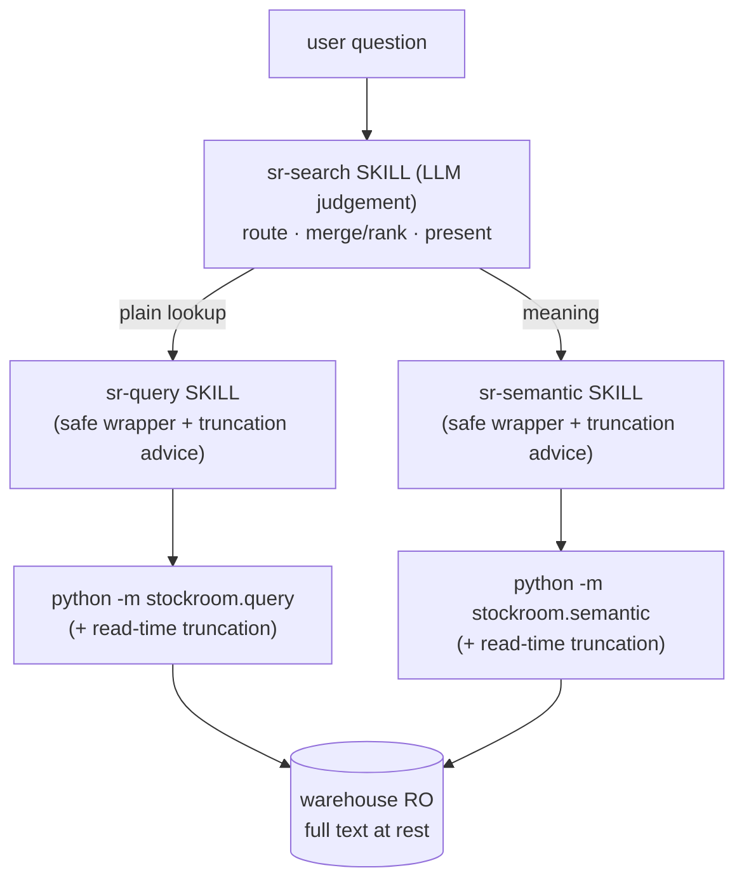

# Architecture Decision: The `sr-search` Surface (skill-orchestrator vs. Python fusion module)

> Phase-2 (L4) architecture decision, made mid-flight during the original m3 sub-run. It
> reshapes the remaining Phase-2 milestone decomposition, so its binding conclusions are
> also folded into `milestones.md` (this doc is the reasoning record).

## Requirements & Constraints

`sr-search` is the *friendly default* search entrypoint. The roadmap: it "picks SQL,
vector, or a blend per the question, merges and ranks," and applies a context-aware
read-time truncation. The question: **what *is* `sr-search`** — a Python module that
programmatically blends keyword + vector results, or an LLM-judgement skill that
orchestrates the existing surfaces?

Quality attributes, ranked:

1. **Intelligent routing** — the headline value is *deciding* "plain lookup vs. meaning
   vs. both." This is a judgement, and it must actually be good, not a brittle heuristic.
2. **No duplication of operational knowledge** — the safeguards that keep an LLM from
   blowing out its context or wasting failed tool calls on a surface must live in exactly
   one place per surface.
3. **Truncation is a demonstrable, tested feature** — the phase's headline "Done when";
   full content preserved at rest, sensibly trimmed at read time.
4. **Honors the test-first foundation** — Python work stays test-first + green `make ci`.

Constraints / context: the engine modules `stockroom.query` and `stockroom.semantic`
already exist (power-user surfaces); the `/sr-*` skill *wrappers* were (wrongly) deferred
wholesale to Phase 5; a local torch-only engine has **no NL→SQL** capability; nothing has
shipped, so realignment is at its cheapest.

## Components

The skills are the **safe LLM-ergonomic layer**; the Python modules are the **raw
superpowers**; truncation is a tested capability on the modules, surfaced + advised by the
skills.

## Options Evaluated

- **Option 1 — Python fusion module** (`stockroom.search`: `ILIKE` keyword + semantic +
  RRF, always-blend, `--detail` truncation). The original m3 plan.
- **Option 2 — `sr-search` skill → engine modules directly** (LLM routes, shells out to
  `python -m stockroom.query` / `.semantic` itself).
- **Option 3 — `sr-search` skill → sibling skills** (LLM routes by delegating to the
  `sr-query` / `sr-semantic` *skills*; truncation is tested Python on the surfaces).

## Analysis

| Criterion | 1 — Python fusion | 2 — skill → modules | 3 — skill → skills |
|-----------|-------------------|---------------------|--------------------|
| Intelligent routing (#1) | ✗ dumb always-blend (a Python router is brittle) | ✓ LLM judgement | ✓ LLM judgement |
| No operational-knowledge duplication (#2) | n/a (no skills) | ✗ `sr-search` must re-encode every safeguard the wrappers carry | ✓ advice lives once per wrapper skill |
| Avoids reimplementing `sr-query` (#2) | ✗ `ILIKE` path duplicates raw SQL | ✓ | ✓ |
| Truncation demonstrable + tested (#3) | ✓ (but in the wrong module) | ~ depends | ✓ tested on surfaces, advised by skills |
| Test-first foundation (#4) | ✓ pytest the module | ✓ python truncation only | ✓ python truncation only; skills verified artisanally |

Key insights:

- **The router was dumb because it was in the wrong layer.** The original plan *rejected* a
  Python auto-router as too brittle and fell back to always-blend — but the brittleness was
  an artifact of doing judgement in Python. Moving it to the LLM (Options 2/3) makes the
  routing actually intelligent, which is the whole point of the surface.
- **A Python keyword path is a worse `sr-query`.** Raw SQL already expresses `ILIKE`;
  reimplementing keyword search in `stockroom.search` is duplication (the DRY tell that
  flagged Option 1).
- **Delegation target is the deciding axis between 2 and 3.** If `sr-search` calls the
  modules directly (Option 2), it must duplicate the per-surface operational advice
  (paging, column selection, truncation flags, failure handling) that the wrapper skills
  exist to hold. Delegating to the *skills* (Option 3) keeps that knowledge in one place
  and reduces `sr-search` to pure judgement + synthesis.
- **Skills aren't `pytest`-able, and that's acceptable here.** Prompt-skill behavior is
  verified artisanally by the operator (try a query, a semantic search, a "regular"
  search; confirm routing + behavior), with per-harness invocation forms verified in
  Phase 5. The test-first contract continues to bind the **Python** mechanism (truncation),
  not the prose skill.

## Decision

**Selected**: **Option 3** — `sr-search` is an **LLM-judgement skill that delegates to the
`sr-query` / `sr-semantic` skills**, with read-time truncation implemented as a **tested
Python mechanism on the engine surfaces**. **No `stockroom.search` fusion module.**

**Rationale**: It is the only option that gets *intelligent* routing (#1) **and** keeps
operational knowledge un-duplicated (#2) by composing the wrapper skills, while preserving
truncation as a demonstrable, test-first feature (#3, #4). It matches the
"superpowers (modules) vs. safe wrappers (skills)" model: power lives in Python, safety/
ergonomics live in the skill that wraps each surface, and judgement lives in `sr-search`.

**Tradeoff**: `sr-search` is not unit-testable and the `sr-*` skill wrappers must be pulled
forward from Phase 5 into Phase 2 (Phase 5 retains only empirical per-harness invocation
verification). Accepted: artisanal verification is the operator's chosen posture for prompt
skills, and authoring the wrappers earlier exercises them sooner.

## Implementation Notes

- **Re-decomposes the remaining Phase-2 work** into four sequential milestones (see
  `milestones.md`): read-time truncation mechanism → `sr-query` skill → `sr-semantic`
  skill → `sr-search` skill. Each is its own sub-run, classified on entry.
- **Truncation mechanism**: a shared, tested helper that bounds wide output to a
  context-safe width with a **visible elision marker**, with selectable detail levels (a
  `compact | snippet | full` starting point carried from the superseded
  `creative-read-time-truncation` exploration). Wired into `stockroom.query` and
  `stockroom.semantic` rendering. Full text stays whole in the store and in returned hit
  objects — trimming is render-time only (no-truncation-at-rest invariant).
- **Wrapper skills** (`sr-query`, `sr-semantic`): SKILL.md prose + any helper `scripts/`,
  encoding when/how to use the surface, the truncation flags, and guardrails against
  context blowout / wasted tool calls. These are the single home for per-surface advice.
- **`sr-search` skill**: a SKILL.md that instructs the agent to (1) judge the lookup kind,
  (2) delegate to the `sr-query` and/or `sr-semantic` skills, (3) merge/rank and present a
  context-truncated answer. Routing and synthesis are prompt-driven; no fusion code.
- **Superseded**: the prior m3 plan and its creative docs (`creative-keyword-search-mechanism`,
  `creative-search-routing-and-fusion`, `creative-read-time-truncation`) — deleted; the
  `ILIKE`/RRF/Python-fusion approach is abandoned. This doc + `milestones.md` are the record.
