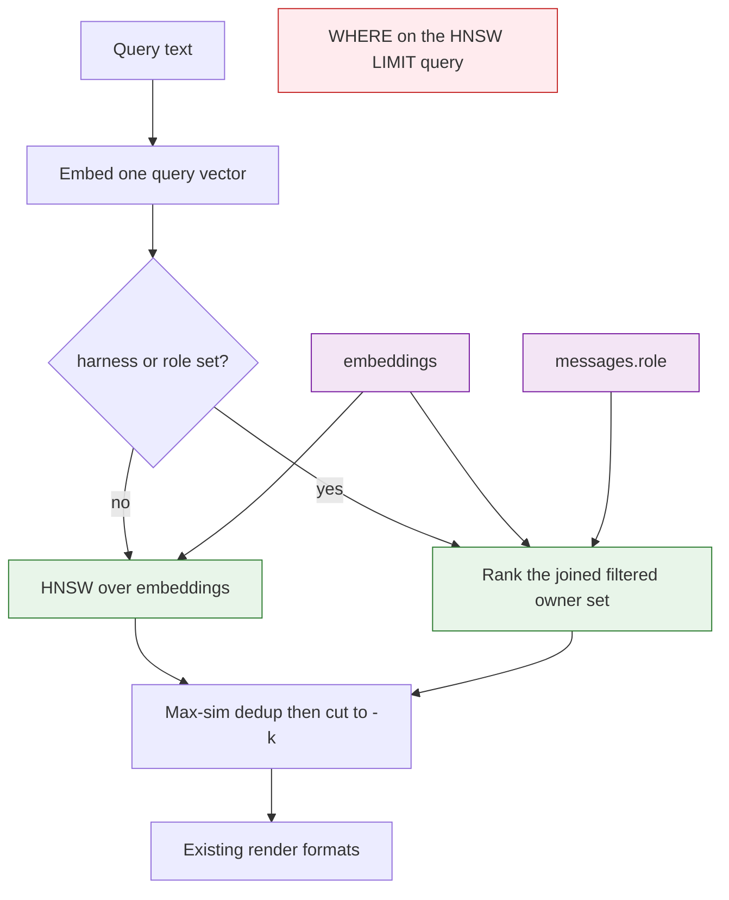

# Architecture Decision: Semantic CLI Filters

## Requirements & Constraints

The open question: should `stockroom semantic` accept filters that shrink the set of messages it ranks, which dimensions belong there, and what should the command look like.

The reported pain is two questions that the current split cannot answer together. `sr-semantic` ranks by meaning and refuses filters. `sr-query` filters and cannot rank by meaning. A repeated opening turn (a bootstrap / initial message, embedded once per session) then occupies the unfiltered neighborhood, so the top hits are that opening instead of the later turn that was actually about the topic.

Ranked quality attributes:

1. **Correct scope.** A filter must change which messages are the nearest, not discard rows from an already-chosen top `-k`. A filtered search that returns fewer hits than exist, or none, is wrong.
2. **One job per surface.** Semantic search stays meaning-ranking plus a few scopes. Counts, dates, projects, and id lookups stay `sr-query`.
3. **Simplicity.** Two harnesses today, a `harness` column so more can arrive later. No per-value indexes and no new vector extension.
4. **Agent ergonomics.** The flags must map onto "where I talked," "where you talked," "where we talked," and "in this harness."
5. **Local cost.** One private warehouse. An exact rank over a filtered subset is acceptable. The unfiltered path should keep the HNSW index.

Technical constraints, checked:

- `messages.role` is `'user' | 'assistant'`. Both Cursor and Claude Code store the human turn as `user` and the model turn as `assistant`. Claude `system` records and Cursor chat `system` leaves are dropped at ingest, so they are not a third speaker.
- `embeddings` carries `harness` and does not carry `role`. A role scope joins `messages`.
- `messages.ts` and `messages.model` are NULL for Cursor. A time or model filter would silently drop Cursor.
- DuckDB 1.5.4 VSS, probed in this session: `WHERE harness = 'a' ORDER BY array_cosine_distance(...) LIMIT 5` plans as `HNSW_INDEX_SCAN` then `FILTER` and returned **zero rows** when 10 matching rows existed and 2000 other rows were nearer. The same predicate on a join of `embeddings` to `messages` planned as sequential scans and returned the true nearest matches. Upstream VSS post-filters; the community `hnsw_acorn` extension documents the same limitation and is not a candidate (new extension, supply-chain surface).

In scope: optional equality scopes on the semantic command, applied before the result list is cut to `-k`.

Out of scope: a general predicate language; project, cwd, workspace, model, time, and entrypoint filters; boilerplate / near-duplicate suppression; changing what ingest stores; the dashboard.

## Components



`run_semantic_search` owns ranking. `render` stays a printer. The unfiltered path is the path that exists today: HNSW, over-fetch, max-sim dedup to one row per `(harness, owner_id)`, cut to `-k`. A scoped path ranks only owners that match, then applies the same dedup and cut.

## Options Evaluated

- **No filters.** Leave the skill boundary as written (`sr-semantic` refuses filters). Does not answer "where I talked about this in Claude."
- **Print-time filter.** Take today's top `-k` and drop rows. Same starvation as the broken SQL shape: if openings fill the window, the scope returns nothing.
- **WHERE on the current HNSW query.** Smallest diff. Checked false on DuckDB 1.5.4: the index picks global neighbors, then the predicate throws them away.
- **Scope flags with exact rank of the filtered set.** Two optional flags. Unfiltered search keeps HNSW. Filtered search ranks the joined subset. Selected.
- **Partitioned HNSW indexes per harness and role.** Pre-filter by picking an index. Role is not on `embeddings`; copying it there drifts from `messages.role`. A new harness should be a new column value, not a new index migration.

## Analysis

| Criterion | No filters | WHERE on HNSW | Exact rank of the filtered set | Partitioned indexes |
|-----------|------------|---------------|--------------------------------|---------------------|
| Fitness | Misses the questions | Empty or short results | Ranks inside the scope | Ranks inside a partition |
| Simplicity | Already shipped | One clause, wrong plan | One extra query shape | New indexes, denormalized role |
| Maintainability | Skill and engine disagree with the need | Looks filtered, is not | Testable: a nearer outsider must not hide an insider | Breaks the harness-column rule |
| Scalability | Index stays | Index stays, answers do not | Exact scan only when a flag is set | Index count grows with harness times role |
| Risk | Pain stays | Silent empty hits | Reversible flags; planner must stay honest | Schema migration to undo |

Key insights:

- The dimensions people named are the right ones, and they are not a boilerplate detector. `--role assistant` steps around a user-role opening. `--role user` selects it. Omitting both flags, which is "where we talked," still ranks the whole corpus and can still be opening-dominated. Suppressing repeated openings is a different feature. It is not a silent default and it is not a third flag in this cut: skipping ordinal 0 would also drop real first questions.
- Time, model, project, and entrypoint fail the simplicity bar or the data bar. Cursor message timestamps and models are NULL. Project identity is a session join and is already `sr-query`'s job.
- Flag vocabulary follows the warehouse. The column and the tsv header are `role`, not speaker. The skill teaches the pronoun map. `--speaker` would be a second name for the same fact.

## Decision

### Choice Pre-Mortem

- The pain was only boilerplate, and harness/role scopes do not fix an unfiltered "where we talked" search. Checked. That limit is the accepted tradeoff. If the only desired outcome is "openings stop winning," this decision is the wrong feature and should be rejected in favor of a boilerplate design.
- A later DuckDB starts post-filtering the join the way it already post-filters `WHERE` on `embeddings`, and filtered search goes empty again. Checked as a required test, not as trust in today's planner. The contract is "rank inside the filtered set." The join is the means that does that on DuckDB 1.5.4. The test is a nearer out-of-scope neighbor that must not hide an in-scope neighbor.

**Selected**: Optional `--harness` and `--role` on `stockroom semantic`. They constrain the set that is ranked. The unfiltered command is unchanged.

**Rationale**: Those two columns are the scopes the questions actually name, they exist for every stored turn, and they compose with AND. Exact ranking of that set is the only shape that survived the DuckDB probe. It keeps HNSW for the common unfiltered call and refuses a new extension.

**Tradeoff**: Unfiltered search can still be dominated by repeated openings. Filtered search scans the subset instead of using HNSW. Project, time, and model scopes are not added.

## Implementation Notes

- Command shape, flags optional and combinable, omit means that dimension is open:

```bash
stockroom semantic "where we talked about flock"
stockroom semantic --role user "where I talked about flock"
stockroom semantic --role assistant "where you talked about flock"
stockroom semantic --harness claude --role user "where I talked about flock in Claude"
```

- `--role` choices are `user` and `assistant`. Anything else is a bad request, exit 2, same family as a non-positive `--limit`.
- `--harness` is a free exact string. The schema is open (`cursor`, `claude`, later values). An unknown value is an empty result, exit 0, same as a query that matches nothing. Do not close the set in argparse.
- One value each. Repeating a flag is not OR. Asking for both harnesses is the same as omitting `--harness`.
- Library: `run_semantic_search` gains optional `harness` and `role`. When both are absent, keep the current HNSW query. When either is set, rank `embeddings` joined to `messages` under those equalities, then max-sim dedup and cut to `-k`. Do not add the predicate to the existing `ORDER BY distance LIMIT` query on `embeddings`.
- Regression test, before the implementation is trusted: a chunk nearer the query, and outside the scope, must not prevent an in-scope chunk from being returned. That is the probe that failed for `WHERE` on `embeddings`.
- `sr-semantic` today says filters belong to `sr-query`. That sentence moves: meaning plus these two scopes is semantic; ids, counts, dates, and projects stay `sr-query`. An empty scoped result means nothing in that scope matched, not that the topic is absent. Say so, and suggest dropping the flag.
- `sr-search` can pass the flags when the question names a speaker or a harness. It does not invent a project or date filter on this command.
- Boilerplate suppression stays a separate question. Do not skip ordinal 0 by default.
