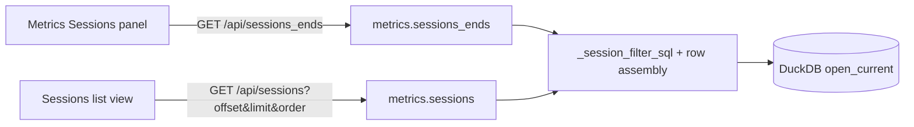

# Architecture Decision: Sessions Retrieval API Shape

## Requirements & Constraints

**Functional**
- Metrics panel: total count; if ≤20 return all; if >20 return newest 10 + oldest 10 (ellipsis is client-side)
- List page: page windows over the same filtered set; show-all must fetch the full filtered set for display
- Must not load the full set merely to count or to build the capped panel / a single page

**Quality attributes (ranked)**
1. Simplicity / maintainability (one local client, small dashboard package)
2. Fitness for the two UI call sites (panel vs list)
3. Efficiency on large filtered ranges (COUNT + bounded ORDER BY / LIMIT)
4. Extensibility (future filters reuse the same WHERE helper)

**Technical constraints**
- Read-only `open_current()`; no schema migration
- Existing dashboard style: flat `/api/<name>` → `metrics.ENDPOINTS`; harness + since/until query params
- Activity grain: `COALESCE(s.started_at, s.source_mtime)` (already `ACTIVITY_TIME_SQL`)
- Today `/api/sessions` returns a JSON **array** with `limit` default 50, clamp 500 — only the dashboard consumes it

**Boundaries**
- In scope: wire shape + metrics functions + server param parsing
- Out of scope: reconstruct payload, search-within-list, schema changes

## Components

## Options Evaluated

- **A — Enrich single `/api/sessions`**: Add `offset` / `order` / `include_total` / optional `ends` mode on one endpoint; panel and list share one route with mode switches.
- **B — Ends endpoint + paged list endpoint**: New `/api/sessions_ends` for the panel envelope; extend `/api/sessions` for `{total, sessions}` with offset/order/limit (show-all = no LIMIT).
- **C — Count + list only**: `/api/sessions/count` plus list with offset/order; panel issues 2–3 parallel calls.

## Analysis

| Criterion | A (one endpoint + modes) | B (ends + paged list) | C (count + list) |
|-----------|--------------------------|------------------------|------------------|
| Fitness | OK but mode matrix grows | Maps 1:1 to UI call sites | Panel needs multiple calls |
| Simplicity | Mode branching in one handler | Two clear endpoints, shared helper | Chatty; more client logic |
| Maintainability | Mode flags tend to accumulate | Clear responsibilities | Duplicates panel assembly client-side |
| Scalability (local) | Fine | Fine | Fine (extra round-trips) |
| Risk | Easy to overload one route | Small surface add; reversible | Panel correctness lives in JS |

Key insights:
- The panel’s “ends” shape is not a page — forcing it through offset/limit invites client bugs (two fetches + merge + N arithmetic).
- `fetchSnapshot` already fans out many endpoints; swapping `sessions` → `sessions_ends` is natural.
- Envelope change on `/api/sessions` (array → `{total, sessions}`) is acceptable: sole consumer is this SPA, updated in the same change.
- Show-all is an intentional full fetch for display; the efficiency rule forbids full fetch only for count/cap/page construction.

## Decision

### Choice Pre-Mortem

- **External clients depended on `/api/sessions` returning a bare array**: checked — localhost dashboard is the only consumer; product is pre-1.0 / agent-local.
- **Show-all on a huge range freezes the browser**: checked — issue explicitly accepts tall pages / show-all; not a reason to reject the API shape.
- **OFFSET deep pages become slow on DuckDB**: checked for v1 — local sessions table + typical operator ranges; keyset pagination deferred unless measured pain.

**Selected**: Option B — dedicated `/api/sessions_ends` plus enriched paged `/api/sessions`.

**Rationale**: Best fitness-to-simplicity fit. Panel gets one efficient round trip (`COUNT` + newest LIMIT + oldest LIMIT). List gets a normal page envelope with total for pagination controls. Shared SQL filter/row helpers keep DRY without mode soup on a single route.

**Tradeoff**: One extra endpoint name in `ENDPOINTS` vs a single polymorphic route; accepted for clearer contracts.

## Implementation Notes

- Extract shared WHERE (harness IN, activity window, not subagent, activity NOT NULL) and row-assembly (msgs / first prompt / dominant model) from today’s `sessions()`.
- `sessions_ends(con, harnesses, since, until) -> {total, newest, oldest}`:
  - `total` via `COUNT(*)`
  - if `total == 0`: empty lists
  - if `total <= 20`: `newest =` all ordered DESC, `oldest = []`
  - if `total > 20`: `newest` = 10 DESC, `oldest` = 10 ASC (then present oldest in chronological order for the UI, or return ASC and let UI render bottom-up — implementer picks; prefer return ASC so table reads top→bottom as oldest→…→newest when concatenated with ellipsis)
- `sessions(con, …, *, limit, offset=0, order="desc") -> {total, sessions}`:
  - Always include `total` (same COUNT) for pagination UI
  - `order` in `{desc, asc}`; tie-break `harness, session_id` as today
  - `offset >= 0`; `limit > 0` applies `LIMIT`; **`limit=0` means no LIMIT** (show-all)
  - Remove or raise the hard 500 clamp for positive limits to a higher safety cap only if needed; show-all must not be silently truncated at 500
- Server: parse `offset`, `order`, `limit` (0 allowed); wire `sessions_ends` like other filter endpoints
- Client: metrics `buildRequestPlan` uses `sessions_ends`; list view calls paged `sessions`
- Preserve `/api/session` (singular) unchanged
