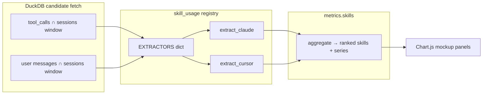

# Architecture Decision: Skill-Usage Extractor Architecture & API Shape

## Requirements & Constraints

**Functional**
- Answer “who (user/agent) used which skill where (harness)” in the dashboard time window.
- Count every discrete use (no session dedupe).
- Extensible: add a harness by adding one extractor function + registry entry, not by editing a mondo SQL CASE.
- Claude + Cursor shapes grounded empirically (see `tasks.md` Empirical Extraction Findings).

**Quality attributes (ranked)**
1. Maintainability / extensibility for new harnesses
2. Correctness of invoker + skill identity
3. Simplicity (match dashboard metrics style)
4. Performance on local DuckDB (filter early; avoid scanning all Reads)

**Technical constraints**
- Offline read-only `open_current()`; no schema migration unless forced.
- Server mode-agnostic; client owns aggregate/compare.
- DuckDB: prefer `json_extract_string` after tool_name filter; heterogeneous `tool_input` keys (`path` vs `file_path`).
- Precedent: `_WORKSPACE_KEY_STRATEGIES` registry; ingest per-harness parsers; `metrics.tools` SQL fetch + Python aggregate.

**Out of scope**
- Final chart placement / layout reshuffle.
- Ingest-time skill normalization.

## Components



- **Candidate SQL**: window + coarse filters only (not skill naming rules).
- **Per-harness extractors**: map candidate rows → normalized `SkillUse(skill, invoker)` events.
- **`metrics.skills`**: harness filter, rank skills, emit chart-ready series.
- **UI panels**: consume one payload; each mockup interprets series differently.

## Options Evaluated

- **A — Mondo SQL**: one query with harness CASE for skill name + invoker; Python only ranks.
- **B — Candidate SQL + registry extractors + server aggregate**: thin SQL; Python extractors emit events; `metrics.skills` builds harness→invoker→aligned arrays.
- **C — Event stream API**: server returns raw events; each chart panel aggregates in JS.

## Analysis

| Criterion | A Mondo SQL | B Candidate + registry | C Event stream |
|-----------|-------------|------------------------|----------------|
| Fitness | Works today; fights extensibility | Fits all functional reqs | Fits; shifts agg burden to JS × N panels |
| Simplicity | SQL grows ugly fast | One clear pipeline | Duplicates agg in every panel |
| Maintainability | Poor (new harness = SQL edit) | Strong (registry peer to workspace_key) | Medium (API simple; UI complex) |
| Performance | Can push filters down | SQL filters candidates; Python parses | Larger payloads |
| Alignment | Conflicts with “no mondo SQL” | Matches ingest + workspace_key | Diverges from tools/models endpoints |
| Risk | High lock-in | Low; reversible | Medium payload/UI drift |

Key insights:
- Requirement “function per harness” eliminates A as the primary design.
- Existing metrics return **aggregated harness-keyed series**, not events — C fights that precedent and multiplies mockup logic.
- B keeps Chart.js mockups thin and shares one aggregation.

## Decision

### Choice Pre-Mortem

- **Claude user slash-commands and Skill tools double-count the same intent**: checked — warehouse probe shows command-message at ordinal 0 and Skill tool later at assistant turn as distinct events; operator wants both counted.
- **SQL candidate filter for Read/`SKILL.md` misses a path key used by a future harness**: checked — extractors own naming; SQL only needs coarse recall. If a new harness uses a different tool, add extractor + widen candidate filter in one place (`_skill_tool_candidates` SQL helper).
- **Nested series shape is awkward for some Chart.js types**: checked — mockups can reshape client-side; better than N aggregators.

**Selected**: Option B — Candidate SQL + per-harness extractor registry + server-side aggregate into chart-ready series.

**Rationale**: Maximizes extensibility and correctness where Python shines, keeps DuckDB on filter/join/window, and matches dashboard metrics contracts so mockups stay presentation-only.

**Tradeoff**: Accepts a small amount of harness-aware candidate SQL (tool_name / path suffix filters) as a performance guardrail, not as the skill-identity source of truth.

## Implementation Notes

### Module layout

- New: `skills/sr-search/src/stockroom/dashboard/skill_usage.py`
  - `SkillUse` NamedTuple/dataclass: `skill: str`, `invoker: Literal["user", "agent"]`
  - `extract_claude(message_rows, tool_rows) -> list[SkillUse]`
  - `extract_cursor(message_rows, tool_rows) -> list[SkillUse]`
  - `EXTRACTORS: dict[str, ExtractorFn]`
  - `iter_skill_uses(harness, message_rows, tool_rows) -> Iterator[SkillUse]` (unknown harness → empty)
- `metrics.skills(con, harnesses, since, until, *, limit=10) -> dict`
- Register `"skills": skills` in `metrics.ENDPOINTS`

### Candidate SQL (illustrative)

1. **Tools** (join `sessions`, `NOT is_subagent`, activity window):
   - `tool_name = 'Skill'`
   - OR `tool_name = 'Read'` AND (`$.path` or `$.file_path` LIKE `%/SKILL.md`)
   - SELECT `harness, tool_name, tool_input`
2. **Messages**:
   - `role = 'user'` AND `text LIKE '%<command-name>/%'`
   - SELECT `harness, text`
   - Extractors ignore skill-blob lines even if they slip through.

### Extractor rules (locked)

- Claude user: regex/parse `<command-name>/NAME</command-name>` → skill `NAME` (strip `/`).
- Claude agent: `tool_name == "Skill"` → `$.skill`.
- Claude: never emit from `Base directory for this skill:` blobs.
- Cursor agent: Read path ending with `/SKILL.md` → parent dir name.
- Cursor user: no-op for now.

### API response shape

```json
{
  "skills": ["niko", "gm", "..."],
  "invokers": ["user", "agent"],
  "calls": {
    "claude": { "user": [1, 10], "agent": [2, 5] },
    "cursor": { "user": [0, 0], "agent": [12, 0] }
  }
}
```

- `skills`: ranked by total count across selected harnesses/invokers (tie-break name), capped by `limit`.
- Arrays aligned to `skills`.
- Missing harness keys omitted or zero-filled for `_active_harnesses` (match `tools()`).
- Endpoint name: **`skills`** → `/api/skills`.

### Client

- `dashboard-data.mjs`: add `"skills"` to `ENDPOINTS`.
- Mockup panels each call a dedicated `buildSkills*Panel(payload, selected, mode, colors)`.
