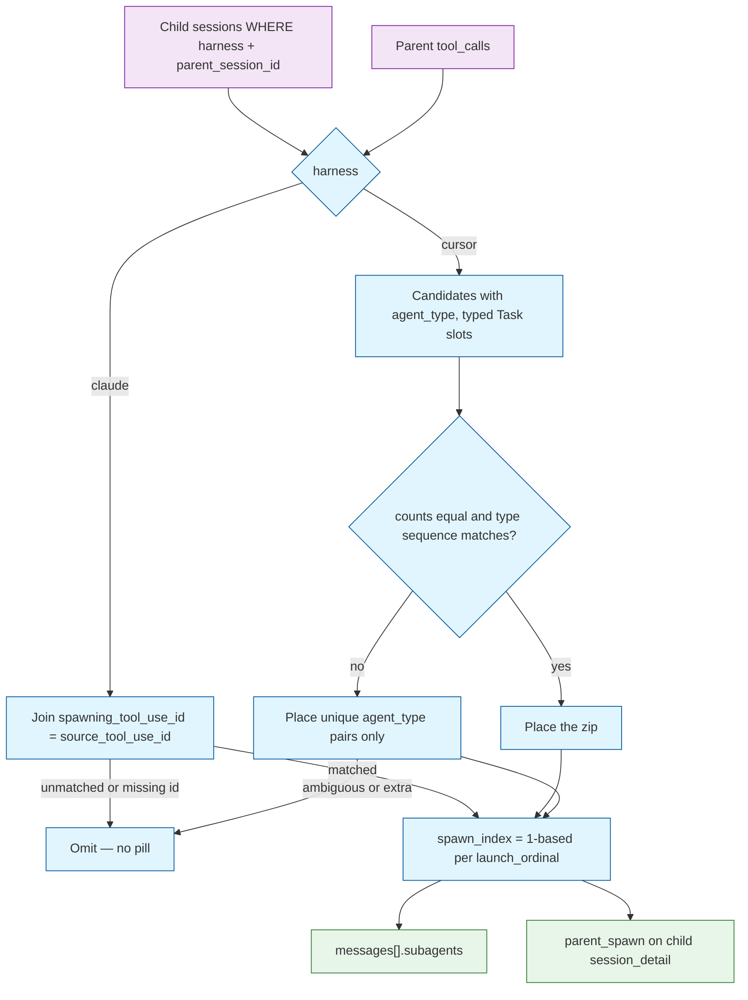

# Algorithm Decision: Spawn-to-Turn Association

## Problem

Given a parent session's messages and tool calls, plus the child sessions that list that parent in `parent_session_id`, compute for each child:

- `launch_ordinal` — the parent's message ordinal that launched it
- `spawn_index` — 1-based among children attached to that same turn (the `n` in `#msg-{ordinal}-sa-{n}`)

Also compute the reverse: for a child session, the parent's `(session_id, launch_ordinal, spawn_index)` so the `parent:` link can deep-link to that child's pill.

Inputs (already in the warehouse, no new columns):

- Children: `sessions` rows where `parent_session_id = parent.session_id` (same `harness`)
- Parent tool calls: `tool_name`, `tool_input`, `source_tool_use_id`, parent `message.ordinal`, tool `ordinal`
- Child fields: `session_id`, `agent_type`, `agent_name`, `title`, `spawning_tool_use_id`, `source_path`

Volumes are tiny (a handful of children per parent). Correctness and honesty beat clever matching.

Invariants:

- Existing `#msg-N` fragments stay valid (`^#msg-(\d+)$` must not match `#msg-N-sa-M`).
- A child appears at most once.
- Claude children that carry `spawning_tool_use_id` attach only via that provenance join, never by guessing.
- Cursor association must not invent a second parent/child model or require an ingest rewrite unless current rows cannot derive a placement.
- Sessions list remains top-level only.

## Options Evaluated

- **A. Provenance join only**: Attach only when `child.spawning_tool_use_id = tool.source_tool_use_id`. Cursor children (NULL spawn id) never attach to a turn.
- **B. Zip every parent `Task` call**: Order children by `source_path` (Cursor ingest glob order) and zip against every `tool_name = 'Task'` in `(message.ordinal, tool.ordinal)` order, including Tasks with no `subagent_type`.
- **C. Claude join + Cursor typed-Task zip**: Claude uses option A. Cursor zips children ordered by `source_path` against parent `Task` calls that have a non-null `subagent_type`, in `(message.ordinal, tool.ordinal)` order — the same slots ingest already uses for `agent_type`.
- **D. Persist launch ordinal at ingest**: Add `launch_message_ordinal` (and maybe `spawn_index`) on `sessions` and write it in the parsers.

## Analysis

| Criterion | A. Join only | B. Zip all Tasks | C. Join + typed zip | D. Persist at ingest |
|-----------|--------------|------------------|---------------------|----------------------|
| Correctness | Fails the motivating Cursor case | Mis-attaches when an untyped Task (nudge / retry) sits in the sequence | Matches ingest's slot list; example child lands on msg 48 | Correct only after a full re-ingest; old warehouses stay blank |
| Simplicity | Simplest | Simple but wrong rule | One harness branch, both already documented | Schema + parser + migration |
| Reuse | Uses Claude provenance | Ignores ingest's typed-Task rule | Reuses `_parent_subagent_types` slot definition | Duplicates association at write time |
| Maintainability | Honest NULL for Cursor | Two Task kinds look the same | Rule lives next to session reconstruction | Two writers of the same fact |
| Time / space | O(tools + children) | same | same | write-time cost + migration |

Key insights:

- The example parent has Task msg 48 (`subagent_type=generalPurpose`) and Task msg 55 (`subagent_type` NULL, description "Nudge L3 QA"), and one child. Option B still happens to attach to 48 today, but a nudge *before* the real spawn would steal the slot. Option C ignores untyped Tasks, which matches how `agent_type` was assigned.
- Cursor `source_mtime` on parent and child can be identical (this warehouse: both `2026-08-26 04:30:07`). Time-proximity matching is not available.
- `source_tool_use_id` is warehouse provenance and is not on the current session-detail tool payload. Association belongs on the server; the client should not re-join.
- Option D violates the brief's "no ingest rewrite unless necessary." Current rows *can* derive placement.

## Decision

**Selected**: Option C — Claude provenance join + Cursor typed-Task zip, computed at read time in `session_detail`.
**Rationale**: It is the only option that places the motivating Cursor child under `#msg-48` without a schema change, and it uses the same Task slots ingest already uses for `agent_type`.
**Tradeoff**: Cursor placement is omit-if-uncorroborated, not best-effort leftover. Extra children and holes produce missing pills, not a guessed turn. Claude unmatched spawn ids are omitted (see Operator Amendment).

## Implementation Notes

- Add a pure helper (e.g. `stockroom.dashboard.spawns.associate_children`) that takes parent tool rows and child session rows. `session_detail` is the only caller. No `message_ordinals` — leftover is gone.
- **Claude**: for each child with `spawning_tool_use_id`, find the parent tool call with matching `source_tool_use_id`; `launch_ordinal` is that call's message ordinal. Unmatched or missing spawn ids are omitted.
- **Cursor**: candidates are children with non-null `agent_type`, ordered by `source_path`. Slots are parent tools where `tool_name == "Task"` and `tool_input.subagent_type is not None`, in message/tool ordinal order. Place only when corroborated:
  1. **Aligned zip** if `len(candidates) == len(slots)` and every pair has `child.agent_type == slot.subagent_type`. Then place all.
  2. **Else unique type** only: a type that appears once among candidates and once among slots places that pair. Everything else is omitted.
  Never leftover. Never zip when counts or the type sequence disagree (that is the shift). Children with `agent_type is None` are omitted.
- `spawn_index` is 1-based among children that share the same `launch_ordinal`, in the order they were assigned (Claude: stable by `session_id`; Cursor: `source_path` order).
- `session_detail` payload:
  - Each message gains `subagents: [{session_id, agent_type, agent_name, title, spawn_index}]` (empty list when none).
  - When the opened session is itself a child, also set `parent_spawn: {session_id, message_ordinal, spawn_index}` by running the same helper on the parent and looking up this `session_id`. If the parent row is missing, `parent_spawn` is null and the UI still has `parent_session_id` for a hash-less link.
- Do not add `source_tool_use_id` to the public tool-call JSON unless some other consumer needs it; association stays server-side.
- Do not change ingest, schema, or the sessions list filter.

## Operator Amendment

2026-08-26, after blocking preflight: Claude children whose `spawning_tool_use_id` is missing or does not join a parent tool are **omitted**. Do not invent a turn. Child/parent/sibling queries use composite identity `(harness, session_id)`.

2026-08-26, after zip-blindness review: a pill is a positive claim and must not be false. Missing a pill is acceptable. Cursor leftover is forbidden. Positional zip runs only when counts match **and** each `child.agent_type` equals that slot's `subagent_type` (the same index ingest used). Otherwise place only types that appear once on both sides. Residual risk: two compensating holes when every remaining pair shares one type still looks aligned — no further warehouse signal exists.
