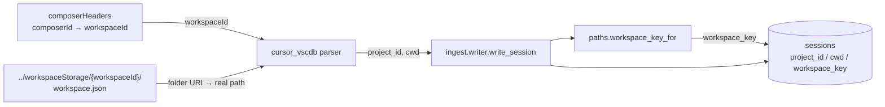

# Architecture Decision: workspace identity for vscdb-sourced sessions

## Requirements & Constraints

**Functional.** Every backfilled session must populate `sessions.project_id`, `cwd`, and `workspace_key` in a way that (a) never fabricates a path, and (b) lets a backfilled conversation be found alongside transcript-ingested conversations from the same project.

**Quality attributes, ranked.**

1. **Honesty** — the schema's "one meaning per field, never fake a value" contract outranks coverage. An honest NULL beats a plausible guess.
2. **Cross-referenceability** — the feature's value is recall; 908 sessions that no project-scoped query can reach are worth much less.
3. **Simplicity** — reuse existing mechanisms rather than adding an identity concept.
4. **Coverage** — maximize resolvable sessions, but only after the three above.

**Technical constraints.**

- vscdb has **no project-dir slug**, so `paths.resolve_cwd`'s verify-don't-invert loop has nothing to verify a candidate against.
- `composerHeaders.workspaceId` (an md5-shaped id) is present for **532 of 908** candidates.
- `../workspaceStorage/{workspaceId}/workspace.json` sits beside the vscdb and resolves a real folder for **437 of 908** candidates: 435 single-root `vscode-remote://wsl+ubuntu/…` and 2 `file://…`; 91 are multi-root `.code-workspace` pointers with no single folder; 4 have no `workspace.json`.
- Of the 39 distinct workspaces so resolved, **33 already exist verbatim as warehouse Cursor `project_id` slugs**.
- The writer already derives `workspace_key` from `cwd` via `paths.workspace_key_for` — no caller does it by hand.

**Scope.** In: what the three identity fields contain for vscdb-sourced sessions. Out: changing what they mean for existing harnesses; multi-root workspace expansion; any filesystem search beyond the vscdb's own sibling directory.

## Components

The parser owns extraction; the writer owns `workspace_key` derivation (unchanged). No new component is introduced by any option below — they differ only in what the parser puts in two fields.

## Options Evaluated

- **Option A — honest NULLs**: leave `project_id`, `cwd`, and therefore `workspace_key` empty; vscdb sessions carry no workspace identity at all.
- **Option B — cwd only**: resolve `cwd` from `workspace.json`; leave `project_id` NULL; let the writer derive `workspace_key` from `cwd`.
- **Option C — cwd plus forward-encoded slug**: as B, but additionally set `project_id = encode_for("cursor", cwd)` so the slug matches what agent-transcripts ingest would have filed.
- **Option D — cwd plus native workspaceId**: as B, but set `project_id = composerHeaders.workspaceId` — the harness's own verbatim identifier for the workspace.

## Analysis

| Criterion | A (NULLs) | B (cwd only) | C (forward-encoded slug) | D (native workspaceId) |
|---|---|---|---|---|
| Honesty | Perfect, vacuously | Good — `cwd` is an authoritative record value, not an inversion | **Violates "verbatim"**: synthesizes a slug the harness never wrote for this surface | Good — `project_id` is the harness's own id, stored verbatim |
| Cross-referenceability | None | Full via `workspace_key` | Full, plus slug-level grouping | Full via `workspace_key` |
| Simplicity | Simplest | One JSON read | One JSON read + an encode call whose output must never be mistaken for a real dir | One JSON read + a column already read for other reasons |
| Precedent in codebase | — | Partial | None | **Exact**: Cursor CLI chats already store a hash directory as `project_id` while `workspace_key` carries the cwd-derived key |
| Coverage (`cwd`) | 0 | 437/908 | 437/908 | 437/908 |
| Coverage (`project_id`) | 0 | 0 | 437/908 | 532/908 |
| Risk / reversibility | Low, but wastes the corpus | Low | Medium — a fabricated-looking slug is hard to walk back once queries depend on it | Low |

Key insights:

- **`workspace_key` already exists for exactly this problem.** `systemPatterns.md` states it is "a separate nullable rollup key … so same-cwd sessions can cross-reference *without mutating `project_id`*". That single sentence collapses the tension between honesty and cross-referenceability: cross-referencing does not require `project_id` to be clever, so Option C is solving a problem the schema already solved. Confirmed live — Cursor `ide` and `cli` sessions that share one project's `cwd` already share an identical `workspace_key` despite entirely different `project_id` namespaces (the `cli` side's `project_id` is a chats hash).
- **A hash-shaped `project_id` is established practice here, not a novelty.** The warehouse already holds `project_id = f0b74fb2de1f78ebd97c0193d5fa1825` for Cursor CLI sessions. `workspaceId` is the same kind of value from the same harness, which makes Option D a continuation of an existing pattern rather than a new identity concept.
- **Reading `workspace.json` is not filesystem guessing.** It is an authoritative record sitting at a path derived from the vscdb's own location, in the same spirit as Claude's record `cwd` — which `resolve_cwd` accepts directly, bypassing slug verification. The verify-don't-invert rule exists to forbid *decoding a lossy slug*; nothing here decodes anything.
- **Option A is the only option that is cheap and wrong.** It satisfies honesty perfectly, but 908 sessions unreachable by every project-scoped query and dashboard rollup defeats the point of backfilling them.

## Decision

### Choice Pre-Mortem

*If we shipped Option D and it turned out wrong, why?*

- **`workspaceId` collides with, or is confusable for, an agent-transcripts slug** — a consumer grouping by `project_id` would mix namespaces. **Checked**: the two shapes are disjoint in practice (32-char hex vs. path-derived slug), and the CLI surface already introduced this mixing years of rows ago without harm, precisely because `workspace_key` is the sanctioned rollup key.
- **`workspace.json` folder URIs do not decode to usable paths** — leaving `cwd` wrong rather than absent. **Checked**: 435 of 437 are `vscode-remote://wsl+ubuntu/<path>` decoding cleanly to real WSL paths that already appear as `cwd` on existing warehouse rows; the 2 `file://` cases decode to Windows-shaped paths, stored as-is rather than mangled.
- **Coverage is so partial that the field is untrustworthy** — 471 of 908 sessions would still have no `cwd`. **Checked**: partial coverage with honest NULLs is the same contract Cursor IDE ingest already lives under (988 of 1,224 existing Cursor sessions have a `workspace_key`; the rest are NULL).

**Selected**: Option D — `cwd` from `workspace.json`, `project_id` from the native `workspaceId`, `workspace_key` derived by the writer.

**Rationale**: It is the only option that scores well on all four ranked attributes at once. Honesty is preserved because both values are recorded facts read verbatim from the harness's own state rather than computed guesses. Cross-referenceability comes free through `workspace_key`, the field the schema designates for it. Simplicity and maintainability are maximized by following the CLI-chats precedent instead of minting a new identity rule, and by leaving the writer's derivation untouched.

**Tradeoff**: `project_id` values for vscdb-sourced sessions will not group with agent-transcripts slugs for the same project. Accepted deliberately — that grouping is `workspace_key`'s job, and forcing it into `project_id` (Option C) would trade a durable contract for a cosmetic convenience.

## Implementation Notes

- **Component boundary**: the parser reads `workspace.json` itself, since it already opens files under the vscdb's directory tree. Resolution root is `<vscdb>.parent.parent / "workspaceStorage" / <workspaceId>` — derived from the configured vscdb path, never searched for.
- **URI decoding**: `vscode-remote://<authority>/<path>` → `/<path>` percent-decoded; `file://<path>` → `<path>` percent-decoded. Any other scheme, a multi-root `workspace` key, a missing or unparseable file, or a missing `workspaceId` yields `cwd = None`. Never raise.
- **Field assignment**: `project_id = workspaceId` (or `None` when the composer has no `composerHeaders` row); `cwd` as resolved above; `workspace_key` is **not** set by the parser — the writer derives it, exactly as for every other harness.
- **Caching**: resolve each `workspaceId` once per run and memoize; 908 composers map to well under 200 distinct workspaces, so this is a few dozen small reads regardless of corpus size.
- **Fail-soft**: an entirely absent `workspaceStorage` directory (a plausible state on a machine where only `globalStorage` was copied) degrades every session to `cwd = None` and must not fail the run.
