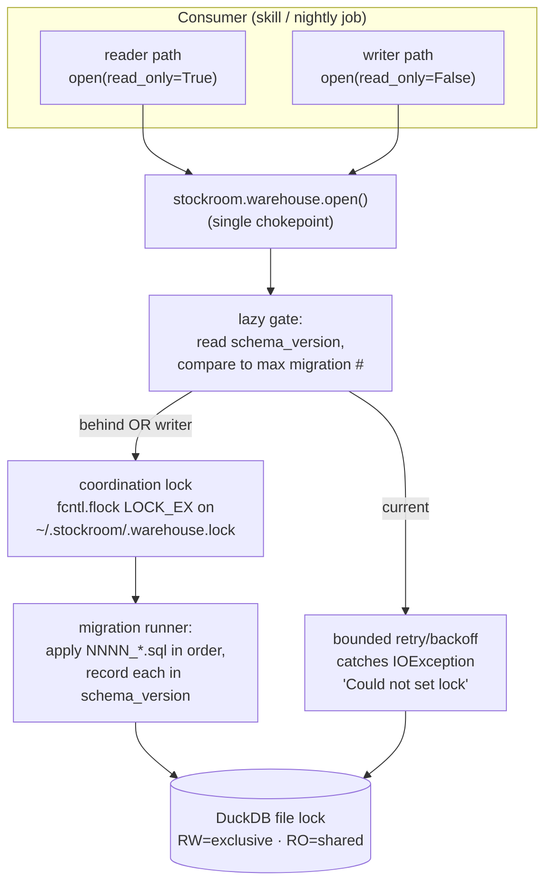

# Architecture Decision: Warehouse Concurrency & Migration-Lock

Resolves milestone-2 open questions **Q1** (migration lock primitive), **Q2** (reader wait/backoff semantics), and — as a consequence of the chosen structure — **Q3** (`schema_version` bootstrap placement).

## Requirements & Constraints

### Functional requirements

- Exactly one process applies pending migrations; concurrent would-be migrators must **not** thrash or double-apply.
- Migrations apply **forward-only**, in ascending number order, each recorded durably; data-preserving (never invalidates embeddings).
- A **lazy gate**: every consumer checks the schema version before touching the DB and migrates if behind; the common case (already current) is near-free.
- **Concurrent readers** tolerate an in-progress migration by waiting/backing off rather than crashing.
- A **writer/migrator waits for readers to drain** before mutating, and never corrupts the warehouse.
- A **harness-neutral** warehouse-open helper is the single chokepoint (`~/.stockroom/warehouse.duckdb`).

### Quality attributes (ranked)

1. **Correctness under parallel access** — the literal "never break your warehouse" promise; must be *tested*.
2. **Crash-safety / no-wedge** — a dead migrator must never permanently block the warehouse.
3. **Simplicity & maintainability** — this is a single-user local tool; realistic concurrency is a nightly cron writer overlapping with a few interactive readers (2x, not 100x). Resist server-grade machinery.
4. **Locked-uv trust** — stdlib-only strongly preferred so `uv.lock` is untouched (torch never added).
5. **Portability** — Linux/WSL + macOS (both POSIX) are v1 targets; Windows-native is out of v1 (cron runs under WSL).

### Scope boundaries

- **In scope:** the lock primitive, reader-degradation semantics, the migration runner + `schema_version` record, the warehouse-open helper, shipping `0001` in place.
- **Out of scope:** the actual ingest/query consumers (m3/m4), VSS/HNSW (Phase 2), the nightly scheduler & hook (Phase 3/4), any down-migration support (forward-only forever).

## Components

Two layers of mutual exclusion, each with a distinct job:

- **Coordination layer — `fcntl.flock(LOCK_EX)` on a sidecar `~/.stockroom/.warehouse.lock`.** This is the **single-writer / migrator token**. A process takes it before opening DuckDB read-write (to migrate and/or to write). Readers **never** take it. Auto-released by the OS on process death (POC-verified) → crash-safe.
- **Data layer — DuckDB's own file lock.** Not bypassable: a RW connection is exclusive (excludes all other-process opens, RW *and* RO); RO connections share. This is the real data-integrity guarantee. The coordination flock exists so the data layer is approached in an orderly, herd-free way.

Readers are **lock-free at the coordination layer**: they open RO directly and degrade only against the data layer (catch the migration-time `IOException`, back off, retry).

## Options Evaluated

- **Option A — Layered: `fcntl.flock` sidecar (writer/migrator token) + DuckDB native lock + reader backoff.** Coordination flock serializes writers/migrators; DuckDB guarantees data integrity; readers retry on the open-time `IOException`.
- **Option B — In-DB advisory lock** (a lock row in `schema_version` updated under a DuckDB transaction).
- **Option C — No external primitive; lean solely on DuckDB's RW file lock** with reader backoff.

## Analysis

| Criterion | A — flock + DuckDB + backoff | B — in-DB advisory row | C — DuckDB lock only |
|---|---|---|---|
| Fitness | Serializes migrators *before* the RW open; clean writer/reader split | **Broken**: acquiring the in-DB lock *requires* a RW connection, but RW is already cross-process exclusive — the lock can't coordinate processes that can't all connect | Works but herd-prone: N processes all RW-probe and thrash |
| Crash-safety | **OS auto-releases flock on death** (POC-verified) — no wedge | Crashed holder leaves a stale lock row; needs manual TTL/recovery → wedge risk | DuckDB lock also auto-releases; OK |
| Simplicity | One small stdlib primitive + a backoff helper; maps 1:1 to "single writer, concurrent readers" | Conceptually circular; extra table semantics | Simplest in LoC but pushes herd/ordering complexity into retry logic |
| Maintainability | Clear two-layer mental model; easy to test with subprocesses | Confusing (lock that needs the thing it guards) | Subtle failure modes (herd, no writer-drain coordination) |
| Locked-uv trust | `fcntl` stdlib — **no new dependency** | stdlib | stdlib |
| Risk | Low; `fcntl` POSIX-only, but v1 targets are POSIX (WSL/macOS); blast radius contained to one module | Medium-high (wedge) | Medium (thrash, harder to prove correct) |

Key insights:

- **DuckDB already provides the data-integrity guarantee** (exclusive RW). So an external lock should not duplicate it — it should solve the *adjacent* problems DuckDB doesn't: (1) serialize would-be migrators so they don't herd on the RW lock, and (2) express "single writer" cleanly. That's exactly what a coordination flock does and an in-DB lock cannot.
- **Option B is structurally unsound**: you can't coordinate processes through a row inside a database whose write-open is itself the exclusive resource you're trying to coordinate. Eliminated.
- **`fcntl.flock` auto-release on process death** (POC-verified) is the property that makes the lock crash-safe without TTLs, heartbeats, or stale-lock reapers — directly serving quality attribute #2.
- The **WSL/Windows-mount `flock` hazard** the tech-brief repeatedly flags is sidestepped because the lockfile lives in `~/.stockroom/` on **WSL-internal ext4** (POC: `HOME` is `/home/mobaxterm`, not `/mnt/*`), where `flock` is reliable.

## Decision

**Selected: Option A — layered `fcntl.flock` writer/migrator token over DuckDB's native lock, with bounded reader backoff.**

**Rationale:** It is the only option that satisfies correctness-under-parallel-access (#1) *and* crash-safety (#2) without server-grade machinery (#3), using stdlib only (#4). It composes with — rather than duplicates — DuckDB's own guarantee, and each layer's responsibility is single and testable. Option B is eliminated as structurally circular; Option C is correct-but-herd-prone and harder to prove.

**Tradeoff accepted:** `fcntl` is POSIX-only (no native-Windows support). Acceptable — v1 explicitly runs under WSL/macOS (both POSIX), and Windows-native is out of v1. The primitive is isolated in one module behind the `warehouse.open()` contract, so swapping it later (e.g. `msvcrt.locking` for native Windows) is a contained change.

### Q1 answer — lock primitive

An OS advisory **`fcntl.flock(LOCK_EX)`** on `~/.stockroom/.warehouse.lock`, acquired by any process before opening DuckDB **read-write** (to migrate and/or write). It is the single-writer/migrator token. Readers do not take it.

### Q2 answer — reader wait/backoff & writer-drain semantics

- **Readers** (`open(read_only=True)`): open RO directly, wrapped in a bounded **exponential backoff with jitter** that catches DuckDB's `IOException("Could not set lock …")` (which occurs only while a migrator holds RW). Defaults: initial ~50 ms, factor 2, per-attempt cap ~1 s, total timeout ~30 s (all parameters injectable for tests). On timeout, raise a typed `WarehouseBusyError` — **fail-soft-visible, never block forever**.
- **Writers/migrators**: after taking the flock, open RW under the **same** bounded backoff to wait for outstanding **readers to drain** (RO holders make the RW open throw the same `IOException`). Same timeout discipline; on exhaustion raise `WarehouseBusyError`.
- **Lazy gate (double-checked):** open RO → read `schema_version`. If current, proceed on that RO connection. If behind, close RO, take the flock, **re-read** the version (another process may have just migrated), and only if still behind open RW + apply pending migrations; release flock; re-open for the caller's requested mode.

### Q3 answer — `schema_version` bootstrap placement (resolved as a consequence)

The `schema_version` record is a **runner-owned bootstrap table**, created by the runner via `CREATE TABLE IF NOT EXISTS` **before** applying numbered migrations — it is **not** part of `0001`. Reasons: (1) the runner must determine "has even `0001` been applied?" before any numbered migration runs, so version bookkeeping logically precedes migration `0001`; (2) it keeps the locked initial **data contract** (`0001` + its golden snapshot) free of migration bookkeeping; (3) the m1 `schema_con` fixture and `0001_snapshot.json` (which raw-execute/introspect only `0001`'s five product tables) remain untouched. `schema_version` records, per applied migration: the version number, the filename, and an applied-at timestamp.

## Implementation Notes

- **Component boundaries:**
  - `stockroom.warehouse` — `open(read_only: bool)` chokepoint, path resolution (`~/.stockroom/warehouse.duckdb`, env-overridable e.g. `STOCKROOM_HOME` for tests), dir creation, the flock context manager, and the backoff/retry wrapper + `WarehouseBusyError`.
  - `stockroom.migrations` — discovery (`sorted` glob of `NNNN_*.sql` in the package dir), the runner (bootstrap `schema_version`, compute pending, apply each in its own transaction, record), and the `current_version` reader.
  - The lazy gate lives **inside** `warehouse.open()` so no consumer can reach an un-migrated DB; this also satisfies "the hook never migrates" (the hook simply never calls `open()`).
- **Integration approach:** consumers call `stockroom.warehouse.open(read_only=…)` and get a ready, migrated connection. Writers get the flock held for the connection's lifetime (single-writer); readers get a lock-free RO connection after the gate confirms/raises currency.
- **Atomicity:** each migration file applies inside a DuckDB transaction together with its `schema_version` insert, so a crash mid-migration leaves the version honest (applied-or-not, never half-recorded).
- **Migration path:** none to replace — this is greenfield; `0001` is wrapped in place (no file move; the m1 `schema_sql_path` fixture pins the packaged path).
- **Empirical anchors (planning POCs):** DuckDB RW=exclusive / RO=shared with open-time `IOException`; `fcntl.flock` `LOCK_EX`/`LOCK_NB` + auto-release-on-death — both verified on the locked DuckDB 1.5.4 and WSL-internal ext4.
