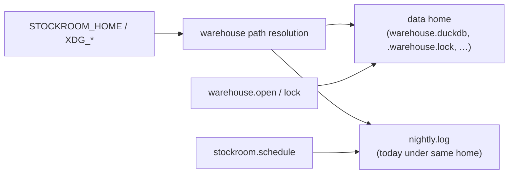

# Architecture Decision: XDG Directory Layout Shape

## Requirements & Constraints

**Functional**
- Resolve stockroom-owned paths via XDG env vars + Freedesktop defaults on Linux, WSL, and macOS
- `STOCKROOM_HOME` remains a single explicit override that wins over XDG entirely
- Dependents today: DuckDB warehouse, sidecar lock, scheduler `logs/nightly.log`

**Quality attributes (ranked)**
1. Simplicity / maintainability — preserve the existing “one home” mental model and test seam
2. Predictability for operators — clear default path naming in docs/doctor
3. Spec fidelity — prefer correct XDG kinds when it does not fight (1)–(2)
4. Extensibility — leave room for future config/cache without forcing them now

**Out of scope**
- Windows-native paths; Apple Application Support tree; harness ingest roots; scheduler mechanism changes beyond log *path*

## Components

Today `home_dir()` is the single root; `schedule._log_path(home)` nests logs under that root. Config/cache trees do not exist yet.

## Options Evaluated

- **A — Single tree under data home**: Default `$XDG_DATA_HOME/stockroom/` → `~/.local/share/stockroom/`; DB, lock, and `logs/` all live there. `STOCKROOM_HOME` replaces that one root.
- **B — Split data vs state**: DB+lock under `$XDG_DATA_HOME/stockroom/`; logs under `$XDG_STATE_HOME/stockroom/`; when `STOCKROOM_HOME` is set, both collapse into that one tree.
- **C — Keep `~/.stockroom` name but relocate under XDG via symlink**: Still one tree, but preserve the legacy path as a compatibility symlink into XDG. Adds symlink lifecycle without buying cleaner API.

## Analysis

| Criterion | A Single data tree | B Split data/state | C Symlink compat |
|-----------|--------------------|--------------------|------------------|
| Fitness | Meets issue (“or under data home”) | Meets preferred table rows | Meets layout, adds machinery |
| Simplicity | Highest — only retarget `home_dir()` | Medium — new `state_dir()` / log API; migration moves two destinations | Lowest — symlink create/repair/conflict |
| Maintainability | Tests stay “one home”; schedule unchanged | Doctor must report two roots; schedule must stop assuming `home/logs` | Extra failure modes |
| Spec fidelity | Logs under DATA (mild impurity) | Best match for log-as-state | Irrelevant to kinds |
| Risk if wrong | Easy to split later | Harder to unsplit once docs/cron bake two paths | Symlink divergence risk |

Key insights:
- Issue #3 explicitly allows keeping logs under the data home; that is not a dodge — it is a documented design fork.
- `STOCKROOM_HOME` is singular. Split only stays simple if override collapses both trees; still doubles the default-path story operators must learn.
- The only current “state” artifact is a regenerable append log. Paying for STATE now optimizes for a future that is not required by acceptance criteria.
- Premature symlink compatibility (C) conflates layout adoption with migration UX; migration is Q2.

## Decision

**Selected**: A — Single tree under `$XDG_DATA_HOME/stockroom/` (default `~/.local/share/stockroom/`), including `logs/nightly.log`

**Rationale**: Ranked simplicity and predictability beat mild XDG purity for a regenerable log. Preserves the existing `home_dir()` → warehouse / lock / schedule-log dependency graph and the singular `STOCKROOM_HOME` contract. Aligns with the issue’s allowed “single tree” option.

**Tradeoff**: Nightly logs live under DATA rather than STATE. Acceptable until durable non-log state appears; splitting later is additive (`state_dir()`) without invalidating this root.

## Implementation Notes

- Retarget `warehouse.home_dir()` default: `Path(os.environ.get("XDG_DATA_HOME", Path.home() / ".local/share")) / "stockroom"` when `STOCKROOM_HOME` unset.
- Keep `warehouse_path` / `lock_path` / `schedule._log_path` as today relative to that home.
- Do **not** introduce `XDG_CONFIG_HOME` / `XDG_CACHE_HOME` / `XDG_STATE_HOME` consumers in this task.
- Docs/skills/memory bank should name `~/.local/share/stockroom/` (and `$XDG_DATA_HOME/stockroom` when set), not invent parallel state paths.
- Resolve Q2 (legacy migration) against this single destination tree.
