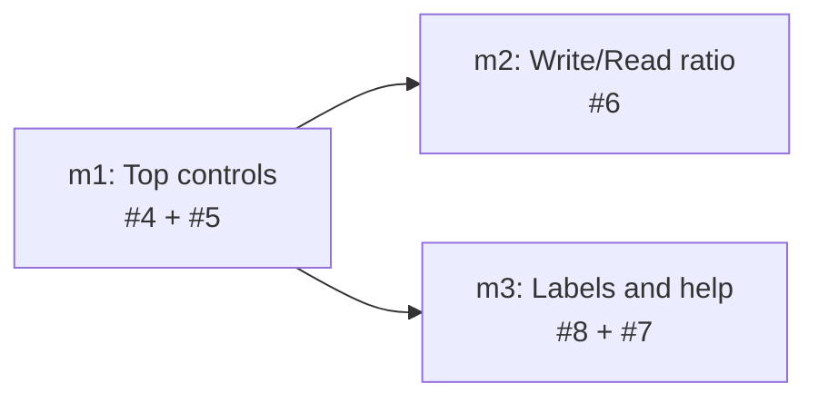

# Milestones: dashboard-polish

## Cross-milestone invariants & constraints

- Read-only warehouse access only (`open_current()` / read-only open); no dashboard path mutates data or schema.
- Fully offline at runtime — no CDN; no new package-manager or bundler path for the dashboard front-end.
- Metric endpoints remain mode-agnostic and harness-keyed; Aggregate/Compare stays client-owned.
- Wrapped stays all-time and unfiltered by any date-range control.
- `sessions.project_id` remains the grouping/identity key; friendly names are display-only.
- Port 6767 and the on-path `stockroom` invocation contract are unchanged.
- Test-first; `make ci` (pytest + `make test-js` + lint/format/REUSE as applicable) green at every milestone boundary.

## Execution Order

m2 and m3 are independent after m1; serial order is m1 → m2 → m3.

## Milestone checklist

- [ ] Add top-bar date-range selector wired to windowed `since`/`until` (prior-period % deltas + panel labels) and restyle Aggregate/Compare as an exclusive segmented toggle (#4, #5)
- [ ] Change Write/Read panel to plot ratio series in Aggregate and Compare modes with honest zero-denominator handling (#6)
- [ ] Show friendly project names with `project_id` on hover (#8) and add clickable info-icon tooltips for Session Efficiency and First-Prompt Quality (#7)

## Scope estimates

| Milestone | Est. | Rationale |
| --- | --- | --- |
| m1 — Top controls (#4, #5) | L3 | Multi-file controls + request-plan wiring + KPI prior-window semantics + CSS/ARIA; design choices on range UX |
| m2 — Write/Read ratio (#6) | L2 | Self-contained panel-model enhancement over existing trends substrate |
| m3 — Labels and help (#8, #7) | L3 | Metrics/display contract for friendly names plus accessible tooltip chrome across panels |
