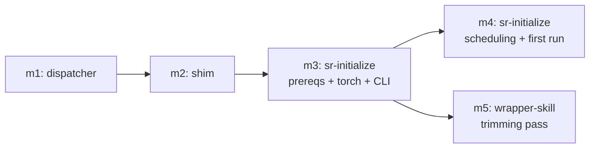

# Milestones: p3-onboarding-cli-scheduling

## Cross-milestone invariants & constraints

- **Torch-safe contract is inviolable at every boundary**: torch stays out of the lock, is provisioned out of band, and no milestone introduces an exact sync anywhere (`--no-sync` / `--inexact` only). The shim and every artifact it generates carry the contract structurally.
- **No raw engine paths in any rendered-out artifact**: anything written outside the repo (shim excepted — it is the one self-healing owner of the baked path) invokes `stockroom <subcommand>`, never a plugin-cache path. Cron/launchd entries, docs, and skills all target the shim.
- **The shim does environment plumbing only; the dispatcher owns all logic.** Dispatch, subcommand help, and error behavior live in tested Python (`python -m stockroom`); the shim stays too dumb to need tests.
- **No fallback incantation in skills**: after the trimming pass, `command -v stockroom` failing means "run `sr-initialize`" — no skill re-teaches `$APP_DIR`/`PYTHONPATH`/uv flags.
- **Run-in-place packaging holds**: `[tool.uv] package = false`, committed layout = install layout, no console-script entry points, no build step.
- **Test-first for all Python; prompt skills verified artisanally** — every shipped example in a SKILL.md is executed live before it is written in; green `make ci` (incl. REUSE compliance — the shim template is a licensed artifact) at every milestone boundary.
- **Windows-native scheduling stays out of v1** (POSIX cron/launchd only; WSL is the Linux path).
- **Existing read/write chokepoints are untouched**: all engine surfaces keep going through `warehouse.open()`; the dispatcher wraps module CLIs, it does not reimplement them.

## Execution Order

m4 and m5 are independent once m3 lands; the checklist order below is a valid serial execution.

- [x] **m1 — `stockroom` dispatcher (est. L2)**: a new tested `python -m stockroom` entrypoint (`__main__.py`) dispatching `query` / `semantic` / `ingest` / `embed` / `migrate` to the module CLIs — authoring the currently-missing `stockroom.migrate` CLI entrypoint — with top-level `--help` listing subcommands, `stockroom  --help` forwarding to each module's argparse, and README dispatcher documentation. Behaves like a "CLI w/ subcommands" - `...<dipatcher> query ...` -> dispatches to the query module.
- [x] **m2 — bake-then-verify `stockroom` shim (est. L3)**: a REUSE-covered shim template shipped in the engine plus tested generation/installation logic that writes `~/.local/bin/stockroom` with a baked `APP_DIR`, runtime verify-then-re-resolve staleness healing (the plugin-update TODO decided here), deterministic resolution order across coexisting harness caches, a clear one-line uv-missing failure, a PATH-membership check, dev-repo parity (`make shim` or equivalent), and the README ad-hoc-invocation section rewritten around `stockroom <subcommand>`.
- [x] **m3 — `sr-initialize`: prerequisites, torch, and CLI binding (est. L3)**: the onboarding skill covering prerequisite checks (uv present and usable), platform/accelerator detection, per-machine out-of-band torch provisioning, a loud-failing smoke test (print version, check `cuda.is_available()`, encode one string), and installation of the m2 shim — validated on the Linux/CUDA path and a CPU path (macOS/MPS reasoning folded into the smoke test).
- [x] **m4 — `sr-initialize`: scheduling and first run (est. L3)**: nightly ingest + embed installed via cron (Linux) or launchd (macOS) with entries invoking the shim (`stockroom ingest` / `stockroom embed`), idempotent re-install semantics, followed by a first full ingest + embed leaving a populated, embedded, query-ready warehouse.
- [ ] **m5 — wrapper-skill trimming pass (est. L2)**: create the shared system-model reference doc, swap every invocation incantation for `stockroom <subcommand>` across `sr-query` / `sr-semantic` / `sr-search`, apply the litter-audit inventory (Categories A–C out, D kept), add one shared-doc pointer per skill, and re-run the m6 grep-verifiable no-invocation-token check across all three.

## Scope Estimates & Rationale

- **m1 (L2)**: self-contained new module over the existing tested CLIs plus one small new argparse `main()` for `stockroom.migrate` (preflight finding: `migrate.py` is library-only today — migration runs via the lazy gate in `warehouse.open()`, so no CLI exists to forward to); dispatch shape is specified in `planning/brainstorm/stockroom-on-path-cli.md`.
- **m2 (L3)**: multiple open design decisions reserved to this milestone (staleness detection/re-resolution, harness-cache resolution order, template location, uv-missing behavior, dev ergonomics) plus generation logic and its tests — design exploration warranted.
- **m3 (L3)**: an orchestrating prompt skill plus supporting tested helpers spanning platform detection, torch provisioning, smoke testing, and shim binding; how much lives in Python vs prose is a design decision made in-run.
- **m4 (L3)**: two platform-specific scheduling mechanisms (cron/launchd) with idempotency and correct per-machine resolution, plus the first-run orchestration; touches the system outside the repo.
- **m5 (L2)**: a bounded editing pass over three existing skills plus one new reference doc, with a pre-existing inventory (`planning/brainstorm/skill-litter-audit.md`) and a mechanical verification check.
