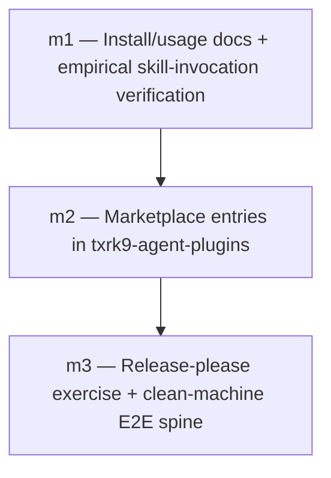

# Milestones: p5-distribution-release

## Cross-milestone invariants & constraints

- **Dual-manifest, no-build template holds** — `.cursor-plugin/plugin.json` and `.claude-plugin/plugin.json` over a shared `skills/` tree; committed layout = install layout. No milestone invents a build/bundle step.
- **Versioning stays in stockroom** — release-please syncs `$.version` into both *plugin* manifests only. Marketplace manifests in `txrk9-agent-plugins` never carry a stockroom version pin that would drift from the source repo.
- **Engine invocation stays on-path** — skills, docs, and E2E proofs invoke the engine only as `stockroom <subcommand>` (or `sr-initialize` for first-time setup). No milestone reintroduces raw `uv`/`PYTHONPATH`/`APP_DIR` incantations into user-facing docs or skills.
- **Both harnesses, always** — every distribution surface (docs, marketplace entries, E2E) covers Cursor *and* Claude Code. Cursor-only or Claude-only publication is a fail.
- **slobac + official docs are the correctness bar** — packaging, marketplace entry shape, and install instructions follow `../slobac` and the Cursor / Claude Code plugin references; do not invent a third pattern.
- **Marketplace is a separate repo** — stockroom entries land in `Texarkanine/txrk9-agent-plugins`; stockroom itself does not host a marketplace.json.

## Execution Order

- [x] **m1 — Install/usage docs + deferred install proof** — Author user-facing install and usage documentation (README) covering the intended marketplace-add path and local/dev loaders; document per-harness skill invocation forms from platform contracts (`/sr-*` vs `/stockroom:<skill>`); confirm dual-manifest layout. Live marketplace install and empirical invocation proof deferred until m2 (catalog entry) + m3 (`main` / clean-machine). No packaging/doc contract tests — docs are free to move without CI pins. Estimated **L2** (docs over an already-scaffolded plugin; self-contained, no architectural change).
- [x] **m2 — Marketplace entries in txrk9-agent-plugins** — Add stockroom to both `.cursor-plugin/marketplace.json` and `.claude-plugin/marketplace.json` in `Texarkanine/txrk9-agent-plugins`, pointing at `Texarkanine/stockroom` in the same shape as the existing `slobac` entries; update the marketplace README if needed so stockroom is discoverable. Estimated **L2** (small, contained change in the marketplace repo following an established pattern).
- [ ] **m3 — Release-please exercise + clean-machine E2E spine** — Exercise the release-please path so a cut version syncs into both stockroom plugin manifests; then on a clean machine add the marketplace, install stockroom, run `sr-initialize`, and prove `sr-search` / `sr-semantic` / `sr-query` / `sr-dashboard` against real Cursor and Claude Code history — the v1 success criteria, demonstrated. Estimated **L3** (multi-component: release automation + cross-harness clean-machine proof of the full spine).
