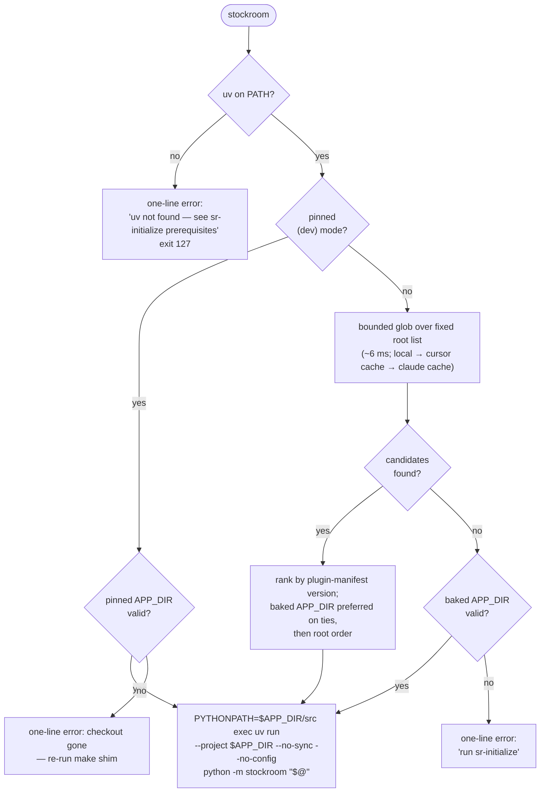

# Task: p3-m2-stockroom-shim

* Task ID: p3-m2-stockroom-shim
* Complexity: Level 3
* Type: feature

Milestone m2 of L4 project `p3-onboarding-cli-scheduling`: a REUSE-covered shim template shipped in the engine plus tested generation/installation logic that writes `~/.local/bin/stockroom` with a baked `APP_DIR`, runtime verify-then-re-resolve staleness healing, deterministic resolution order across coexisting harness caches, a clear one-line uv-missing failure, a PATH-membership check, dev-repo parity (`make shim`), and the README ad-hoc-invocation section rewritten around `stockroom <subcommand>`.

## Pinned Info

### Shim runtime selection flow

The heart of the milestone — the decision every `stockroom …` invocation makes. Pinned because most test cases and the template itself are direct renderings of this flow (decided in `creative-shim-staleness-resolution.md`).

## Component Analysis

### Affected Components
- **`src/stockroom/shim_template.sh`** (new): POSIX-sh template; environment plumbing + directory selection only. Render-time substitutions: baked `APP_DIR`, pinned/normal mode, generator version stamp in the header comment.
- **`src/stockroom/shim.py`** (new): `render(app_dir, *, pinned)`, `install(dest, app_dir, *, pinned)`, `main(argv) -> int` (`--app-dir`, `--dest`, `--pin`). Atomic 0o755 write, idempotent re-install, PATH-membership check, conditional install-time `stockroom --version` verify.
- **`src/stockroom/__main__.py`** (dispatcher): sixth `SUBCOMMANDS` row `"shim"`, lazy import as with the rest.
- **`Makefile`**: new `shim` target delegating to the dispatcher with the checkout engine dir (pinned mode).
- **`README.md`**: ad-hoc-invocation section rewritten around installed `stockroom <subcommand>`; `stockroom shim` / `make shim` as the way to get and heal it.
- **`REUSE.toml`**: add `skills/**/*.sh` to the code-shaped AGPL re-assert list (annotation block 3).
- **`memory-bank/techContext.md`**: gains the shim section (persistent-doc counterpart of the README change).

### Cross-Module Dependencies
- `shim.py` → `stockroom.__version__` (stamped into the rendered header) and `stockroom.__file__` (default `--app-dir` auto-resolution: the engine dir containing the running package).
- Dispatcher → `stockroom.shim` (lazy, only on dispatch).
- Rendered shim → dispatcher (`python -m stockroom`), the m1 artifact; install-time verify → dispatcher `--version` (the probe m1 added for exactly this).
- m3 (`sr-initialize`, next milestone) will drive `python -m stockroom shim` — the CLI is m3's consumption contract.

### Boundary Changes
- New public CLI surface: `stockroom shim` (additive; no existing module CLI changes).
- New on-disk artifact outside the repo: `~/.local/bin/stockroom` (written only by explicit invocation; idempotent).

### Environment Facts (verified on this machine)
- Cursor installs: `~/.cursor/plugins/cache/<marketplace>/<plugin>/<git-sha>/`; dev installs `~/.cursor/plugins/local/<plugin>/`. `marketplaces/` holds clones, not installs — out of scope.
- Claude installs: `~/.claude/plugins/cache/<marketplace>/<plugin>/<version>/`; `installed_plugins.json` records `installPath` (local installs point into the Cursor tree — covered by the local root).
- Both manifest files carry the release-please-synced `"version"`; engine `pyproject.toml` stays `0.0.0` (not a signal).
- No harness env var at shim runtime (cron/bare shell); bounded glob ≈ 6 ms, `find -L` ≈ 2.2 s.

### Invariants & Constraints
- Torch-safe contract structural in the shim (`--no-sync --no-config`; never an exact sync).
- Shim does environment plumbing + directory *selection* only; all product logic in tested Python.
- Run-in-place packaging holds (`package = false`, no console scripts, no build step).
- The shim is the one self-healing owner of a baked engine path; no other rendered-out artifact carries one.
- REUSE compliance repo-wide; the template is a licensed AGPL artifact.

## Open Questions

- [x] **Q1 — Runtime staleness healing & resolution order** → Resolved: always-scan, version-ranked, baked-preferred-on-ties selection over a fixed ordered root list (bounded glob ~6 ms/run; plugin-manifest `"version"`; baked-dir fallback; dev-pinned render mode) (see `memory-bank/active/creative/creative-shim-staleness-resolution.md`)
- [x] **Q2 — Shim generation surface & template home** → Resolved: new `stockroom.shim` module CLI as the dispatcher's sixth subcommand; template ships in-package at `src/stockroom/shim_template.sh`; `make shim` delegates; pinned dev variant is a render-time mode, no separate `stockroom-dev` (see `memory-bank/active/creative/creative-shim-generation-surface.md`)

## Test Plan (TDD)

### Behaviors to Verify

**Render/install unit level (`stockroom.shim` library):**
- `render(app_dir)` → output contains the baked `APP_DIR`, `--no-sync`, `--no-config`, `PYTHONPATH="$APP_DIR/src"`, `exec uv run`, and the `stockroom.__version__` stamp
- `render(app_dir, pinned=True)` → no re-resolution scan block; pinned error message present
- `install(dest, app_dir)` → file exists at dest, mode `0o755`, content == `render(...)`
- re-`install` over an existing shim → replaced cleanly (idempotent), no stray temp files
- `install` with dest dir not on `PATH` → report flags it (warning, not failure); on `PATH` → verify step attempted
- default `app_dir` (none supplied) → resolves to the engine dir containing the running `stockroom` package

**Shim runtime level (rendered script run as a subprocess against a fixture `HOME` + stub `uv` on `PATH`):**
- baked dir valid and sole candidate → execs with baked `APP_DIR`
- baked dir deleted, one cache candidate elsewhere → selects it (self-heal)
- **baked dir exists but an install with a higher manifest version exists elsewhere → selects the newer one** (the lingering-old-dir case that motivated m2)
- two candidates with equal versions, one is the baked dir → baked preferred
- equal versions, baked dir gone → first in root order wins (local → cursor → claude)
- scan finds nothing, baked dir valid → baked fallback
- scan finds nothing, baked dir invalid → one-line stderr mentioning `sr-initialize`, nonzero exit, no shell noise
- `uv` absent from `PATH` → one-line stderr `uv not found — see sr-initialize prerequisites`, exit 127
- pinned shim → uses pinned dir even when a higher-versioned cache candidate exists; pinned dir gone → one-line error naming `make shim`
- arguments forwarded verbatim (incl. spaces) and `PYTHONPATH`/`--no-sync`/`--no-config` observed by the stub `uv`
- candidate with unreadable/absent manifest version → ranks lowest, never crashes selection

**CLI + dispatcher level (subprocess):**
- `python -m stockroom.shim --help` → exits 0, documents `--dest` / `--app-dir` / `--pin`
- `python -m stockroom.shim --dest <tmp>/bin/stockroom --app-dir <tmp>/engine` → exits 0, writes executable shim, reports dest + PATH status
- `python -m stockroom shim --help` → dispatcher forwards (sixth row); top-level `--help` lists `shim`
- existing `test_dispatcher_cli.py` help fingerprints extended with `shim`

**Licensing:**
- `skills/sr-search/src/stockroom/shim_template.sh` resolves AGPL, not PPL-S (extends `test_licensing.py`); `reuse lint` stays green

### Test Infrastructure

- Framework: pytest, configured in `skills/sr-search/pyproject.toml`; run via `make test` / `make ci`
- Conventions: subprocess-CLI convention from `test_query_cli.py` / `test_dispatcher_cli.py` (`sys.executable -m …`, env copy with `PYTHONPATH` + `STOCKROOM_HOME`)
- New test files: `tests/test_shim.py` (render/install unit), `tests/test_shim_runtime.py` (rendered-script subprocess behaviors), `tests/test_shim_cli.py` (CLI subprocess)
- Runtime-test harness: fixture builds a fake `HOME` tree (`.cursor/plugins/cache/...`, `.claude/plugins/cache/...`, `plugins/local/...` with `pyproject.toml` + manifest `"version"` files) and a stub `uv` executable that prints its argv + `PYTHONPATH` and exits 0 — selection and contract observable without executing the real engine
- Modified: `test_dispatcher_cli.py` (SUBCOMMANDS tuple + fingerprint), `test_licensing.py` (template license assertion)

### Integration Tests

- `stockroom shim` through the real dispatcher writing a real shim into a tmp dest, then that shim executed with stub `uv` against a fixture `HOME` → the full generate → install → select → exec chain, torch-free
- Install-time verify: dest dir prepended to `PATH` in the test env, stub `uv` answering, report shows verify outcome

## Implementation Plan

1. **REUSE layer** — licensing test first
    - Files: `REUSE.toml`, `skills/sr-search/tests/test_licensing.py`
    - Changes: failing test asserting `shim_template.sh` resolves AGPL; add `skills/**/*.sh` to annotation block 3 (test needs a placeholder template file — pairs with step 2's stub)
2. **Template + render/install library** — `tests/test_shim.py` red → green
    - Files: `skills/sr-search/src/stockroom/shim_template.sh`, `skills/sr-search/src/stockroom/shim.py`
    - Changes: template with substitution markers + normal/pinned blocks; `render` / `install` (atomic 0o755 write, PATH check, report dataclass or tuple)
    - Creative ref: both creative docs
3. **Shim runtime selection behaviors** — `tests/test_shim_runtime.py` red → template logic green
    - Files: `skills/sr-search/src/stockroom/shim_template.sh`, test fixtures (fixture-`HOME` builder, stub `uv`)
    - Changes: the selection flow per the pinned diagram — root-list glob, manifest-version ranking (POSIX-portable, see Challenges), baked preference/fallback, uv check, pinned mode, error lines
    - Creative ref: `creative-shim-staleness-resolution.md`
4. **CLI + dispatcher wiring** — `tests/test_shim_cli.py` + `test_dispatcher_cli.py` updates red → green
    - Files: `skills/sr-search/src/stockroom/shim.py` (argparse `main`), `skills/sr-search/src/stockroom/__main__.py`
    - Changes: `--dest` / `--app-dir` / `--pin` flags, default app-dir auto-resolution, install-time verify wiring; `"shim"` row in `SUBCOMMANDS`
5. **Dev parity** — `make shim`
    - Files: `Makefile`
    - Changes: `shim:` target: `PYTHONPATH=$(ENGINE)/src $(UV_RUN) python -m stockroom shim --app-dir $(ENGINE) --pin` (exact incantation per Makefile conventions; `##` help comment)
6. **Documentation**
    - Files: `README.md`, `memory-bank/techContext.md`
    - Changes: ad-hoc-invocation section rewritten around installed `stockroom <subcommand>` (raw incantation demoted to a bootstrap footnote); `stockroom shim` / `make shim` documented; techContext gains the shim section

## Technology Validation

No new dependencies — the template uses POSIX sh + coreutils (`grep`, `sed`, `sort`) already assumed by the plugin's target platforms; generation is stdlib-only Python. Validation not required beyond the portability note in Challenges.

## Challenges & Mitigations

- **`sort -V` is not POSIX** (absent from BSD/macOS sort): rank `x.y.z` versions with a POSIX-portable `sort -t. -k1,1n -k2,2n -k3,3n` over dot-split numeric fields; a runtime test pins ranking of `0.10.0 > 0.9.9` to prevent lexicographic regressions.
- **Old cache dir lingers after update** (the motivating failure): covered structurally by always-scan + version ranking; the dedicated runtime test is the milestone's acceptance spine.
- **Tests must never touch the real `~/.local/bin` or real caches**: every write goes through `--dest`; every runtime test sets `HOME` to a fixture tree; stub `uv` prevents real engine execution.
- **Install-time verify can't run when dest dir is off `PATH`**: verify is conditional — attempted only when the dest dir is on `PATH`, otherwise the report says why it was skipped (m3 will ensure `PATH` and re-verify).
- **Manifest `"version"` grepped with line-oriented tools**: manifests are machine-written (release-please), one `"version"` key; an unreadable candidate ranks lowest rather than erroring — asserted by a test.
- **Template drift vs. renderer**: `render()` is the only reader of the template and tests assert on rendered output, so a marker rename breaks tests immediately.

## Status

- [x] Component analysis complete
- [x] Open questions resolved (2 creative documents)
- [x] Test planning complete (TDD)
- [x] Implementation plan complete
- [x] Technology validation complete
- [ ] Preflight
- [ ] Build
- [ ] QA
