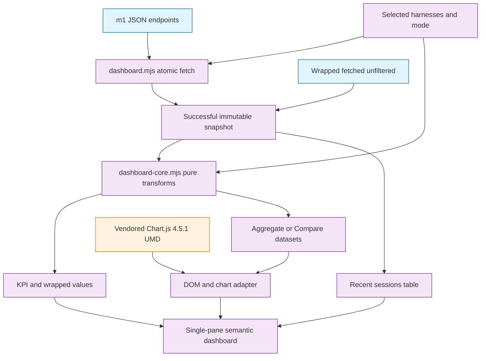

# Task: p4-dashboard / m2 — Vendored single-pane front-end

* Task ID: p4-dashboard-m2
* Complexity: Level 3
* Type: Feature

Replace the m1 dashboard placeholder with a fully offline, single-pane, accessible dashboard that renders the eight shipped API contracts through a vendored Chart.js 4.5.1 UMD bundle. The browser discovers arbitrary harnesses from API data, owns selection and Aggregate/Compare presentation, preserves m1 metric semantics, and never introduces a write, migration, network, or build path.

## Pinned Info

### Client Data and Rendering Flow

This diagram is the plan's backbone because it fixes the ownership boundaries: m1 remains mode-agnostic, pure transformations are unit-tested outside the DOM, the adapter owns browser state and atomic refresh, and wrapped bypasses selection.

## Component Analysis

### Affected Components

- **Static page shell** — `skills/sr-search/src/stockroom/dashboard/static/index.html` currently carries one placeholder line → becomes semantic page structure, inline design tokens/layout CSS, native harness disclosure, Aggregate/Compare radio group, status/error surfaces, KPI cards, chart containers, recent-sessions table, and wrapped banner.
- **Pure client domain logic** — new `skills/sr-search/src/stockroom/dashboard/static/dashboard-core.mjs` → owns deterministic harness ordering/color assignment, URL construction, selected-series aggregation, weighted averages, KPI/delta derivation, generic labels, chart heights, and mode-specific dataset construction without DOM or Chart.js access.
- **Browser adapter** — new `skills/sr-search/src/stockroom/dashboard/static/dashboard.mjs` → owns initial discovery, selected-harness/mode state, atomic parallel fetch, stale-request suppression, native control events, safe DOM updates, Chart.js lifecycle, loading/error/empty states, local date formatting, and responsive redraw.
- **Vendored chart runtime** — new `skills/sr-search/src/stockroom/dashboard/static/chart-4.5.1.umd.min.js` → verbatim official npm distribution, loaded locally before the browser module and retaining MIT identity.
- **HTTP/static boundary** — `skills/sr-search/src/stockroom/dashboard/server.py` already serves arbitrary files beneath the guarded static root → expected to remain unchanged unless cross-platform `.mjs` MIME testing proves an explicit mapping is required.
- **JavaScript test infrastructure** — new `skills/sr-search/tests-js/dashboard-core.test.mjs`, plus `Makefile` and `.github/workflows/ci.yml` → Node 22 built-in test runner becomes part of local/full CI without npm, a package manifest, or a build step.
- **Python static and HTTP contracts** — new `skills/sr-search/tests/test_dashboard_static.py` and extensions to `tests/test_dashboard_server.py` → verify semantic asset wiring, offline-only references, packaged serving, MIME types, and traversal behavior without pretending to prove browser rendering.
- **Licensing** — `REUSE.toml`, new `LICENSES/MIT.txt`, and `skills/sr-search/tests/test_licensing.py` → authored HTML/ES modules resolve to AGPL while the exact Chart.js artifact resolves to MIT.
- **Technical context** — `memory-bank/techContext.md` → records Node 22 as a contributor test prerequisite, native ES modules/no-build ownership, the pinned Chart.js artifact, and the static asset/test locations.

### Cross-Module Dependencies

- `index.html` → local `chart-4.5.1.umd.min.js` → global `Chart`; then `index.html` → `dashboard.mjs` as a native module.
- `dashboard.mjs` → `dashboard-core.mjs`: all deterministic transformations cross this seam; the DOM adapter does not duplicate metric math.
- `dashboard.mjs` → `/api/overview|trends|projects|tools|models|efficiency|sessions|wrapped`: seven endpoints receive repeated selected `harness` parameters; wrapped never does.
- `dashboard.mjs` → Chart.js: adapter creates and destroys chart instances; core returns plain labels/datasets/options inputs.
- `server.py` → `static/`: existing traversal-safe file serving exposes all committed assets without package-data or build configuration.
- `tests-js/dashboard-core.test.mjs` → `dashboard-core.mjs`: native ESM import under Node 22, with no browser or third-party dependency.
- pytest → static files/loopback server/REUSE CLI: verifies artifact and licensing boundaries; browser MCP/manual QA verifies actual rendered behavior.

### Boundary Changes

- **New public static routes:** `/dashboard.mjs`, `/dashboard-core.mjs`, and `/chart-4.5.1.umd.min.js` become loopback-served assets. No JSON endpoint shape, warehouse schema, CLI, or Python API changes.
- **Contributor toolchain:** the full test gate gains Node 22 and `node --test`; runtime users still need only the existing locked Python environment and a browser.
- **Licensing contract:** dashboard-authored `.html`/`.mjs` files are explicitly AGPL despite the surrounding `skills/**` PPL-S layer; only the pinned Chart.js file is MIT.

### Invariants and Constraints

- Every dashboard database request remains read-only through `warehouse.open_current()`; m2 adds no database, migration, ingest, or write path.
- Runtime is fully offline: no CDN, external font, analytics, dynamic import URL, or fetch target outside same-origin `/api/*`.
- Harness keys are discovered from data, sorted deterministically, and mapped positionally to the fixed eight-color palette; more than eight harnesses cycle the palette without blocking discovery.
- Aggregate/Compare remains client-owned; KPI meanings do not change by mode; Projects uses filtered `overview.distinct_projects`; First-Prompt Aggregate is weighted by `n`; Write/Read remains blended.
- Wrapped remains all-time and unfiltered. Its eighth factual field is Top Tool, not a derived personality.
- The page remains single-pane with no drill-down, conversation reconstruction, token/cost, subagent, or branch UI.
- Warehouse-derived strings enter the document through `textContent`/attributes, never raw HTML.
- Tests follow the mandated stub tests → stub interfaces → implement tests and observe failure → implement behavior sequence; browser-only visual checks stay in the sanctioned manual QA boundary.
- `make ci`, including pytest, Node tests, Ruff, lock verification, and REUSE, is green at the milestone boundary.

## Open Questions

- [x] Interaction and presentation contract → Resolved: contract-first native dashboard with atomic refresh, accessible native controls, endpoint-owned windows, truthful m1 fields, global actionable errors, and Top Tool replacing "Your Type" (see `memory-bank/active/creative/creative-dashboard-interaction-contract.md`).
- [x] Test-first strategy for client logic → Resolved: pure native ES module under Node 22's built-in test runner; pytest for static/HTTP/licensing contracts; browser rendering in manual QA (see `memory-bank/active/creative/creative-dashboard-js-testing.md`).

## Test Plan

### Behaviors to Verify

#### Automated JavaScript Unit Behaviors

- Arbitrary unsorted harness keys → sorted unique harness list and stable positional colors; the ninth harness cycles without being dropped.
- Raw harness keys containing hyphens/underscores → generic title-cased display labels without a curated harness map.
- Selected harness names containing spaces/reserved characters → URL builder emits repeated encoded `harness` parameters; sessions includes `limit=50`; wrapped omits filters.
- Aligned per-harness arrays with selected, missing, and zero-only harnesses → element-wise aggregate of selected data with no input mutation.
- Aggregate mode → one summed dataset; Compare mode → one labeled/colorized dataset per selected harness in deterministic order.
- Weekly writes/reads in either mode → two blended selected-harness series, never per-harness Compare series.
- First-prompt `avg_msgs` plus `n` → weighted bucket averages; zero total observations produce zero rather than `NaN`.
- Filtered overview payload → Sessions and Messages sums, Projects from `distinct_projects`, and Avg Msgs / Session with a zero-session guard.
- Current/previous values → signed rounded percentage; previous zero/current positive → `New`; both zero → neutral no-change label.
- Label count → deterministic minimum/dynamic chart height that keeps all model rows available.
- Null/invalid display values → em dash or zero-safe outputs rather than exceptions.
- Input payloads passed through every pure transform → remain unchanged.

#### Automated Python Static and Boundary Behaviors

- Packaged root request → complete HTML document with `stockroom dashboard`, semantic landmark, labeled native controls, live status/error regions, required panel IDs, semantic recent-sessions table, and canvas fallback labels.
- HTML script/style/resource references → local relative assets only; no `http://`, `https://`, protocol-relative URL, CDN host, external font, or inline remote fetch target.
- Requests for authored `.mjs` assets and pinned Chart.js → 200 with JavaScript MIME and non-empty bodies; encoded traversal remains rejected.
- Script load order → pinned Chart.js UMD precedes the module adapter; adapter imports the pure core module.
- REUSE SPDX map → `index.html`, `dashboard.mjs`, and `dashboard-core.mjs` resolve only to AGPL-3.0-or-later.
- REUSE SPDX map → `chart-4.5.1.umd.min.js` resolves to MIT and not AGPL/PPL-S; `reuse lint` remains clean with canonical `LICENSES/MIT.txt`.

#### Manual Browser and Integration Behaviors

- Current populated warehouse → one initial same-origin request per endpoint, all panels render real values, and no external network request occurs.
- Initial 503 missing/stale/busy response → visible `error` plus `action`; a later successful refresh clears it.
- Selection change → seven filterable endpoints refetch with repeated harness filters, wrapped remains unchanged, and the last selected harness cannot be removed.
- Mode change → no network fetch; KPI/table/wrapped meanings stay fixed while relevant charts switch summed/doughnut versus stacked/grouped datasets.
- Rapid selection changes → stale responses cannot overwrite the newest selection; prior successful data remains visible during refresh/failure.
- Empty/zero payloads and nullable wrapped fields → stable zero cards, chart no-data summaries, empty table row, and em dashes without console exceptions.
- Light/dark system themes and widths above/below 800px → readable contrast, one-column collapse, no clipped labels, and all-model chart remains scrollable.
- Keyboard-only flow → disclosure, checkboxes, radio group, focus order, focus visibility, and closing behavior remain usable; color is never the only harness cue.
- Chart canvases → concise accessible labels/fallback summaries; recent sessions retain semantic column headers.
- Session and wrapped dates → local short formatting with exact session ISO timestamps preserved in `title`.

### Test Infrastructure

- Frameworks: pytest 8 for Python/static/licensing boundaries; Node 22 stable built-in `node:test` + `node:assert/strict` for pure browser-domain logic.
- Python test location: `skills/sr-search/tests/`; JavaScript test location: `skills/sr-search/tests-js/`.
- Conventions: descriptive `test_*` Python functions with behavior docstrings; `.test.mjs` files using explicit native imports; no npm/package.json/transpilation; whole-suite execution through root `make test` and `make ci`.
- New test files: `skills/sr-search/tests/test_dashboard_static.py`, `skills/sr-search/tests-js/dashboard-core.test.mjs`.
- Extended test files: `skills/sr-search/tests/test_dashboard_server.py`, `skills/sr-search/tests/test_licensing.py`.

### Integration Tests

- Extend the loopback server test to request the real packaged HTML, both authored modules, and pinned Chart.js, verifying MIME and guarded serving as one boundary.
- Preserve the existing fixture ingest → real warehouse → `open_current()` → HTTP overview test; m2 consumes that frozen API contract and needs no duplicate DB integration test.
- Use browser automation/manual QA against the real foreground server and populated local warehouse for end-to-end fetch/render/offline verification; do not add a flaky browser suite to CI.

## Implementation Plan

1. **Prepare all tests, interfaces, and the JavaScript runner without implementing behavior.**
    - Files: `skills/sr-search/tests-js/dashboard-core.test.mjs`, `skills/sr-search/tests/test_dashboard_static.py`, `skills/sr-search/tests/test_dashboard_server.py`, `skills/sr-search/tests/test_licensing.py`, `skills/sr-search/src/stockroom/dashboard/static/dashboard-core.mjs`, `skills/sr-search/src/stockroom/dashboard/static/dashboard.mjs`, `Makefile`, `.github/workflows/ci.yml`.
    - Test stubs first: add every planned Node/pytest test with an empty implementation and explanatory comments where the signature is not self-describing; modify existing test modules only after stubs exist.
    - Interface stubs second: add documented pure exports in `dashboard-core.mjs` with empty returns, a documented browser adapter entry with no rendering logic, and the `test-js`/CI Node 22 invocation.
    - Do not replace the placeholder page, vendor Chart.js, add licensing rules, or implement any transformation in this step.
    - Creative ref: `creative-dashboard-js-testing.md`.
2. **Implement and fail the pure client contract tests, then build the core module behavior by behavior.**
    - Files: `skills/sr-search/tests-js/dashboard-core.test.mjs`, `skills/sr-search/src/stockroom/dashboard/static/dashboard-core.mjs`.
    - Fill tests for harness ordering/colors/labels, filtered URL construction, array aggregation, mode datasets, blended write/read, weighted averages, KPI/delta semantics, null guards, dynamic heights, and immutability.
    - Run the Node test file and confirm the newly implemented tests fail against the stubs.
    - Implement one pure export at a time, rerunning the focused Node suite after each behavior; refactor shared selected-series traversal only after green.
3. **Lock vendored-asset, static-page, and license contracts before adding the assets.**
    - Files: `skills/sr-search/tests/test_dashboard_static.py`, `skills/sr-search/tests/test_dashboard_server.py`, `skills/sr-search/tests/test_licensing.py`.
    - Fill the prepared pytest cases for semantic landmarks/panel IDs, local-only resource references, script ordering, served `.mjs`/Chart.js MIME, AGPL authored assets, and MIT Chart.js.
    - Run these focused pytest modules and `reuse lint`; confirm failures due to the placeholder, absent assets, and missing MIT annotation/license.
4. **Vendor Chart.js and establish precise REUSE ownership.**
    - Files: `skills/sr-search/src/stockroom/dashboard/static/chart-4.5.1.umd.min.js`, `LICENSES/MIT.txt`, `REUSE.toml`.
    - Extract `dist/chart.umd.min.js` verbatim from the official `chart.js@4.5.1` npm tarball already validated in planning; use the versioned filename as the runtime pin.
    - Add canonical MIT text and ordered REUSE overrides: dashboard-authored static assets to AGPL, then the exact Chart.js file to `MIT` with upstream copyright.
    - Rerun focused licensing tests and `reuse lint`; do not modify the minified upstream artifact to satisfy formatting or headers.
5. **Build the semantic responsive page shell and pass static contracts.**
    - Files: `skills/sr-search/src/stockroom/dashboard/static/index.html`.
    - Replace the placeholder with the header/control region, status/error live region, four KPI cards, seven chart panels, recent-sessions table, and eight-cell wrapped banner.
    - Add inline authored CSS for the mock-guided tokens, 1200px layout, cards, chart containers, responsive breakpoints, dark scheme, visible focus, screen-reader utilities, and no-data states.
    - Load the local versioned UMD bundle before `dashboard.mjs`; include labels/fallback summaries for every canvas.
    - Rerun `test_dashboard_static.py` and server asset tests until green.
    - Creative ref: `creative-dashboard-interaction-contract.md`.
6. **Implement atomic browser state, fetch, controls, and safe status handling.**
    - Files: `skills/sr-search/src/stockroom/dashboard/static/dashboard.mjs`, `skills/sr-search/src/stockroom/dashboard/static/index.html`.
    - Discover sorted harnesses from overview, default to all selected, render a native disclosure/checklist and Aggregate/Compare radio group, and prevent an empty selection.
    - Fetch eight endpoints in parallel, filter only the seven filterable endpoints, retain the previous snapshot while busy, suppress stale generations, and commit only complete successful snapshots.
    - Surface sanitized global errors/actions through text nodes; distinguish initial loading, refreshing, refusal, and legitimate no-data states.
    - Mode changes use the current snapshot without refetching; selection changes refetch. Keep warehouse-derived strings out of `innerHTML`.
    - Exercise pure state inputs through the green Node core suite, then manually smoke the adapter's request and failure lifecycle.
7. **Render all measured content and mode-specific charts.**
    - Files: `skills/sr-search/src/stockroom/dashboard/static/dashboard.mjs`, `skills/sr-search/src/stockroom/dashboard/static/dashboard-core.mjs`, `skills/sr-search/tests-js/dashboard-core.test.mjs`.
    - Render truthful KPIs/deltas and proportional harness bars; daily, project, tools, write/read, efficiency, model, and first-prompt charts per the mode table; rebuild through a centralized chart registry.
    - Render all recent sessions with generic harness labels/colors and exact ISO titles; render wrapped unfiltered with Top Tool as the eighth field.
    - Add any newly exposed pure dataset/config behavior test-first in the prepared Node suite before adapter code consumes it.
    - Use selected-series sums and weighted averages from core; no second metric implementation in the adapter.
8. **Complete cross-browser accessibility, responsive, and offline QA.**
    - Files: `skills/sr-search/src/stockroom/dashboard/static/index.html`, `skills/sr-search/src/stockroom/dashboard/static/dashboard.mjs`.
    - Verify keyboard flow, visible focus, semantic table/controls, live announcements, canvas labels/fallbacks, color-plus-text encoding, light/dark contrast, 800px collapse, and dynamic all-model scrolling.
    - Run the real server against populated data, inspect all panels in Aggregate and Compare, exercise one/many harnesses, resize/theme changes, and each 503 action.
    - Disable external network or inspect requests to prove every runtime asset/API request remains loopback-only. Fix stockroom code found by the smoke pass; do not add tests for Chart.js/browser internals.
9. **Document and run the complete milestone gate.**
    - Files: `memory-bank/techContext.md`, and `skills/sr-search/src/stockroom/dashboard/server.py` only if focused MIME tests proved platform-specific handling is necessary.
    - Record Node 22, the no-package native module test command, static asset locations, Chart.js 4.5.1 vendoring, and manual browser QA boundary.
    - Run formatting/linting, focused Node and pytest suites, `make reuse`, then the entire `make ci` gate. Because `make ci` exact-syncs, restore the documented per-machine Torch build afterward and rerun the production encoder smoke as the established milestone-boundary check.
    - Finish with a real foreground dashboard smoke and confirm no untracked vendoring/build debris.

## Technology Validation

- **Chart.js 4.5.1:** `npm view` confirmed the current package version and MIT license. A temporary extraction of the official npm tarball confirmed `dist/chart.umd.js` exposes `globalThis.Chart.version === "4.5.1"` with no install or build. Runtime artifact will be the minified UMD file served locally. Official responsive-container guidance: https://www.chartjs.org/docs/latest/configuration/responsive.html; accessibility boundary: https://www.chartjs.org/docs/latest/general/accessibility.html.
- **Node 22 built-in test runner:** local Node 22.22.1 is available; `node:test` is stable since Node 20 and requires no package. CI will pin major 22 explicitly. Official runner documentation: https://nodejs.org/docs/latest-v22.x/api/test.html.
- **No package/build addition:** no npm dependency, `package.json`, JavaScript lockfile, bundler, transpiler, or runtime network fetch is introduced.

## Challenges & Mitigations

- **REUSE override order can silently apply PPL-S to browser code or AGPL to Chart.js:** lock exact resolved licenses in `test_licensing.py`; place authored-static AGPL then exact-file MIT overrides after the broad `skills/**` rule.
- **Vendored bytes can drift from the pinned release:** obtain the artifact only from the official `chart.js@4.5.1` npm tarball, preserve it verbatim, use a versioned filename, and review it as an upstream binary/minified asset rather than formatted project code.
- **`.mjs` MIME inference varies by platform:** test real server content types on the supported environment; add a narrow explicit mapping in `server.py` only if the focused test demonstrates a failure.
- **Rapid filter changes can race:** use `AbortController` where available plus a monotonically increasing generation token; render only the newest complete snapshot.
- **Per-harness arrays may be missing, empty, or differently sparse:** centralize aligned selected-series traversal in the pure core, zero-fill by labels, and test missing/zero cases.
- **Project and average math are easy to make visually plausible but semantically wrong:** use filtered `distinct_projects` and weighted `avg_msgs * n` in tested core functions; never recompute them ad hoc in chart code.
- **Many models can overflow a fixed chart:** derive chart height from label count and place it in a bounded scroll region; never silently trim or group.
- **Canvas is not inherently accessible:** provide meaningful canvas labels/fallback summaries and keep exact values available in semantic text/table surfaces where practical, following Chart.js guidance.
- **Node becomes a new contributor prerequisite:** pin Node 22 in CI, make the missing-command failure explicit in `make test-js`, document it in `techContext.md`, and avoid npm so the new surface remains minimal.
- **Full CI exact sync removes the per-machine Torch exception:** follow the documented restoration and production encoder smoke procedure after `make ci`; this is known tooling debt, not m2 functionality.
- **Browser testing can sprawl into low-ROI platform proofs:** automate only stockroom-owned deterministic logic and asset contracts; keep Chart.js rendering, CSS, and native browser behavior in the explicit manual QA checklist.

## Status

- [x] Component analysis complete
- [x] Open questions resolved
- [x] Test planning complete (TDD)
- [x] Implementation plan complete
- [x] Technology validation complete
- [ ] Preflight
- [ ] Build
- [ ] QA
