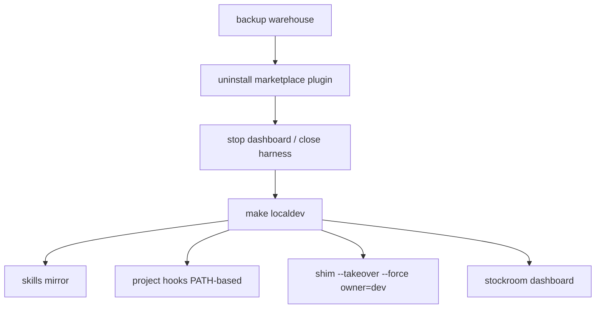

# Task: contributing-localdev-guide

* Task ID: contributing-localdev-guide
* Complexity: Level 3
* Type: enhancement (rework — localdev one-shot + FORCE + docs)

Rework the contributor localdev path: rip-it-out docs story, delete `plugin-local`, add shim FORCE (two-key with TAKEOVER), grow `make localdev` to skills + PATH-based project hooks + claim shim + dashboard bounce, split `localdev-status` sections.

## Pinned Info

### Localdev one-shot

## Component Analysis

### Affected Components

- **`stockroom.shim`**: add `force=` to `install`; CLI `--force`; alive foreign requires takeover∧force
- **`Makefile`**: FORCE passthrough; delete `plugin-local`; expand `localdev` / `localdev-clean` / `localdev-status`
- **`docs/contributing/local-workflow.md`**: full rewrite (rip-it-out + modular appendix)
- **`docs/contributing/development.md`**, **CONTRIBUTING.md**, **troubleshooting**: drop plugin-local; point at new story
- **`memory-bank/techContext.md` / `systemPatterns.md`**: drop plugin-local mentions if present
- **Tests**: `tests/test_shim.py`, `tests/test_shim_cli.py`

### Cross-Module Dependencies

- localdev → shim install (Python) → dashboard CLI
- hooks assume on-path shim already claimed (order: skills → hooks → shim → dashboard, or shim before hooks — **shim before hooks write is fine; hooks run later at sessionStart**. Order in make: skills, hooks files, shim claim, dashboard bounce.)

### Boundary Changes

- Public CLI: new `--force` on `shim install` (dangerous; warned)
- Make: remove `plugin-local`; `FORCE=1` on `shim` / implied by `localdev`
- Docs: new enter narrative

### Invariants & Constraints

- Must preserve: succeed-or-refuse without FORCE; agents/skills never recommend FORCE
- Must preserve: TAKEOVER alone insufficient for live foreign
- Must hold: warehouse backup in rip-it-out story
- Must hold: localdev-clean does not touch warehouse or marketplace installs
- Non-goal: dashboard stop/restart subcommands this rework

## Open Questions

- [x] Project hooks + FORCE surface → **Option B PATH-based hooks + FORCE two-key** (`memory-bank/active/creative/creative-localdev-hooks-and-force.md`)

## Test Plan (TDD)

### Behaviors to Verify

Engine (pytest):

- S1: alive foreign + takeover + force → installed (owner replaced)
- S2: alive foreign + takeover without force → refused
- S3: alive foreign + force without takeover → refused
- S4: dead foreign + takeover (no force) → installed (unchanged)
- S5: CLI `--force` accepted and wired (argparse + install call)

Makefile (shell):

- M1: `make -n shim TAKEOVER=1 FORCE=1` shows `--takeover` and `--force`; plain `make -n shim` shows neither
- M2: `make -n plugin-local` fails (target gone)
- M3: `make localdev-status` prints a clear separator between localdev-managed vs shim sections
- M4: `make localdev-clean` removes skills symlinks, managed hook markers, managed pre-commit block; does not require plugin-local

Docs:

- B1: `make docs-build` green
- B2: no remaining `plugin-local` in user-facing docs
- B3: local-workflow has rip-it-out first + modular appendix + FORCE warning

### Test Infrastructure

- pytest under `skills/sr-search/tests/` (existing shim suites)
- Shell checks for Make; docs-build for docs

## Implementation Plan

1. **Shim FORCE (TDD)** — S1–S5 in `test_shim.py` / `test_shim_cli.py` → implement `force` in `install` + CLI → green
2. **Makefile: FORCE + delete plugin-local + localdev expansion** — M1–M4 fail then implement: `FORCE`; remove `plugin-local`; `localdev` does skills + Cursor/Claude managed hooks + `shim TAKEOVER=1 FORCE=1` + `stockroom dashboard`; clean/status updated per creative
3. **Docs rewrite** — `local-workflow.md` rip-it-out + appendix; scrub plugin-local from development/CONTRIBUTING/troubleshooting/techContext/systemPatterns
4. **Gates** — pytest shim suites; M1–M4; docs-build; reuse; `make ci` if Python changed (yes)

## Challenges & Mitigations

- **Cursor project hooks experiment-gated**: Document; localdev still bounces dashboard once
- **FORCE abuse**: Two-key Make flags; CLI help scare text; no skill mentions
- **Hook merge into existing `.cursor/hooks.json`**: Managed markers only; don't wipe unrelated hooks
- **Claude settings.local.json JSON merge**: Read-modify-write carefully; markers in a comment-free JSON world — use a dedicated key path or sibling file if markers impossible; prefer writing a stockroom-owned fragment file referenced if needed, else replace only SessionStart entries tagged via a distinctive command substring match for clean

## Pre-Mortem

- **Plan fails by shipping PLUGIN_ROOT hooks**: Prevented by creative B
- **Plan fails by making FORCE easy**: Two-key + downplay in docs
- **Plan fails leaving plugin-local half-referenced**: Explicit scrub step + B2 grep gate

## Technology Validation

No new technology — validation not required.

## Status

- [x] Component analysis complete
- [x] Open questions resolved (creative-localdev-hooks-and-force)
- [x] Test planning complete (TDD)
- [x] Implementation plan complete
- [x] Technology validation complete
- [x] Pre-Mortem complete
- [ ] Preflight
- [ ] Build
- [ ] QA
