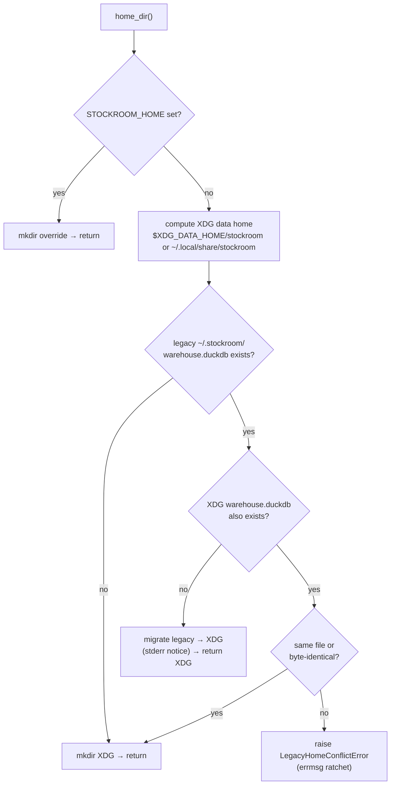

# Task: xdg-base-directory-layout

* Task ID: xdg-base-directory-layout
* Complexity: Level 3
* Type: feature

Adopt XDG Base Directory layout for stockroom-owned runtime data on all Unix-like platforms (Linux, WSL, macOS), with safe legacy migration and doctor reporting, per [issue #3](https://github.com/Texarkanine/stockroom/issues/3).

## Pinned Info

### Path resolution and migration flow

Authoritative sequence for default (no `STOCKROOM_HOME`) path resolution after this feature. Pinned because nearly every implementation step hangs off this order, especially “detect before mkdir.”

## Component Analysis

### Affected Components

- **`stockroom.warehouse`** (`skills/sr-search/src/stockroom/warehouse.py`): Owns `home_dir` / `warehouse_path` / `lock_path`. Today: `STOCKROOM_HOME` else `~/.stockroom`, mkdir-on-resolve. Change: XDG data-home default, legacy detect+migrate helpers, typed conflict error; mkdir only after resolve decision.
- **`stockroom.doctor`** (`skills/sr-search/src/stockroom/doctor.py`): `probe_facts` reports OS/GPU/torch/engine-dir only. Change: add home / home-source / legacy-home / legacy-warehouse facts (read-only; must not trigger migrate as a side effect of probe, or must call a pure `inspect_homes()` that does not migrate).
- **`stockroom.schedule`**: Log path derived from `warehouse.home_dir()`. No structural change if single-tree decision holds; docstrings/comments update; existing tests keep working via `STOCKROOM_HOME`.
- **Tests** (`tests/test_warehouse_open.py`, new `test_warehouse_paths.py` or extended suite, `test_doctor.py` / `test_doctor_cli.py`, docstring updates in `conftest.py`).
- **Docs / memory bank**: `memory-bank/systemPatterns.md`, `memory-bank/techContext.md`, `planning/brainstorm/README.md` (O1/D7), `planning/tech-brief.md`, `planning/brainstorm/tech.md` / `implementation-details.md`, spike `export_dataset.py` default path comment/code for consistency.
- **`sr-initialize`**: No hard-coded `~/.stockroom` today; may add a short note that `doctor probe` reports home / legacy and that after upgrade, re-run `stockroom schedule install` if old log path remains in crontab/plist.

### Cross-Module Dependencies

- `schedule` → `warehouse.home_dir()` (log path)
- `open` / `open_current` / lock → `warehouse_path` / `lock_path` → `home_dir`
- `doctor.probe` → new inspect helpers in `warehouse` (prefer warehouse as single owner of path policy)
- All CLI subprocess tests → `STOCKROOM_HOME` fixture (unchanged)

### Boundary Changes

- Public path default changes from `~/.stockroom` → `~/.local/share/stockroom` (or `$XDG_DATA_HOME/stockroom`).
- New public symbols likely: `LegacyHomeConflictError`, `legacy_home()`, `data_home()` / internal XDG resolve, `inspect_homes()` (pure), maybe `migrate_legacy_home_if_needed()` used by `home_dir`.
- Doctor probe fact schema grows (additive; exit 0 unchanged).
- No DuckDB schema change; no scheduler mechanism change.

### Invariants & Constraints

- `STOCKROOM_HOME` always wins; never runs legacy migration when set.
- No silent data loss; divergent dual warehouses → hard fail with next action.
- Detect before mkdir (empty XDG must not look like “already present”).
- One layout on all *nix; no macOS Application Support tree.
- Harness roots and Windows paths out of scope.
- Canonical edits under `skills/`; not `.cursor/skills/stockroom-local` (localdev symlink).

## Open Questions

- [x] Q1: Directory layout shape → **Resolved: single tree under `$XDG_DATA_HOME/stockroom/` including logs** (`memory-bank/active/creative/creative-xdg-layout-shape.md`)
- [x] Q2: Legacy migration strategy → **Resolved: safe auto-migrate at path resolve; refuse on divergent dual warehouses; doctor reports home + legacy** (`memory-bank/active/creative/creative-legacy-home-migration.md`)

## Test Plan (TDD)

### Behaviors to Verify

- **STOCKROOM_HOME override**: env set → `home_dir()` returns that path; XDG/legacy ignored; no migrate.
- **XDG_DATA_HOME set**: unset `STOCKROOM_HOME`, set `XDG_DATA_HOME` → home is `$XDG_DATA_HOME/stockroom`; warehouse/lock under it.
- **Default when XDG unset** (macOS-like): home is `Path.home() / ".local/share/stockroom"`.
- **Auto-create**: first resolve creates the chosen home directory.
- **Legacy-only migrate**: legacy warehouse exists, XDG warehouse absent → after `home_dir()`, data lives at XDG path; legacy warehouse gone (or not the live DB); stderr notice optional but assert outcome.
- **Idempotent post-migrate**: second `home_dir()` uses XDG; no error.
- **Conflict refuse**: both warehouses exist and differ → `LegacyHomeConflictError` (or equivalent); neither file deleted.
- **Same-file / identical allow**: both paths present but same content (or hardlink) → use XDG without error (choose one rule and pin it: prefer “same file via `os.path.samefile` OR byte-identical”).
- **Doctor facts**: probe includes `home`, `home-source` (`STOCKROOM_HOME` | `XDG_DATA_HOME` | `default`), `legacy-home`, `legacy-warehouse` (`present`|`absent`); probe does not migrate (leave legacy in place when only reporting).
- **Doctor CLI**: `doctor probe` stdout contains the new keys.
- **Schedule unchanged under override**: existing schedule tests with `STOCKROOM_HOME` still pass (log under that home).

### Edge Cases

- Legacy dir exists but empty / no warehouse → treat as no legacy warehouse; use XDG.
- `XDG_DATA_HOME` set to relative path — follow `Path` semantics consistently (expanduser recommended).
- Partial migrate failure: if move fails mid-way, leave a clear error; prefer copy+verify+remove legacy warehouse file only after XDG verify, or `Path.replace`/`os.replace` of the duckdb file.
- `home_dir()` called under conflict: must not mkdir over / wipe either tree.

### Test Infrastructure

- Framework: pytest under `skills/sr-search/tests/`
- Conventions: `warehouse_home` fixture sets `STOCKROOM_HOME`; injectable env via `monkeypatch`; doctor unit tests call `probe_facts` directly
- New / extended files:
  - Extend `tests/test_warehouse_open.py` or add `tests/test_warehouse_home_xdg.py` for XDG + migration behaviors (prefer dedicated file to avoid bloating open/gate tests)
  - Extend `tests/test_doctor.py` and `tests/test_doctor_cli.py` for new facts
- Update module/fixture docstrings that claim `~/.stockroom` is the only non-override default

### Integration Tests

- Subprocess CLI still isolated via `STOCKROOM_HOME` (no change required beyond path-docstring accuracy)
- Optional: one doctor CLI probe with monkeypatched home via env in subprocess (already via env inheritance patterns)

## Implementation Plan

1. **TDD: XDG / override path resolution (no migrate yet)**
   - Files: `tests/test_warehouse_home_xdg.py` (new), then `src/stockroom/warehouse.py`
   - Changes: helpers `_xdg_data_home()`, retarget default in `home_dir()`; keep `STOCKROOM_HOME` first; update module docstring
   - Creative ref: `creative-xdg-layout-shape.md`

2. **TDD: Legacy detect + migrate + conflict**
   - Files: same test module + `warehouse.py`
   - Changes: `legacy_home()`, `inspect_homes()` (pure), `migrate_legacy_home_if_needed()`, `LegacyHomeConflictError`, wire into `home_dir()` with detect-before-mkdir; stderr one-liner on successful migrate
   - Creative ref: `creative-legacy-home-migration.md`

3. **TDD: Doctor home/legacy facts (read-only inspect)**
   - Files: `tests/test_doctor.py`, `tests/test_doctor_cli.py`, `src/stockroom/doctor.py`
   - Changes: `probe_facts` appends home facts from `warehouse.inspect_homes()` (or equivalent) without calling migrate; update `format_facts` width handling already generic

4. **Docstring / comment sweep in engine tests**
   - Files: `tests/conftest.py`, `tests/test_warehouse_open.py`, schedule module docs if they assert legacy path naming
   - Changes: replace “always `~/.stockroom`” with XDG default language; `STOCKROOM_HOME` still the test seam

5. **Memory bank + planning language reconciliation**
   - Files: `memory-bank/systemPatterns.md`, `memory-bank/techContext.md`, `planning/brainstorm/README.md` (O1/D7), `planning/tech-brief.md`, `planning/brainstorm/tech.md`, `planning/brainstorm/implementation-details.md`
   - Changes: ship path is XDG data home; note `STOCKROOM_HOME`; note legacy auto-migrate; mark O1 as fully realized (no aspirational “where the platform expects it” gap)

6. **Skills / operator docs**
   - Files: `skills/sr-initialize/SKILL.md` (brief doctor/home + reinstall schedule note if needed), spike `planning/spikes/embed-model-eval/export_dataset.py` (+ README) to use same default resolution or at least document XDG default
   - Changes: align operator-facing defaults; avoid teaching `~/.stockroom` as current home

7. **Verification**
   - Run targeted new tests, then full `make test` / project CI recipe from engine dir; fix regressions
   - Sanity: with `STOCKROOM_HOME` unset in a temp `$HOME`, confirm default path string

## Technology Validation

No new technology - validation not required. Uses stdlib `os.environ`, `pathlib`, existing pytest/`monkeypatch`.

## Challenges & Mitigations

- **Empty XDG dir vs warehouse presence**: Key of “present” is `warehouse.duckdb` file, not parent dir existence; never mkdir until after detect/migrate decision for the default path.
- **Probe must not migrate**: Doctor is constitutionally read-only — implement `inspect_homes()` without side effects; only `home_dir()` migrates.
- **Stale schedule log paths**: After migrate, old crontab may still append to `~/.stockroom/logs/nightly.log` — mitigate via doctor warning when legacy home dir still exists / docs say re-run `schedule install`.
- **Dual-tree conflict recovery**: Errmsg must name both paths and a manual next action (compare/remove one; re-run).
- **Move vs copy**: Prefer create XDG dir, `os.replace` warehouse file into place when same filesystem; if cross-device, copy+fsync+verify size+unlink legacy warehouse. Keep lock/logs best-effort secondary.
- **Archive docs**: Do not rewrite historical `memory-bank/archive/**` narratives; only living docs + O1 reconciliation.

## Preflight Findings

- **PASS** (2026-07-09). Status: `memory-bank/active/.preflight-status`
- TDD encoding: steps 1–3 order new tests before `warehouse.py` / `doctor.py` production edits
- Convention: path policy stays owned by `warehouse`; doctor remains read-only via `inspect_homes()`
- No overlapping XDG utilities found; no second code tree to edit (localdev symlink only)
- Advisory (not blocking): after migrate, `schedule status` could optionally warn if an installed crontab/plist still names `~/.stockroom/logs/` — deferred; doctor + docs cover the reinstall guidance for this issue

## Status

- [x] Component analysis complete
- [x] Open questions resolved
- [x] Test planning complete (TDD)
- [x] Implementation plan complete
- [x] Technology validation complete
- [x] Preflight
- [ ] Build
- [ ] QA
