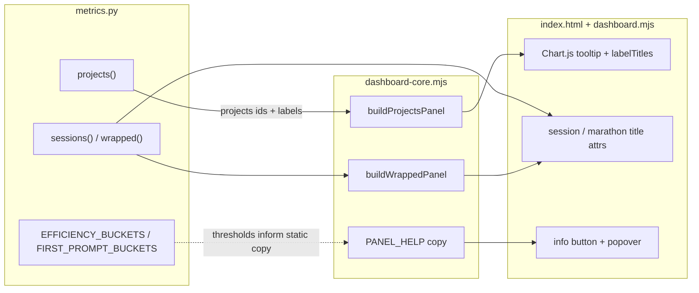

# Task: dashboard-polish-m3-labels-and-help

* Task ID: dashboard-polish-m3-labels-and-help
* Complexity: Level 3
* Type: intermediate feature

Show friendly project names with `project_id` on hover (#8) and add clickable info-icon tooltips for Session Efficiency and First-Prompt Quality (#7). Grouping/ranking stays on `project_id`; friendly names are display-only. Help chrome is limited to those two panels.

## Pinned Info

### Label + help data flow

Pinned because #8 and #7 share the static/adapter surface but take different paths from the warehouse — this diagram keeps the boundary clear for the whole plan.

## Component Analysis

### Affected Components

- **`metrics.projects()`** (`skills/sr-search/src/stockroom/dashboard/metrics.py`): ranks by `project_id` and returns slug labels today → keep ranked `projects` as ids; add parallel `labels` (friendly basename or slug fallback); resolve cwd via a projects-local pass (do **not** widen `_session_rows` for all callers).
- **`metrics.sessions()` / `metrics.wrapped()`**: already emit friendly `project_name` → add `project_id` so the client can set hover only when display ≠ slug; extract a tiny shared `project_display_name(cwd, project_id)` helper used by sessions, wrapped, and projects.
- **`buildProjectsPanel` / `panelModel`** (`dashboard-core.mjs`): chart labels from `labels` (fallback to `projects`); attach `labelTitles` (slug when friendly, else omit/null) for hover/aria.
- **`chartOptions` / `renderChart` / `renderSessions` / `renderWrapped`** (`dashboard.mjs`): Chart.js tooltip title shows slug when `labelTitles[i]` is set; session project cell and marathon subtitle get `title` / accessible description the same way.
- **`index.html` + adapter help init**: Session Efficiency and First-Prompt Quality headers gain an info control + popover; CSS for icon/popover; no icons on other panels.
- **Tests**: `test_dashboard_metrics.py`, `dashboard-core.test.mjs`, `test_dashboard_static.py`; optional thin adapter/help unit coverage in JS if extractable without DOM harness.

### Cross-Module Dependencies

- `projects()` → `buildProjectsPanel` → `renderChart` / `chartOptions` (label + hover metadata).
- `sessions()` / `wrapped()` → `renderSessions` / `renderWrapped` (title attrs).
- Static help copy aligned with `EFFICIENCY_BUCKETS` / first-prompt thresholds (documented constants; no runtime import from Python).

### Boundary Changes

- **`/api/projects`**: additive `labels: string[]` parallel to `projects` (ids). Ranking key unchanged.
- **`/api/sessions` rows / wrapped marathon**: additive `project_id` field.
- **Panel model**: optional `labelTitles: (string|null)[]`.
- No schema/migration changes; no CDN/bundler; endpoints stay mode-agnostic.

### Invariants & Constraints

- Must preserve `sessions.project_id` as grouping/identity key; never rank/decode by basename.
- Must preserve read-only warehouse path and offline static dashboard.
- Must not add info icons to Daily Activity, Projects, Tools, Models, Write/Read, KPIs, or Recent Sessions.
- Must use safe DOM updates only (textContent / attributes; static help copy).
- Must keep Wrapped all-time / unfiltered by date range.
- Fallback-to-slug labels must not get a redundant hover that only repeats the visible slug.
- Dirty WIP currently in the working tree (trends adaptive granularity + writeShare null→0) is **out of scope** and must not be mixed into this build — restore or isolate before implementing.

## Open Questions

None — implementation approach is clear.

Decisions locked in plan:

1. **cwd pick when sessions disagree**: among windowed sessions for a `project_id`, take the basename of the most recent non-NULL `cwd` by activity; if none, fall back to `project_id`.
2. **API shape**: keep `projects` as ranked ids; add parallel `labels`; client derives hover titles when `labels[i] !== projects[i]`.
3. **Chart hover**: Chart.js tooltip `callbacks.title` (bar hover) surfaces the slug; canvas ticks stay friendly labels (Chart.js has no reliable tick-hover DOM).
4. **Help UI**: click-toggle button + popover (`aria-expanded` / `aria-controls`), dismiss on Escape / outside click / re-toggle; static copy in `dashboard-core.mjs` as `PANEL_HELP`.

## Test Plan (TDD)

### Behaviors to Verify

- Friendly projects: project with recoverable cwd → `labels[i]` is basename; `projects[i]` remains slug; ranking still by slug totals.
- Fallback slug: all cwd NULL for a project → `labels[i] === projects[i]`.
- Deterministic cwd pick: two sessions, different cwd basenames → label from most recent non-NULL cwd.
- Hover metadata (JS): when label ≠ id → `labelTitles[i] === id`; when equal → null/absent.
- Aggregate/compare projects panels: chart `labels` are friendly; series still aligned to id order.
- Sessions: row includes `project_id`; render sets `title` to slug only when `project_name !== project_id`.
- Wrapped marathon: same hover rule when friendly name shown.
- Efficiency info: `#efficiency-panel` has clickable info control explaining abandoned/short/medium/long message-count buckets.
- First-prompt info: `#first-prompt-panel` has clickable info control explaining short/medium/detailed length buckets and that the chart is avg session length per bucket.
- Dismiss/a11y: Escape, outside click, and toggle close the popover; control is a named button; no info icons on other panels.
- Safe copy: help text is static (no warehouse HTML injection).
- Regression: existing projects ranking, sessions truncation, efficiency bucket boundaries, and other panel builders stay green.

### Edge Cases

- Empty projects list → empty panel; no labelTitles required.
- Friendly basename colliding across different `project_id`s → both show same leaf; hover distinguishes via slug.
- Missing `labels` in payload (old shape) → JS falls back to `projects` as labels (defensive).
- Only one of the two help popovers open at a time (opening one closes the other) — preferred UX; document in implementation.

### Test Infrastructure

- Framework: pytest (`uv run --no-sync pytest`); Node 22 `node:test` (`make test-js`).
- Test location: `skills/sr-search/tests/`, `skills/sr-search/tests-js/`.
- Conventions: `test_*` / `test("…")`; extend existing suites.
- New test files: none required (extend `test_dashboard_metrics.py`, `dashboard-core.test.mjs`, `test_dashboard_static.py`; add a small `dashboard-help` helper test in `dashboard-core.test.mjs` if copy/toggle helpers are pure).

### Integration Tests

- Metrics → panel model: projects payload with cwd-backed labels produces friendly chart labels + labelTitles in `buildProjectsPanel`.
- Static shell: only efficiency + first-prompt panels contain `.panel-info` (or agreed selector).

## Implementation Plan

1. **Shared display helper + projects labels (TDD, Python)**
    - Files: `metrics.py`, `test_dashboard_metrics.py`
    - Changes: add `project_display_name(cwd, project_id)`; extend `projects()` to resolve cwd (projects-local query/pass), return parallel `labels`; keep ranking on ids; update `test_projects_*` for friendly/fallback/deterministic pick.

2. **Sessions / wrapped `project_id` (TDD, Python)**
    - Files: `metrics.py`, `test_dashboard_metrics.py`
    - Changes: include `project_id` on session rows and marathon; reuse `project_display_name`; assert hover-capable fields without changing default `project_name` behavior.

3. **Projects panel model + labelTitles (TDD, JS)**
    - Files: `dashboard-core.mjs`, `dashboard-core.test.mjs`
    - Changes: `buildProjectsPanel` prefers `labels` with fallback to `projects`; `panelModel` accepts `labelTitles`; tests for friendly labels + titles.

4. **Adapter hover wiring (TDD where practical)**
    - Files: `dashboard.mjs` (`chartOptions`, `renderSessions`, `renderWrapped`)
    - Changes: tooltip title callback uses `labelTitles`; session/marathon DOM `title` when friendly ≠ slug; keep textContent-only updates.

5. **PANEL_HELP copy + static chrome (TDD)**
    - Files: `dashboard-core.mjs` (export `PANEL_HELP`), `index.html` (header markup + CSS), `test_dashboard_static.py`
    - Changes: info buttons only on efficiency + first-prompt; copy matches bucket thresholds from issue #7 / `EFFICIENCY_BUCKETS` / first-prompt rules.

6. **Help toggle behavior**
    - Files: `dashboard.mjs` (init listeners), optional pure helpers in `dashboard-core.mjs` for open/close state
    - Changes: click toggle, Escape, outside click; one open popover at a time; ARIA wiring.

7. **Verification**
    - Run targeted pytest/JS tests during TDD; finish with `make ci` (pytest + `make test-js` + lint/format/REUSE).

## Technology Validation

No new technology — validation not required. Native ES modules, existing Chart.js, no CDN, no new packages.

## Challenges & Mitigations

- **Chart.js cannot hover axis tick DOM**: Mitigate by using bar-index tooltips for slug disclosure (issue accepts tooltip/accessible description). Document that tick-hover is not the vehicle.
- **Widening `_session_rows` would ripple overview/trends/efficiency**: Mitigate with a projects-local cwd resolution pass; leave `_session_rows` signature alone.
- **Dirty unrelated WIP in working tree**: Mitigate by restoring those files to HEAD (or stashing) before build so m2 null-gap and trends contracts stay intact.
- **Help copy drift from Python constants**: Mitigate by citing thresholds in `PANEL_HELP` comments and static tests; no cross-language import.

## Pre-Mortem

- **Plan failed because friendly names were used as ranking keys**: Already covered by invariant + tests that assert `projects` order stays id-ranked.
- **Plan failed because Chart.js tick hover was assumed**: Plan response — tooltip-on-bar is the deliberate hover surface; acceptance text maps to that.
- **Plan failed by shipping m2 regressions from dirty WIP**: Plan response — explicit out-of-scope restore step before build (Challenge above).
- **Plan failed by putting info icons on every panel**: Already covered by static test asserting only two panels.

## Status

- [x] Component analysis complete
- [x] Open questions resolved
- [x] Test planning complete (TDD)
- [x] Implementation plan complete
- [x] Technology validation complete
- [x] Pre-Mortem complete
- [ ] Preflight
- [ ] Build
- [ ] QA
