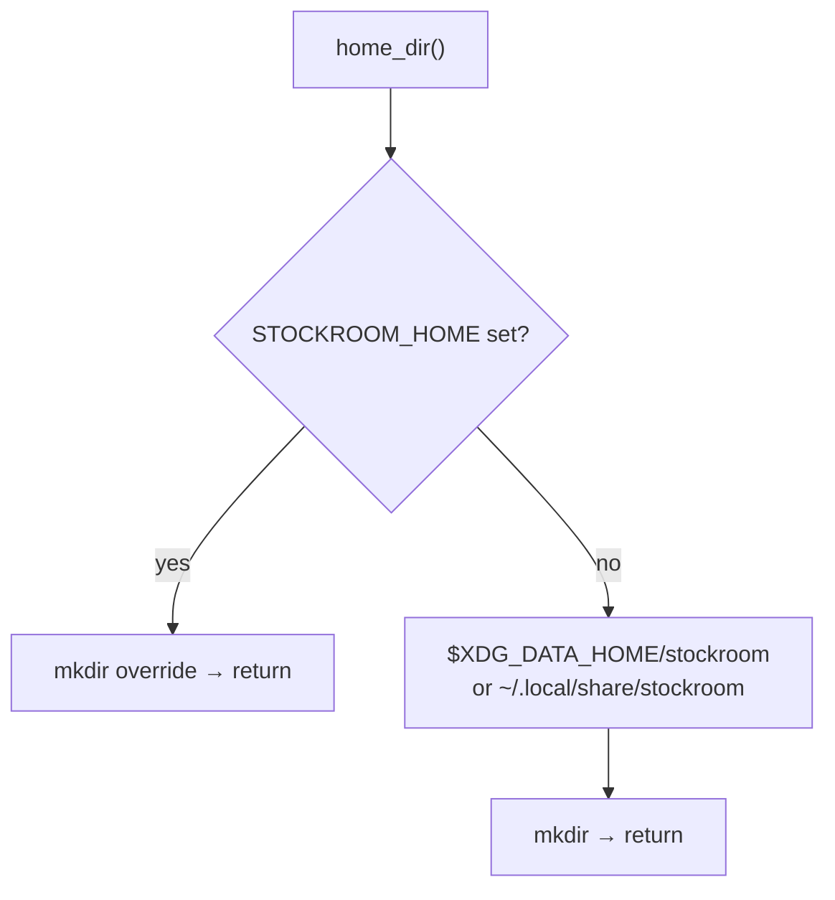

# Task: xdg-base-directory-layout

* Task ID: xdg-base-directory-layout
* Complexity: Level 3
* Type: feature

Adopt XDG Base Directory layout for stockroom-owned runtime data on all Unix-like platforms (Linux, WSL, macOS), per [issue #3](https://github.com/Texarkanine/stockroom/issues/3). **No legacy `~/.stockroom/` migration** — operator will fresh-install / `cp` warehouse data manually on the only two machines that have installs.

## Pinned Info

### Path resolution

Single tree under the XDG data home (warehouse DB, lock, and `logs/`). `STOCKROOM_HOME` overrides everything.

## Component Analysis

### Affected Components

- **`stockroom.warehouse`**: Add pure `resolve_home() -> (Path, source)` (`STOCKROOM_HOME` | `XDG_DATA_HOME` | `default`); `home_dir()` = resolve + mkdir. Default target `$XDG_DATA_HOME/stockroom` (else `~/.local/share/stockroom`). `warehouse_path` / `lock_path` unchanged relative to home.
- **`stockroom.doctor`**: Probe facts `home` + `home-source` via `resolve_home()` (no mkdir side effect). No legacy detection.
- **`stockroom.schedule`**: No API change (still uses `warehouse.home_dir()` for log path); docstring updates only if they still teach `~/.stockroom`.
- **Tests**: New XDG path tests; doctor fact tests; docstring sweep in fixtures/open tests.
- **Docs / memory bank**: Living docs + O1/brainstorm language → XDG data home as shipped default. Historical archives left as-is.
- **`sr-initialize` / spike paths**: Align any operator-facing defaults that still teach `~/.stockroom`.

### Cross-Module Dependencies

- `schedule` / `open` / lock → `warehouse.home_dir()`
- Doctor → warehouse path helpers (read current resolved home; no side effects beyond what `home_dir()` already does, or a thin pure resolver that mirrors it without requiring mkdir if useful for tests)
- CLI tests stay on `STOCKROOM_HOME` fixture

### Boundary Changes

- Default home: `~/.stockroom` → `~/.local/share/stockroom` (or `$XDG_DATA_HOME/stockroom`)
- Doctor probe facts grow additively
- No schema change; no scheduler mechanism change; **no migrate/conflict types or helpers**

### Invariants & Constraints

- `STOCKROOM_HOME` always wins over XDG
- One layout on all *nix; no macOS Application Support tree
- No auto-migration, no legacy-home detection, no dual-tree conflict handling
- Harness roots and Windows paths out of scope
- Canonical edits under `skills/` only

## Open Questions

- [x] Q1: Directory layout shape → **Single tree under `$XDG_DATA_HOME/stockroom/` including logs** (`creative-xdg-layout-shape.md`)
- [x] Q2: Legacy migration → **Won't implement.** Operator decision (2026-07-09): only two private installs; fresh install / manual `cp`. Issue #3 migration acceptance is explicitly waived for this task. (`creative-legacy-home-migration.md` is superseded — do not build it.)

## Test Plan (TDD)

### Behaviors to Verify

- **STOCKROOM_HOME override**: env set → `home_dir()` is that path; XDG env ignored
- **XDG_DATA_HOME set**: unset `STOCKROOM_HOME`, set `XDG_DATA_HOME` → `$XDG_DATA_HOME/stockroom`
- **Default when XDG unset** (macOS-like): `Path.home() / ".local/share/stockroom"`
- **Auto-create**: first resolve creates the chosen home
- **warehouse_path / lock_path** live under resolved home
- **Doctor facts**: `home`, `home-source` (`STOCKROOM_HOME` | `XDG_DATA_HOME` | `default`)
- **Doctor CLI**: `doctor probe` prints those keys
- **Schedule under override**: existing `STOCKROOM_HOME` schedule tests still pass

### Edge Cases

- Relative `XDG_DATA_HOME` — consistent `Path` / expanduser handling
- Unset both override and XDG → default under fake `HOME` in tests

### Test Infrastructure

- pytest in `skills/sr-search/tests/`
- New `tests/test_warehouse_home_xdg.py` (prefer over bloating open/gate tests)
- Extend `tests/test_doctor.py` / `tests/test_doctor_cli.py`
- Update docstrings in `conftest.py` / `test_warehouse_open.py` that claim `~/.stockroom` is the non-override default

## Implementation Plan

1. **TDD: XDG / override path resolution** ✅
   - Files: `tests/test_warehouse_home_xdg.py` → `src/stockroom/warehouse.py`
   - Changes: pure `resolve_home()`; `home_dir()` wraps it with mkdir; XDG data-home default; `STOCKROOM_HOME` first; module docstring

2. **TDD: Doctor home facts** ✅
   - Files: `tests/test_doctor.py`, `tests/test_doctor_cli.py` → `src/stockroom/doctor.py`
   - Changes: probe reports `home` + `home-source` from `resolve_home()` (no legacy keys; no mkdir)

3. **Docstring / comment sweep** ✅
   - Files: `tests/conftest.py`, `tests/test_warehouse_open.py`, schedule docs if needed
   - Changes: default path language → XDG data home

4. **Memory bank + planning reconciliation** ✅
   - Files: `systemPatterns.md`, `techContext.md`, brainstorm O1/D7, `tech-brief.md`, related brainstorm notes
   - Changes: shipped default is XDG data home + `STOCKROOM_HOME`; O1 gap closed; **no migration story**

5. **Skills / operator docs** ✅
   - Files: `sr-initialize` if useful; spike `export_dataset.py` (+ README) default path
   - Changes: stop teaching `~/.stockroom` as current home (`sr-initialize` already had none)

6. **Verification**
   - Targeted new tests, then full engine/CI test recipe; fix regressions

## Technology Validation

No new technology — validation not required.

## Challenges & Mitigations

- **Doc sprawl**: Many stale `~/.stockroom` mentions in living docs/planning — sweep living surfaces; leave `memory-bank/archive/**` historical.
- **Issue #3 migration checkboxes**: Waived by operator for this task; note on close / in reflection rather than implementing dead code.
- **Operator machines**: Manual `cp` of `warehouse.duckdb` (and re-`schedule install` if log path was baked into cron/plist) is out of code scope.

## Preflight Findings

- Re-preflight PASS (2026-07-09) against amended no-migration plan.
- `creative-legacy-home-migration.md` remains on disk as historical exploration; **do not implement** — Q2 superseded by operator waiver.
- Advisory applied into plan: pure `resolve_home()` so doctor probe does not mkdir.

## Status

- [x] Component analysis complete (amended — no migration)
- [x] Open questions resolved (Q2 superseded: won't implement)
- [x] Test planning complete (TDD)
- [x] Implementation plan complete (amended)
- [x] Technology validation complete
- [x] Preflight PASS
- [ ] Build
- [ ] QA
